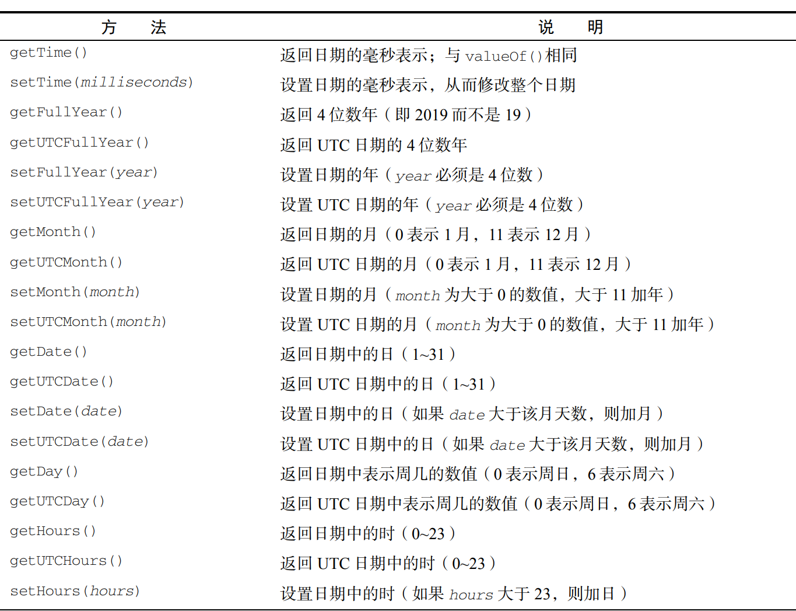
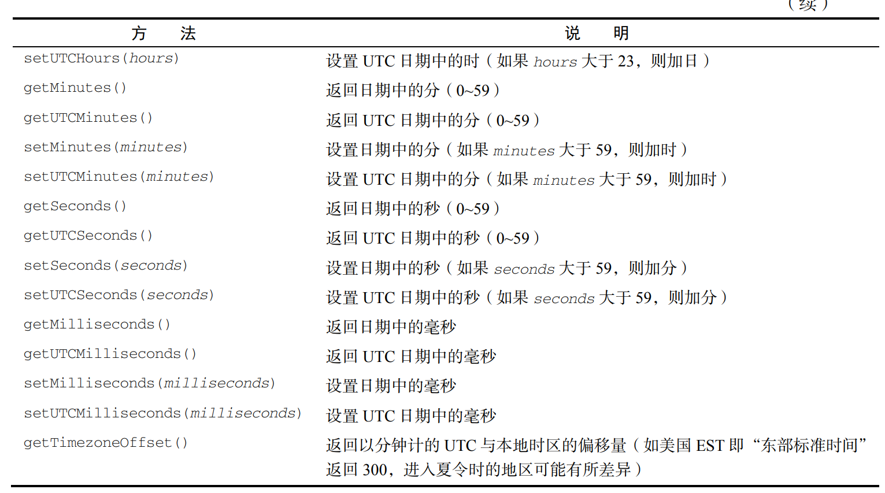
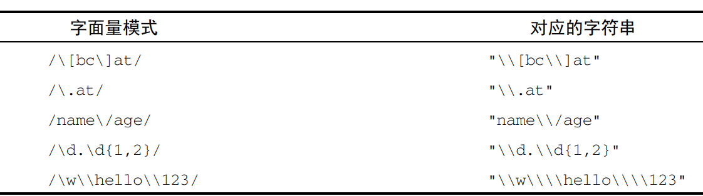

# 基本引用类型

 理解对象
 基本 JavaScript 数据类型
 原始值与原始值包装类型

讨论 JavaScript 所有内置的引用类型，如 Date、Regexp、原始类型及其包装类型。每种引用类型既有理论上的讲解，也有相关浏览器实现的剖析

构造函数就是用来创建新对象的函数，``let now = new Date();``Date这里就是构造函数，负责创建一个只有默认属性和方法的简单对象。ecmascript提供了很多像Date这样的原生引用类型，帮开发者实现任务。

函数也是一种引用类型，内容很多放在10章讲。

## Date

date类型将日期自动保存为UTC，Universal Time Coordinated格式，即自1970110000经过的毫秒数。使用这种，Date可以精确表示1970110000之前之后285616年的日期。为什么是285616年？？？

两个辅助方法：Date.parse()和 Date.UTC()。返回的是该日期的毫秒数。

```js
let someDate = new Date(Date.parse("May 23, 2019")); 
//上下两句等价
let someDate = new Date("May 23, 2019"); 
```

```js
// GMT 时间 2000 年 1 月    （1 日零点）默认是0
let y2k = new Date(Date.UTC(2000, 0)); 
// GMT 时间 2005 年 5 月 5 日下午 5 点 55 分 55 秒
let allFives = new Date(Date.UTC(2005, 4, 5, 17, 55, 55)); 
//上下同
// 本地时间 2000 年 1 月 1 日零点
let y2k = new Date(2000, 0); 
// 本地时间 2005 年 5 月 5 日下午 5 点 55 分 55 秒
let allFives = new Date(2005, 4, 5, 17, 55, 55);
```

### 继承的方法

Date类型重写了toLocaleString()、toString()和 valueOf()方法，分别返回与浏览器运行的本地环境一致的日期和时间、带时区信息的日期时间、

因Date的valueof不返回字符串，而是毫秒表示，所以能比大小。如下。也是确保日期先后的简单方式

```js
toLocaleString() - 2/1/2019 12:00:00 AM 
toString() - Thu Feb 1 2019 00:00:00 GMT-0800 (Pacific Standard Time)

let date1 = new Date(2019, 0, 1); // 2019 年 1 月 1 日
let date2 = new Date(2019, 1, 1); // 2019 年 2 月 1 日
console.log(date1 < date2); // true 
console.log(date1 > date2); // false 
```

### 日期格式化方法

 toDateString()显示日期中的周几、月、日、年（格式特定于实现）；

 toTimeString()显示日期中的时、分、秒和时区（格式特定于实现）；

 toLocaleDateString()显示日期中的周几、月、日、年（格式特定于实现和地区）；

 toLocaleTimeString()显示日期中的时、分、秒（格式特定于实现和地区）；

 toUTCString()显示完整的 UTC 日期（格式特定于实现）。
用这个不用toGMTstring（）

### 日期/时间组件方法




## RegExp

## 正则RegExp

Regular Expression

`RegExp`（正则表达式）是一种强大的文本模式匹配工具，用于在字符串中查找、匹配和操作特定模式的文本。正则表达式由一系列字符组成，形成一个搜索模式。它可以用于验证字符串的格式、搜索和替换特定文本，以及执行其他字符串处理操作。
`RegExp` 对象则是JavaScript中与正则表达式相关的对象。通过`RegExp`对象，你可以创建和操作正则表达式。`RegExp`对象有两种创建方式：

1. 字面量创建： 使用正斜杠`/`将正则表达式包裹起来，例如：`/pattern/`。

   ```javascript
   var pattern = /abc/;
   ```

2. 构造函数创建： 使用`RegExp`构造函数，传递一个字符串作为正则表达式的模式。

   ```javascript
   var pattern = new RegExp("abc");
   ```

比喻：想象你正在寻找一本书中的特定内容，而这本书是一本巨大的百科全书。正则表达式就像是你要查找的关键字，而`RegExp`对象就像是你用来查找的放大镜。

- 正则表达式（关键字）：比如你要查找书中所有包含关键字“JavaScript”的段落，这个关键字就是你的正则表达式。
- RegExp对象（放大镜）：`RegExp`对象就是你使用的工具，它帮助你在整本书中定位和匹配所有包含“JavaScript”关键字的部分。你可以使用不同的模式和选项，就像调整放大镜的焦距一样，以精准地找到你需要的内容。
总体而言，正则表达式和`RegExp`对象提供了一种强大的方式来处理字符串，就像你用放大镜在文本中查找特定内容一样。

```js
// 匹配字符串中的所有"at" 
let pattern1 = /at/g; 
// 匹配第一个"bat"或"cat"，忽略大小写
let pattern2 = /[bc]at/i; 
// 匹配所有以"at"结尾的三字符组合，忽略大小写
let pattern3 = /.at/gi;

// 匹配第一个"bat"或"cat"，忽略大小写
let pattern1 = /[bc]at/i; 
// 匹配第一个"[bc]at"，忽略大小写
let pattern2 = /\[bc\]at/i; 
// 匹配所有以"at"结尾的三字符组合，忽略大小写
let pattern3 = /.at/gi; 
// 匹配所有".at"，忽略大小写
let pattern4 = /\.at/gi; 

// 匹配第一个"bat"或"cat"，忽略大小写
let pattern1 = /[bc]at/i; 
// 跟 pattern1 一样，只不过是用构造函数创建的
let pattern2 = new RegExp("[bc]at", "i");

// 匹配第一个"bat"或"cat"，忽略大小写
let pattern1 = /[bc]at/i; 
// 跟 pattern1 一样，只不过是用构造函数创建的
let pattern2 = new RegExp("[bc]at", "i"); 
```



```js
//使用regexp也可以修改正则
const re1 = /cat/g; 
console.log(re1); // "/cat/g" 
const re2 = new RegExp(re1); 
console.log(re2); // "/cat/g" 
const re3 = new RegExp(re1, "i"); 
console.log(re3); // "/cat/i"```
```

### RegExp实例属性

```js
let pattern1 = /\[bc\]at/i; 
console.log(pattern1.global); // false 
console.log(pattern1.ignoreCase); // true 
console.log(pattern1.multiline); // false 
console.log(pattern1.lastIndex); // 0 
console.log(pattern1.source); // "\[bc\]at" 
console.log(pattern1.flags); // "i" 

let pattern2 = new RegExp("\\[bc\\]at", "i"); 

console.log(pattern2.global); // false 
console.log(pattern2.ignoreCase); // true 
console.log(pattern2.multiline); // false 
console.log(pattern2.lastIndex); // 0 
console.log(pattern2.source); // "\[bc\]at" 
console.log(pattern2.flags); // "i"
```

global：布尔值 g 标记。
 ignoreCase：布尔值 i 标记。
 unicode：布尔值 u 标记。
 sticky：布尔值 y 标记。
 lastIndex：整数，表示在源字符串中下一次搜索的开始位置，始终从 0 开始。
 multiline：布尔值 m 标记。
 dotAll：布尔值 s 标记。
 source：正则表达式的字面量字符串（不是传给构造函数的模式字符串），没有开头和结尾的斜杠。
 flags：正则表达式的标记字符串。始终以字面量而非传入构造函数的字符串模式形式返回（没有前后斜杠）

实际开发中用的不多

### RegExp实例方法

主要是exec（），execute，主要用于配合捕获组match使用。找到匹配项，返回匹配信息的第一个数组；没找到，null

```js
let text = "mom and dad and baby"; 
let pattern = /mom( and dad( and baby)?)?/gi; 
let matches = pattern.exec(text); 
console.log(matches.index); // 0 
console.log(matches.input); // "mom and dad and baby" 
console.log(matches[0]); // "mom and dad and baby" 
console.log(matches[1]); // " and dad and baby" 
console.log(matches[2]); // " and baby"
```

1. - 创建了一个包含字符串 "mom and dad and baby" 的文本。比喻：  - 就像有一段包含家庭关系的文本。

1. - 创建了一个正则表达式模式。
   - 正则表达式的模式是：以 "mom" 开头，后面可以有可选部分 "and dad"，再后面可以有可选部分 "and baby"。整个模式是不区分大小写的，全局匹配。
   比喻：  - 就像有一个家庭模式，可以是 "mom"，也可以是 "mom and dad"，还可以是 "mom and dad and baby"。

1. - 使用正则表达式模式对文本进行匹配，并将结果存储在 `matches` 中。
   - `exec` 方法返回一个数组，其中包含匹配的结果。
   比喻：   - 就像在文本中找到了符合家庭模式的部分，并把这个部分的信息存储在了 `matches` 中。

1. - 打印匹配结果的起始位置。
   比喻： - 就像找到的家庭关系在文本中的起始位置是在第一个字符处。

1. - 打印匹配的整个文本。
   比喻： - 就像打印了整段文本，显示了整个家庭关系的内容。

1.- 打印匹配的第一个子字符串。
   比喻：- 就像打印了找到的家庭关系中的第一个部分，即整个家庭关系。

1. - 打印匹配的第一个捕获组（在括号内的部分）。
   比喻：- 就像打印了找到的家庭关系中的第一个捕获组，即 " and dad and baby" 部分。

1. - 打印匹配的第二个捕获组。
   比喻：- 就像打印了找到的家庭关系中的第二个捕获组，即 " and baby" 部分。

功能说明：这段代码使用正则表达式来匹配包含家庭关系的文本。通过使用捕获组，可以分别获取整个匹配结果、第一个捕获组和第二个捕获组的内容。这种正则表达式模式在匹配不同家庭结构的文本时非常灵活。比如，在匹配结果中，`matches[0]` 包含了整个匹配结果，`matches[1]` 包含了第一个捕获组的内容，以此类推。

```js
let text = "cat, bat, sat, fat"; 
let pattern = /.at/; 
let matches = pattern.exec(text); 
console.log(matches.index); // 0 
console.log(matches[0]); // cat 
console.log(pattern.lastIndex); // 0 
matches = pattern.exec(text); 
console.log(matches.index); // 0 
console.log(matches[0]); // cat 
console.log(pattern.lastIndex); // 0 
//这是没设全局即没g的情况,就会从头开始读,只会读第一个匹配的.lastindex也是0
```

```js
let text = "cat, bat, sat, fat"; 
let pattern = /.at/g; 
let matches = pattern.exec(text); 
console.log(matches.index); // 0 
console.log(matches[0]); // cat 
console.log(pattern.lastIndex); // 3 
matches = pattern.exec(text); 
console.log(matches.index); // 5 
console.log(matches[0]); // bat 
console.log(pattern.lastIndex); // 8 
matches = pattern.exec(text); 
console.log(matches.index); // 10 
console.log(matches[0]); // sat 
console.log(pattern.lastIndex); // 13 
//设置了全局标记,就会是无0数法的开始数儿和结束数儿加一
```

```js
let text = "cat, bat, sat, fat"; 
let pattern = /.at/y; 
let matches = pattern.exec(text); 
console.log(matches.index); // 0 
console.log(matches[0]); // cat 
console.log(pattern.lastIndex); // 3 
// 以索引 3 对应的字符开头找不到匹配项，因此 exec()返回 null 
// exec()没找到匹配项，于是将 lastIndex 设置为 0 
matches = pattern.exec(text); 
console.log(matches); // null 
console.log(pattern.lastIndex); // 0 
// 向前设置 lastIndex 可以让粘附的模式通过 exec()找到下一个匹配项：
pattern.lastIndex = 5; 
matches = pattern.exec(text); 
console.log(matches.index); // 5 
console.log(matches[0]); // bat 
console.log(pattern.lastIndex); // 8 
//lastindex可以想象是光标在无0计数法下第8个后面
```

```js
let text = "000-00-0000"; 
let pattern = /\d{3}-\d{2}-\d{4}/; 
if (pattern.test(text)) { 
 console.log("The pattern was matched."); 
} 
//正则的另一方法test,多用于严重用户输入的信息.这个正则表达式用于匹配美国社会安全号码（Social Security Number，简称 SSN）的模式。下面是对每个部分的逐词解释：
// 1. `/\d{3}`：`/` 是正则表达式的起始和结束符号，`\d` 表示匹配任意一个数字字符，`{3}` 表示匹配前面的 `\d` 恰好三次。因此，`\d{3}` 匹配三个数字字符。
// 2. `-`：匹配一个连字符 `-`，表示 SSN 中的第一个分隔符。
// 3. `\d{2}`：同样是匹配两个数字字符。
// 4. `-`：匹配第二个连字符 `-`。
// 5. `\d{4}`：匹配四个数字字符。
// 因此，这个正则表达式可以有效地匹配美国社会安全号码的标准格式，即 `###-##-####`，其中 `#` 代表数字字符。
```

以下也是match实例,用于匹配邮箱地址的模式,这个正则表达式可以有效地匹配符合标准格式的电子邮件地址。

```javascript
var emailPattern = /^\w+([\.-]?\w+)*@\w+([\.-]?\w+)*(\.\w{2,3})+$/;
var email = "example@example.com";
var isMatch = emailPattern.test(email);
console.log(isMatch); // 输出 true
```

1. `^`：表示匹配输入的开始位置，确保电子邮件地址从字符串的开头开始。
2. `\w+`：匹配一个或多个字母、数字或下划线字符，表示电子邮件地址的用户名部分，用户名必须至少包含一个字符。
3. `([\.-]?\w+)*`：这部分用于匹配用户名中的可能的特殊字符（点号`.`和连字符`-`），以及后续的字母、数字或下划线字符。`*`表示可以重复零次或多次。
4. `@`：匹配邮箱地址中的 "@" 符号，表示用户名和域名之间的分隔。
5. `\w+`：匹配一个或多个字母、数字或下划线字符，表示域名的第一部分。
6. `([\.-]?\w+)*`：这部分用于匹配域名中的可能的特殊字符（点号`.`和连字符`-`），以及后续的字母、数字或下划线字符。`*`表示可以重复零次或多次。
7. `(\.\w{2,3})+`：匹配顶级域名（TLD），即域名的最后一部分。`\.\w{2,3}` 匹配一个点号`.`后跟两到三个字母的字符，表示常见的顶级域名，例如`.com`、`.net`等。`+` 表示可以重复一次或多次，以匹配可能的子域名和顶级域名的组合。
8. `$`：表示匹配输入的结束位置，确保电子邮件地址以正确的顶级域名结尾。

```js
let pattern = new RegExp("\\[bc\\]at", "gi"); 
console.log(pattern.toString()); // /\[bc\]at/gi 
console.log(pattern.toLocaleString()); // /\[bc\]at/gi
//用于匹配字符串中的 `[bc]at` 或 `[BC]at`。
```

### RegExp构造函数属性

regexp本身也有几个属性/静态属性.

```js
let text = "this has been a short summer"; 
let pattern = /(.)hort/g; 
if (pattern.test(text)) { 
 console.log(RegExp.input); // this has been a short summer  $_ 是简写,最后搜索的字符串
 console.log(RegExp.leftContext); // this has been a  $` 是简写,lastmatch前的文本
 console.log(RegExp.rightContext); // summer $' 是简写,lastmatch后的文本
 console.log(RegExp.lastMatch); // short $&简写,最后匹配的文本
 console.log(RegExp.lastParen); // s  $+简写,最后匹配的捕获组
} 
```

以上等同于下面的示例

```js
let text = "this has been a short summer"; 
let pattern = /(.)hort/g; 
/* 
 * 注意：Opera 不支持简写属性名
 * IE 不支持多行匹配
 */ 
if (pattern.test(text)) { 
 console.log(RegExp.$_); // this has been a short summer 
 console.log(RegExp["$`"]); // this has been a 
 console.log(RegExp["$'"]); // summer 
 console.log(RegExp["$&"]); // short 
 console.log(RegExp["$+"]); // s 
}
// sh：RegExp.$1 是一个 JavaScript 内置属性，表示最近一次成功匹配的第一个捕获组（即模式中第一个括号内的内容）。在这里，打印出的是匹配成功的文本中第一个捕获组的内容，即 sh。
 // t：类似地，RegExp.$2 表示最近一次成功匹配的第二个捕获组（即模式中第二个括号内的内容）。在这里，打印出的是匹配成功的文本中第二个捕获组的内容，即 t。
```

RegExp 构造函数的所有属性都没有任何 Web 标准出处，因此不要在生产环境中使用它们。  什么意思???为什么???

### 模式局限

正则有些特性还未得到ecmascript的支持,虽然已经很强了.可以参考Regular-Expressions.info网站

## 原始值包装类型

对于操作原始值的功能是很重要的.每个原始值包装类型都有相应的一套方法来方便数据操作。 这是干什么的,怎么玩不清楚!?????

```js
let s1 = "some text"; 
let s2 = s1.substring(2);
//等价于下面
let s1 = new String("some text"); 
let s2 = s1.substring(2); 
s1 = null; 
//但是下面的是不可行的,因为不能在运行时给原始值添加属性和方法
let s1 = "some text"; 
s1.color = "red"; 
console.log(s1.color); // undefined
```

### Boolean

是对应布尔值的引用类型。

```js
let falseObject = new Boolean(false); 
let result = falseObject && true; 
console.log(result); // true 
let falseValue = false; 
result = falseValue && true; 
console.log(result); // false 
//所有对象在布尔表达式中都会自动转换为 true，因此 falseObject 在这个表达式里实际上表示一个 true 值。

console.log(typeof falseObject); // object 
console.log(typeof falseValue); // boolean 
console.log(falseObject instanceof Boolean); // true 
console.log(falseValue instanceof Boolean); // false
//布尔值和Boolean对象之间的区别很重要,不建议使用后者,即只用布尔值
```

### Number

是对应数值的引用类型。要创一个Number对象,就用它构造函数并传入一个数值,``let numberObject = new Number(10);``.与 Boolean 类型一样，Number 类型重写了 valueOf()、toLocaleString()和 toString()方法。

```js
let num = 10; 
console.log(num.toString()); // "10" 
console.log(num.toString(2)); // "1010" 二进制
console.log(num.toString(8)); // "12" 
console.log(num.toString(10)); // "10" 
console.log(num.toString(16)); // "a" 

console.log(num.toFixed(2)); // "10.00" 表明接受了参数2,即返回的数值要包含两位小数.下面的例子表示超过了指定位数要四舍五入
let num = 10.005; 
console.log(num.toFixed(2)); // "10.01"
```

```js
//另一个格式化数值的方法
let num = 10; 
console.log(num.toExponential(1)); // "1.0e+1"

//返回数值最适当的形式,即从toFixed()和toExponential()中间挑一种
let num = 99; 
console.log(num.toPrecision(1)); // "1e+2" 一位数字表示
console.log(num.toPrecision(2)); // "99" 
console.log(num.toPrecision(3)); // "99.0"
```

三个方法都会向上/下舍入

```js
let numberObject = new Number(10); 
let numberValue = 10; 
console.log(typeof numberObject); // "object" 
console.log(typeof numberValue); // "number" 
console.log(numberObject instanceof Number); // true 
console.log(numberValue instanceof Number); // false
//Number对象是 Number 类型的实例，而原始数值不是。
```

isInteger()方法辨别一个数值是否保存为整数

```js
console.log(Number.isInteger(1)); // true 
console.log(Number.isInteger(1.00)); // true 
console.log(Number.isInteger(1.01)); // false 
```

```js
//以下是查看是否是安全整数的方法.安全整数的范围是2的53次幂到-2的53次幂,不包含两个端点.
console.log(Number.isSafeInteger(-1 * (2 ** 53))); // false 
console.log(Number.isSafeInteger(-1 * (2 ** 53) + 1)); // true 
console.log(Number.isSafeInteger(2 ** 53)); // false 
console.log(Number.isSafeInteger((2 ** 53) - 1)); // true
```

### String

```js
let stringValue = "hello world"; 
console.log(stringValue.length); // "11"
//每个String对象都有以一个length属性
```

#### js字符

```js
//查找指定索引位置的16位码元
let message = "abcde"; 
console.log(message.charAt(2)); // "c"
```

```js
//查看指定码元的字符编码
let message = "abcde"; 
// Unicode "Latin small letter C"的编码是 U+0063 
console.log(message.charCodeAt(2)); // 99 
// 十进制 99 等于十六进制 63 
console.log(99 === 0x63); // true
```

```js
//用给定的utf-16码元创建字符串中的字符

// Unicode "Latin small letter A"的编码是 U+0061 
// Unicode "Latin small letter B"的编码是 U+0062 
// Unicode "Latin small letter C"的编码是 U+0063 
// Unicode "Latin small letter D"的编码是 U+0064 
// Unicode "Latin small letter E"的编码是 U+0065 
console.log(String.fromCharCode(0x61, 0x62, 0x63, 0x64, 0x65)); // "abcde" 
// 0x0061 === 97 
// 0x0062 === 98 
// 0x0063 === 99 
// 0x0064 === 100 
// 0x0065 === 101 
console.log(String.fromCharCode(97, 98, 99, 100, 101)); // "abcde" 
```

```js
//Unicode增补字符平面,下面是使用代理对编码的字符

// "smiling face with smiling eyes" 表情符号的编码是 U+1F60A 
// 0x1F60A === 128522 
let message = "ab☺de"; 
console.log(message.length); // 6 
console.log(message.charAt(1)); // b
console.log(message.charAt(2)); // <?> 
console.log(message.charAt(3)); // <?> 
console.log(message.charAt(4)); // d 

console.log(message.charCodeAt(1)); // 98 
console.log(message.charCodeAt(2)); // 55357 
console.log(message.charCodeAt(3)); // 56842 
console.log(message.charCodeAt(4)); // 100 

console.log(String.fromCodePoint(0x1F60A)); // ☺

console.log(String.fromCharCode(97, 98, 55357, 56842, 100, 101)); // ab☺de 
```

```js
//为解析同时含码元字符和代理字符的字符串,用codePointAt()来代替charCodeAt()
let message = "ab☺de"; 

console.log(message.codePointAt(1)); // 98 
console.log(message.codePointAt(2)); // 128522 
console.log(message.codePointAt(3)); // 56842 
console.log(message.codePointAt(4)); // 100 
```

```js
console.log(String.fromCharCode(97, 98, 55357, 56842, 100, 101)); // ab☺de 
console.log(String.fromCodePoint(97, 98, 128522, 100, 101)); // ab☺de 
```

#### normalize()方法

```js
// U+00C5：上面带圆圈的大写拉丁字母 A 
console.log(String.fromCharCode(0x00C5)); // Å 
// U+212B：长度单位“埃”
console.log(String.fromCharCode(0x212B)); // Å 
// U+004：大写拉丁字母 A 
// U+030A：上面加个圆圈
console.log(String.fromCharCode(0x0041, 0x030A)); // Å
```

```js
let a1 = String.fromCharCode(0x00C5), 
 a2 = String.fromCharCode(0x212B), 
 a3 = String.fromCharCode(0x0041, 0x030A); 
console.log(a1, a2, a3); // Å, Å, Å 
console.log(a1 === a2); // false 
console.log(a1 === a3); // false 
console.log(a2 === a3); // false比较操作符不管你的样子
```

```js
let a1 = String.fromCharCode(0x00C5), 
 a2 = String.fromCharCode(0x212B), 
 a3 = String.fromCharCode(0x0041, 0x030A); 
// U+00C5 是对 0+212B 进行 NFC/NFKC 规范化之后的结果
console.log(a1 === a1.normalize("NFD")); // false 
console.log(a1 === a1.normalize("NFC")); // true 
console.log(a1 === a1.normalize("NFKD")); // false 
console.log(a1 === a1.normalize("NFKC")); // true 
// U+212B 是未规范化的
console.log(a2 === a2.normalize("NFD")); // false 
console.log(a2 === a2.normalize("NFC")); // false 
console.log(a2 === a2.normalize("NFKD")); // false 
console.log(a2 === a2.normalize("NFKC")); // false 
// U+0041/U+030A 是对 0+212B 进行 NFD/NFKD 规范化之后的结果
console.log(a3 === a3.normalize("NFD")); // true 
console.log(a3 === a3.normalize("NFC")); // false 
console.log(a3 === a3.normalize("NFKD")); // true 
console.log(a3 === a3.normalize("NFKC")); // false 
```

```js
//同一种规范化形式可以让上3个全等成立
let a1 = String.fromCharCode(0x00C5), 
 a2 = String.fromCharCode(0x212B), 
 a3 = String.fromCharCode(0x0041, 0x030A); 
console.log(a1.normalize("NFD") === a2.normalize("NFD")); // true 
console.log(a2.normalize("NFKC") === a3.normalize("NFKC")); // true 
console.log(a1.normalize("NFC") === a3.normalize("NFC")); // true
```

#### 字符串操作方法

几个操作字符串的方法

```js
//不改变的情况下拼接
let stringValue = "hello "; 
let result = stringValue.concat("world"); 
console.log(result); // "hello world" 
console.log(stringValue); // "hello" 

//还可以拼接多个
let stringValue = "hello "; 
let result = stringValue.concat("world", "!"); 
console.log(result); // "hello world!" 
console.log(stringValue); // "hello" 
```

```js
//slice()、substr()和 substring()方法.省略第二个参数都意味着提取到字符串末尾.3是开始(取),7是截止(不取).
let stringValue = "hello world"; 
console.log(stringValue.slice(3)); // "lo world" 
console.log(stringValue.substring(3)); // "lo world" 
console.log(stringValue.substr(3)); // "lo world" 
console.log(stringValue.slice(3, 7)); // "lo w" 截取
console.log(stringValue.substring(3,7)); // "lo w" 截取
console.log(stringValue.substr(3, 7)); // "lo worl"
//也是截取,但是规则有变.对于substr,7表示取7个字符!!!
```

```js
//当参数是负值时,又有不同!
let stringValue = "hello world"; 
console.log(stringValue.slice(-3)); // "rld" 相当于11-3即8
console.log(stringValue.substring(-3)); // "hello world"  -3会变成0
console.log(stringValue.substr(-3)); // "rld" 相当于11-3即8


console.log(stringValue.slice(3, -4)); // "lo w" 即3,7
console.log(stringValue.substring(3, -4)); // "hel" -4变0 相当于3,0 即0,3
console.log(stringValue.substr(3, -4)); // "" (empty string) 相当于3,0  即截取长度为0 返回空串
```

#### 字符串位置方法

```js
//定位字串的方法。没找到，返回-1。一个是从头搜，一个是从末尾搜
let stringValue = "hello world"; 
console.log(stringValue.indexOf("o")); // 4 
console.log(stringValue.lastIndexOf("o")); // 7 

//第二个参数意思是搜的时候，从标记处操作。indexof就是从第6个即w后开始搜；lastindexof就是从w处往前搜o，即返回4
let stringValue = "hello world"; 
console.log(stringValue.indexOf("o", 6)); // 7 
console.log(stringValue.lastIndexOf("o", 6)); // 4
```

```js
//运用循环在字符串中找到所有目标字串位置，并把位置push给建的数值中
let stringValue = "Lorem ipsum dolor sit amet, consectetur adipisicing elit"; 
let positions = new Array(); 
let pos = stringValue.indexOf("e"); 
while(pos > -1) { 
 positions.push(pos); 
 pos = stringValue.indexOf("e", pos + 1); 
} 
console.log(positions); // [3,24,32,35,52]
```

#### 字符串包含方法

```js

let message = "foobarbaz"; 
console.log(message.startsWith("foo")); // true 
console.log(message.startsWith("bar")); // false 

console.log(message.endsWith("baz")); // true 
console.log(message.endsWith("bar")); // false 

console.log(message.includes("bar")); // true 
console.log(message.includes("qux")); // false 
console.log(message.includes("oba")); // true
```

```js
//startwith和includes的第二参数表示从参数标识的地方开始搜
let message = "foobarbaz"; 

console.log(message.startsWith("foo")); // true 
console.log(message.startsWith("foo", 1)); // false 

console.log(message.includes("bar")); // true 
console.log(message.includes("bar", 4)); // false 

//而endwith的第二参数表示到此为止，规定了搜索的末尾
let message = "foobarbaz"; 
console.log(message.endsWith("bar")); // false 
console.log(message.endsWith("bar", 6)); // true
```

#### trim（）方法

即删除字符串中空格的方法。trimLeft()和 trimRight()方法分别用于从字符串开始和末尾清理空格符。不影响原始字符串。

```js
let stringValue = " hello world "; 
let trimmedStringValue = stringValue.trim(); 
console.log(stringValue); // " hello world " 
console.log(trimmedStringValue); // "hello world" 
```

#### repeat（）方法

就是复制，加空格的复制，复制完可以看情况拼接

```js
let stringValue = "na "; 
console.log(stringValue.repeat(16) + "batman"); 
// na na na na na na na na na na na na na na na na batman 
```

#### padStart()和 padEnd()方法

即前置填充和后置填充

```js
let stringValue = "foo"; 
console.log(stringValue.padStart(6)); // " foo" 
console.log(stringValue.padStart(9, ".")); // "......foo" 
console.log(stringValue.padEnd(6)); // "foo " 
console.log(stringValue.padEnd(9, ".")); // "foo......" 
```

```js
//填够长度即不再填；目标长度比原始长度短，不做更改
let stringValue = "foo"; 
console.log(stringValue.padStart(8, "bar")); // "barbafoo" 
console.log(stringValue.padStart(2)); // "foo" 
console.log(stringValue.padEnd(8, "bar")); // "foobarba" 
console.log(stringValue.padEnd(2)); // "foo" 
```

#### 字符串迭代与解构

```js
let message = "abc"; 
let stringIterator = message[Symbol.iterator](); 
console.log(stringIterator.next()); 
// {value: "a", done: false} 第一次调用时，返回的是字符串中的第一个字符 "a"，并且 done 属性为 false，表示迭代尚未结束。
console.log(stringIterator.next()); // {value: "b", done: false} 
console.log(stringIterator.next()); // {value: "c", done: false} 
console.log(stringIterator.next()); // {value: undefined, done: true}
```

```js
//遍历字符串中的字符，在c中保存
for (const c of "abcde") { 
 console.log(c); 
} 
// a 
// b 
// c 
// d 
// e
```

```js
//使用扩展运算符 ... 将字符串 message 转换为一个包含每个字符的数组。扩展运算符 ... 将字符串中的每个字符作为单独的数组元素，并将这些元素放入一个新的数组中。
let message = "abcde"; 
console.log([...message]); // ["a", "b", "c", "d", "e"]
```

#### 字符串大小写和转换

```js
//通常，如果不知道代码涉及什么语言，则最好使用地区特定的转换方法。
let stringValue = "hello world"; 
console.log(stringValue.toLocaleUpperCase()); // "HELLO WORLD" 
console.log(stringValue.toUpperCase()); // "HELLO WORLD" 
console.log(stringValue.toLocaleLowerCase()); // "hello world" 
console.log(stringValue.toLowerCase()); // "hello world" 
```

#### 字符串模式匹配方法

两种：一个是match（）方法

```js
let text = "cat, bat, sat, fat"; 
let pattern = /.at/; 
// 等价于 pattern.exec(text) 
let matches = text.match(pattern); 
console.log(matches.index); // 0 
console.log(matches[0]); // "cat" 
console.log(pattern.lastIndex); // 0 
```

另一个是search（）方法

```js
let text = "cat, bat, sat, fat"; 
let pos = text.search(/at/); 
console.log(pos); // 1 
//这里，search(/at/)返回 1，即"at"的第一个字符在字符串中的位置。如果是/ba/，会返回5，注意bat前有空格
```

replace（）方法

```js
let text = "cat, bat, sat, fat"; 
let result = text.replace("at", "ond"); 
console.log(result); // "cond, bat, sat, fat" 
//没有正则加全局标记

//必须正则加全局标记，才能全换
result = text.replace(/at/g, "ond"); 
console.log(result); // "cond, bond, sond, fond" 
```

```js
//$1用抓捕到的替换
let text = "cat, bat, sat, fat"; 
result = text.replace(/(.at)/g, "word ($1)"); 
console.log(result); // word (cat), word (bat), word (sat), word (fat)
```

```js
//replace第二个参数是函数=更细致控制替换过程
function htmlEscape(text) { 
 return text.replace(/[<>"&]/g, function(match, pos, originalText) { 
 switch(match) { 
 case "<": 
 return "&lt;"; 
 case ">": 
 return "&gt;"; 
 case "&": 
 return "&amp;"; 
 case "\"": 
 return "&quot;"; 
 } 
 }); 
} 
console.log(htmlEscape("<p class=\"greeting\">Hello world!</p>")); 
// "&lt;p class=&quot;greeting&quot;&gt;Hello world!</p>" 
```

定义了一个函数 `htmlEscape(text)`，用于将字符串中的特殊字符 `<`, `>`, `&`, `"` 转换为 HTML 实体编码，以防止 XSS（跨站脚本攻击）等安全问题。

1. `function htmlEscape(text) {`：定义了一个名为 `htmlEscape` 的函数，接受一个参数 `text`，表示待转换的字符串。
2. `return text.replace(/[<>"&]/g, function(match, pos, originalText) {`：使用字符串的 `replace()` 方法，将字符串中的特殊字符替换为 HTML 实体编码。`/[<>"&]/g` 是一个正则表达式，用于匹配字符串中的 `<`, `>`, `&`, `"` 这几个字符。`g` 表示全局匹配，即匹配到所有符合条件的字符。匹配到的每个字符都会调用一个回调函数来进行替换。
3. `switch(match) {`：在回调函数中使用 switch 语句，根据匹配到的字符进行不同的替换操作。
4. `case "<": return "&lt;";`：如果匹配到的字符是 `<`，则将其替换为 `&lt;`，表示 HTML 实体编码中的小于号。
5. `case ">": return "&gt;";`：如果匹配到的字符是 `>`，则将其替换为 `&gt;`，表示 HTML 实体编码中的大于号。
6. `case "&": return "&amp;";`：如果匹配到的字符是 `&`，则将其替换为 `&amp;`，表示 HTML 实体编码中的与号。
7. `case "\"": return "&quot;";`：如果匹配到的字符是 `"`，则将其替换为 `&quot;`，表示 HTML 实体编码中的双引号。
8. `});`：结束回调函数。
9. `console.log(htmlEscape("<p class=\"greeting\">Hello world!</p>"));`：调用 `htmlEscape()` 函数，将 `<p class="greeting">Hello world!</p>` 作为参数传入，并打印转换后的结果。
10. 输出结果为：`"&lt;p class=&quot;greeting&quot;&gt;Hello world!&lt;/p&gt;"`。表示原始字符串中的特殊字符已经被替换为了 HTML 实体编码。

split（）方法，根据字符串中的分隔符拆分数组。

```js
let colorText = "red,blue,green,yellow"; 
let colors1 = colorText.split(","); // ["red", "blue", "green", "yellow"] 
let colors2 = colorText.split(",", 2); // ["red", "blue"] 两个元素
let colors3 = colorText.split(/[^,]+/); // ["", ",", ",", ",", ""] 包含前后两个空字符串，开头的和末尾的。
```

#### localeCompare（）方法

按字母表顺序进行比较。区分大小写，大写排在小写前。

```js
let stringValue = "yellow"; 
console.log(stringValue.localeCompare("brick")); // 1前字符串字母位置靠后 
console.log(stringValue.localeCompare("yellow")); // 0 
console.log(stringValue.localeCompare("zoo")); // -1 前字符串字母位置靠前
```

最好用下面的方法

```js
let stringValue = "yellow"; 
function determineOrder(value) { 
 let result = stringValue.localeCompare(value); 
 if (result < 0) { 
 console.log(`The string 'yellow' comes before the string '${value}'.`); 
 } else if (result > 0) { 
 console.log(`The string 'yellow' comes after the string '${value}'.`); 
 } else { 
 console.log(`The string 'yellow' is equal to the string '${value}'.`); 
 } 
} 
determineOrder("brick"); 
determineOrder("yellow"); 
determineOrder("zoo"); 
```

#### HTML方法

辅助生成HTML标签的方法。基本不用了。

```js
anchor(name)  <a name="name">string</a>
big()         <big>string</big>
bold()        <b>string</b>
fixed()       <tt>string</tt>
fontcolor(color) <font color="color">string</font>
fontsize(size) <font size="size">string</font>
italics()     <i>string</i>
link(url)     <a href="url">string</a>
small()       <small>string</small>
strike()      <strike>string</strike>
sub()         <sub>string</sub>
sup()         <sup>string</sup>
```

## 单例内置对象

已经实例花好了。前面我们已经接触了大部分内置对象，包括 Object、Array 和 String。本节介绍 ECMA-262
定义的另外两个单例内置对象：Global 和 Math

### Global

isNaN()、isFinite()、parseInt()和 parseFloat()都是 Global 对象的方法，还有另外一些方法

#### URL编码方法

```js
//以下两个方法都用于编码 统一资源标识符URI，传给浏览器/浏览器能理解的形式
let uri = "http://www.wrox.com/illegal value.js#start"; 
 
console.log(encodeURI(uri)); 
//整个，只动空格。 "http://www.wrox.com/illegal%20value.js#start"

console.log(encodeURIComponent(uri));
// "http%3A%2F%2Fwww.wrox.com%2Fillegal%20value.js%23start" 所有非字母都动，所以一般用于对 URL 的一部分（比如查询字符串参数）进行编码，对所有的特殊字符都进行编码
```

#### eval（）方法

接受一个要执行的字符串,它是一个完整的ecmascript解释器.极为慎重,小心xss攻击.

```js
eval("console.log('hi')"); 
//上面这行代码的功能与下一行等价：
console.log("hi"); 
```

```js
let msg = "hello world"; 
eval("console.log(msg)"); // "hello world" 
//上下相比较,体会
eval("let msg = 'hello world';"); 
console.log(msg); // Reference Error: msg is not defined 
//（）方法定义的任何变量和函数都不会被提升.只在eval执行的时候才会被创建
"use strict"; 
eval = "hi"; // ,严格模式下,eval会导致错误
```

#### Global对象属性

```js
undefined  特殊值 undefined
NaN        特殊值 NaN
Infinity   特殊值 Infinity
Object     Object 的构造函数
Array      Array 的构造函数
Function   Function 的构造函数
Boolean    Boolean 的构造函数
String     String 的构造函数
Number     Number 的构造函数
Date       Date 的构造函数
RegExp     RegExp 的构造函数
Symbol     Symbol 的伪构造函数
Error      Error 的构造函数
EvalError  EvalError 的构造函数
RangeError RangeError 的构造函数
ReferenceError ReferenceError 的构造函数
SyntaxError    SyntaxError 的构造函数
TypeError      TypeError 的构造函数
URIError       URIError 的构造函数
```

#### window对象

```js
var color = "red"; 
function sayColor() { 
 console.log(window.color); 
 //全局变量变成了 window 的属性
} 
window.sayColor(); // "red"
```

以上是一种获取Global对象的方式,另一种如下

```js
let global = function() { 
 return this; 
}(); 
//调用一个简单返回this函数是在执行上下文
```

当一个函数在没有明确（通过成为某个对象的方法，或者通过 call()/apply()）指定 this 值的情况下执行时，this 值等于
Global 对象。什么意思????

### Math

math对象提供了作为保存数学公式、信息和计算的地方

#### Math对象属性

```js
Math.E        自然对数的基数 e 的值
Math.LN10     10为底的自然对数
Math.LN2      2为底的自然对数
Math.LOG2E    以 2 为底 e 的对数
Math.LOG10E   以 10 为底 e 的对数
Math.PI       π 的值
Math.SQRT1_2  1/2 的平方根
Math.SQRT2    2的平方根
```

#### min()和max()方法

```js
let max = Math.max(3, 54, 32, 16); 
console.log(max); // 54 
let min = Math.min(3, 54, 32, 16); 
console.log(min); // 3 
//省去了用循环来找最大小值
```

```js
let values = [1, 2, 3, 4, 5, 6, 7, 8]; 
let max = Math.max(...values);
//...是扩展运算符
```

#### 舍入方法

四个:Math.ceil()、Math.floor()、Math.round()
和 Math.fround()

```js
// Math.ceil()方法始终向上舍入为最接近的整数。
//  Math.floor()方法始终向下舍入为最接近的整数。
//  Math.round()方法执行四舍五入。
//  Math.fround()方法返回数值最接近的单精度（32 位）浮点值表示。
console.log(Math.ceil(25.9)); // 26 
console.log(Math.ceil(25.5)); // 26 
console.log(Math.ceil(25.1)); // 26 

console.log(Math.round(25.9)); // 26 
console.log(Math.round(25.5)); // 26 
console.log(Math.round(25.1)); // 25 

console.log(Math.fround(0.4)); // 0.4000000059604645 
console.log(Math.fround(0.5)); // 0.5 
console.log(Math.fround(25.9)); // 25.899999618530273 

console.log(Math.floor(25.9)); // 25 
console.log(Math.floor(25.5)); // 25 
console.log(Math.floor(25.1)); // 25
```

#### random()方法

Math.random()方法返回一个 0~1 范围内的随机数，其中包含 0 但不包含 1。

```js
number = Math.floor(Math.random() * total_number_of_choices + first_possible_value) 
//可选总数（total_number_of_choices）是  ，而最小可能的值（first_possible_value）是  。

let num = Math.floor(Math.random() * 10 + 1);
//1到10范围内随机数,最小值1

let num = Math.floor(Math.random() * 9 + 2);
//2到10共9个数
```

```js
function selectFrom(lowerValue, upperValue) { 
 let choices = upperValue - lowerValue + 1; 
 return Math.floor(Math.random() * choices + lowerValue); 
} 
let num = selectFrom(2,10); 
console.log(num); // 2~10 范围内的值，其中包含 2 和 10 
//和下面的配套使用.即用mathrandom写一个selectfrom函数
let colors = ["red", "green", "blue", "yellow", "black", "purple", "brown"]; 
let color = colors[selectFrom(0, colors.length-1)];
```

如果是为了加密而需要生成随机数（传给生成器的输入需要较高的不确定性），那么建议使用 window.crypto.getRandomValues().

#### 其它方法

```js
Math.abs(x)    返回 x 的绝对值
Math.exp(x)    返回 Math.E 的 x 次幂
Math.expm1(x)  等于 Math.exp(x) - 1
Math.log(x)    返回 x 的自然对数
Math.log1p(x)  等于 1 + Math.log(x)
Math.pow(x, power) 返回 x 的 power 次幂
Math.hypot(...nums) 返回 nums 中每个数平方和的平方根
Math.clz32(x)  返回 32 位整数 x 的前置零的数量
Math.sign(x)   返回表示 x 符号的 1、0、-0 或-1
Math.trunc(x)  返回 x 的整数部分，删除所有小数
Math.sqrt(x)   返回 x 的平方根
Math.cbrt(x)   返回 x 的立方根
Math.acos(x)   返回 x 的反余弦
Math.acosh(x)  返回 x 的反双曲余弦
Math.asin(x)   返回 x 的反正弦
Math.asinh(x)  返回 x 的反双曲正弦
Math.atan(x)   返回 x 的反正切
Math.atanh(x)  返回 x 的反双曲正切
Math.atan2(y, x) 返回 y/x 的反正切
Math.cos(x)    返回 x 的余弦
Math.sin(x)    返回 x 的正弦
Math.tan(x)    返回 x 的正切
```

## 小结

JavaScript 中的对象称为引用值，几种内置的引用类型可用于创建特定类型的对象。

 引用值与传统面向对象编程语言中的类相似，但实现不同。

 Date 类型提供关于日期和时间的信息，包括当前日期、时间及相关计算。

 RegExp 类型是 ECMAScript 支持正则表达式的接口，提供了大多数基础的和部分高级的正则表达式功能。

JavaScript 比较独特的一点是，函数实际上是 Function 类型的实例，也就是说函数也是对象。因为函数也是对象，所以函数也有方法，可以用于增强其能力。

由于原始值包装类型的存在，JavaScript 中的原始值可以被当成对象来使用。有 3 种原始值包装类型：Boolean、Number 和 String。它们都具备如下特点。

 每种包装类型都映射到同名的原始类型。

 以读模式访问原始值时，后台会实例化一个原始值包装类型的对象，借助这个对象可以操作相应的数据。

 涉及原始值的语句执行完毕后，包装对象就会被销毁。

当代码开始执行时，全局上下文中会存在两个内置对象：Global 和 Math。其中，Global 对象在大多数 ECMAScript 实现中无法直接访问。不过，浏览器将其实现为 window 对象。所有全局变量和函数都是 Global 对象的属性。Math 对象包含辅助完成复杂计算的属性和方法。
