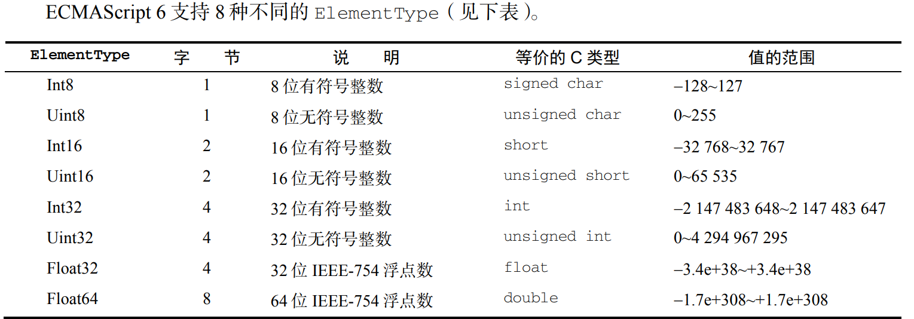

# 集合引用类型

 collection reference type

 对象   Object
 数组与定型数组   Array
 Map、WeakMap、Set 以及 WeakSet 类型

继续讨论内置引用类型，包括 Object、Array、Map、WeakMap、Set 和 WeakSet 等

## Object

显示地创建object得方式,一是使用new操作符

```js
let person = new Object(); 
person.name = "Nicholas"; 
person.age = 29; 
```

二是使用对象字面量

```js
let person = { 
 name: "Nicholas", 
 age: 29 
}; 
//{表示对象字面量的开始,因为它出现在一个表达式上下文中.赋值号即=号后面是期待的返回值.
```

```js
//属性名可以是字符串或数值，比如：
let person = { 
 "name": "Nicholas", 
 "age": 29, 
 5: true 
};
```

```js
//与使用new操作符那个等效.以下是表示只有一个默认属性和方法的对象
let person = {}; // 与 new Object()相同
person.name = "Nicholas"; 
person.age = 29; 
```

```js
//对象字面量方法是传递大量可选参数的主要方式
function displayInfo(args) { 
 let output = ""; 
 if (typeof args.name == "string"){ 
 output += "Name: " + args.name + "\n"; 
 } 
 if (typeof args.age == "number") { 
 output += "Age: " + args.age + "\n"; 
 } 
 alert(output); 
} 
displayInfo({ 
 name: "Nicholas", 
 age: 29 
}); 
displayInfo({ 
 name: "Greg" 
}); 
//一般来说，命名参数更直观，但在可选参数过多的时候就显得笨拙了。最好的方式是对必选参数使用命名参数，再通过一个对象字面量来封装多个可选参数。
```

```js
console.log(person["name"]); // "Nicholas" 
console.log(person.name); // "Nicholas"

let propertyName = "name"; 
console.log(person[propertyName]); // "Nicholas"   通过变量访问属性.什么意思????

//点语法是首选的属性存取方式
person["first name"] = "Nicholas"; 
```

## Array

即数组,数组中的每个槽位可以存储任意类型的数据

### 创建数组

几种方式创建数组,一:使用Array构造函数

```js
let colors = new Array(); 

let colors = new Array(20); //初始length是20

let colors = new Array("red", "blue", "green");//含3个字符串

let colors = new Array(3); // 创建一个包含 3 个元素的数组
let names = new Array("Greg"); // 创建一个只包含一个元素，即字符串"Greg"的数组

//以下为省略new操作符,是一样的
let colors = Array(3); // 创建一个包含 3 个元素的数组
let names = Array("Greg"); // 创建一个只包含一个元素，即字符串"Greg"的数组
```

二是:使用数组字面量,即字面上看就是一个数组的样子=不会调用Array构造函数

```js
let colors = ["red", "blue", "green"]; // 创建一个包含 3 个元素的数组
let names = []; // 创建一个空数组
let values = [1,2,]; // 创建一个包含 2 个元素的数组
```

三四:静态方法from()和 of()。from()用于将类数组结构转换为数组实例，而 of()用于将一组参数转换为数组实例。

```js
// 字符串会被拆分为单字符数组
console.log(Array.from("Matt")); // ["M", "a", "t", "t"] 
// 可以使用 from()将集合和映射转换为一个新数组
const m = new Map().set(1, 2) 
 .set(3, 4); 
const s = new Set().add(1) 
 .add(2) 2
 .add(3) 
 .add(4); 
console.log(Array.from(m)); // [[1, 2], [3, 4]] 
console.log(Array.from(s)); // [1, 2, 3, 4] 

// Array.from()对现有数组执行浅复制
const a1 = [1, 2, 3, 4]; 
const a2 = Array.from(a1); 
console.log(a1); // [1, 2, 3, 4] 
console.log(a2);//同上
alert(a1 === a2); // 通知显示false,为什么???

// 可以使用任何可迭代对象
const iter = { 
 *[Symbol.iterator]() {
 yield 1; 
 yield 2; 
 yield 3; 
 yield 4; 
 } 
}; 
console.log(Array.from(iter)); // [1, 2, 3, 4]
// arguments 对象可以被轻松地转换为数组
function getArgsArray() { 
 return Array.from(arguments); 
} 
console.log(getArgsArray(1, 2, 3, 4)); // [1, 2, 3, 4] 

// from()也能转换带有必要属性的自定义对象
const arrayLikeObject = { 
 0: 1, 
 1: 2, 
 2: 3, 
 3: 4, 
 length: 4 
}; 
console.log(Array.from(arrayLikeObject)); // [1, 2, 3, 4] 
```

```js
//接受第二个可选的映射函数参数.这个函数可以用于增强数组的值，无须调用 Array.from().map()先创建一个中间数组。还可接收第三个可选参数，用于指定映射函数中 this 的值。但这个重写的 this 值在箭头函数中不适用。
const a1 = [1, 2, 3, 4]; 
const a2 = Array.from(a1, x => x2); //const a2 = Array.from(a1, x => x ** 2);

const a3 = Array.from(a1, function(x) {return xthis.exponent}, {exponent: 2}); //const a3 = Array.from(a1, function(x) {return x * this.exponent}, {exponent: 2});使用了传统的函数作为映射函数，并传入了第三个参数 {exponent: 2} 作为映射函数中的 this 值。在映射函数中，每个元素 x 与 this.exponent 相乘，即对每个元素进行乘方操作，然后返回一个新的数组 a3。

console.log(a2); // [1, 4, 9, 16] 
console.log(a3); // [1, 4, 9, 16] 
```

Array.of()可以把一组参数转换为数组。

```js
console.log(Array.of(1, 2, 3, 4)); // [1, 2, 3, 4] 
console.log(Array.of(undefined)); // [undefined] 
```

### 数组空位

```js
//创建空位数组
const options = [,,,,,]; // 创建包含 5 个元素的数组
console.log(options.length); // 5 
console.log(options); // [,,,,,]
```

```js
const options = [1,,,,5]; 
for (const option of options) { 
 console.log(option === undefined); 
} 
// false 
// true 
// true 
// true 
// false
const a = Array.from([,,,]); // 使用 ES6 的 Array.from()创建的包含 3 个空位的数组
for (const val of a) { 
 alert(val === undefined); 
} 
// true 
// true 
// true 
alert(Array.of(...[,,,])); // [undefined, undefined, undefined] 
for (const [index, value] of options.entries()) { 
 alert(value); 
} 
// - `for`：表示开始一个循环。
// - `const`：声明一个常量，用于保存循环中当前元素的值。
// - `[index, value]`：使用解构赋值，将数组元素的索引保存到 `index` 变量中，将数组元素的值保存到 `value` 变量中。
// - `of`：用于指定要遍历的可迭代对象。
// - `options.entries()`：调用数组 `options` 的 `entries()` 方法，该方法返回一个迭代器对象，该对象包含数组的索引/值对。
// - `()`：表示调用函数或方法。
// - `{}`：表示循环体的开始和结束。
// - `alert(value);`：弹出对话框，显示当前数组元素的值。
// - `}`：表示循环体的结束。
// 综上所述，这段代码的作用是遍历数组 `options` 中的每个元素，并对每个元素调用 `alert()` 方法弹出其值。
// 1 
// undefined 
// undefined 
// undefined 
// 5 

//以上是如何处理数组空位的
```

由于行为不一致和存在性能隐患，因此实践中要避免使用数组空位。如果确实需要空位，则可以显式地用 undefined 值代替。

### 数组索引

```js
let colors = ["red", "blue", "green"]; // 定义一个字符串数组
alert(colors[0]); // 显示第一项
colors[2] = "black"; // 修改第三项
colors[3] = "brown"; // 添加第四项,增长
```

```js
let colors = ["red", "blue", "green"]; // 创建一个包含 3 个字符串的数组
let names = []; // 创建一个空数组
alert(colors.length); // 3 
alert(names.length); // 0 

//length属性不止可以读,也可以增删元素.新添的元素用undefined填充
let colors = ["red", "blue", "green"]; // 创建一个包含 3 个字符串的数组
colors.length = 2; 
alert(colors[2]); // undefined

let colors = ["red", "blue", "green"]; // 创建一个包含 3 个字符串的数组,即length是3
colors[colors.length] = "black"; // 添加一种颜色（位置 3）
colors[colors.length] = "brown"; // 再添加一种颜色（位置 4）

let colors = ["red", "blue", "green"]; // 创建一个包含 3 个字符串的数组
colors[99] = "black"; // 添加一种颜色（位置 99）
alert(colors.length); // 100,而位置 3~98，实际上并不存在，因此在访问时会返回 undefined
```

数组最多可以包含 4 294 967 295 个元素.为什么???

### 检测数组

```js
if (value instanceof Array){ 
 // 操作数组

//以上是假设只有一个全局执行上下文.以下可以解决这个问题,不管它是在哪个全局执行上下文中创建的.因为网页里有多个框架,可能设计两个不同的全局执行上下文.什么意思??????
 if (Array.isArray(value)){ 
 // 操作数组
} 
} 
```

### 迭代器方法

Array原型上暴露了3个用于检查数组内容的方法keys()、values()和entries()。keys()返回数组索引的迭代器，values()返回数组元素的迭代器，而 entries()返回索引/值对的迭代器

```js
const a = ["foo", "bar", "baz", "qux"]; 

// 因为这些方法都返回迭代器，所以可以将它们的内容
// 通过 Array.from()直接转换为数组实例
const aKeys = Array.from(a.keys()); 
const aValues = Array.from(a.values()); 
const aEntries = Array.from(a.entries()); 

console.log(aKeys); // [0, 1, 2, 3] 序号的数组
console.log(aValues); // ["foo", "bar", "baz", "qux"]内容的数组 
console.log(aEntries); // [[0, "foo"], [1, "bar"], [2, "baz"], [3, "qux"]]序号和内容配对作为数组的的合数组 
//使用 ES6 的解构可以非常容易地在循环中拆分键/值对：
const a = ["foo", "bar", "baz", "qux"]; 

for (const [idx, element] of a.entries()) { 
 alert(idx); 
 alert(element); 
} 
// 0 
// foo 
// 1 
// bar 
// 2 
// baz 
// 3 
// qux
```

```js
const a = ["foo", "bar", "baz", "qux"]; 
for (const [idx, element] of a.entries()) { 
 alert(idx); 
 alert(element); 
} 
// 0 
// foo 
// 1 
// bar 
// 2 
// baz 
// 3 
// qux 
```

### 复制和填充方法

批量复制方法 copyWithin()，以及填充数组方法 fill(),都需要指定既有数组实例上的一个范围，包含开始索引，不包含结束索引。

```js
const zeroes = [0, 0, 0, 0, 0]; 
// 用 5 填充整个数组,每个位置都填上
zeroes.fill(5); 
console.log(zeroes); // [5, 5, 5, 5, 5] 
zeroes.fill(0); // 重置

// 用 6 填充索引大于等于 3 的元素,即在3位置(含)开始往后使用6顶替
zeroes.fill(6, 3); 
console.log(zeroes); // [0, 0, 0, 6, 6] 
zeroes.fill(0); // 重置

// 用 7 填充索引大于等于 1 且小于 3 的元素,即在1位置开始(含)到3位置(不含)使用7顶替
zeroes.fill(7, 1, 3); 
console.log(zeroes); // [0, 7, 7, 0, 0]; 
zeroes.fill(0); // 重置

// 用 8 填充索引大于等于 1 且小于 4 的元素
// (-4 + zeroes.length = 1) 
// (-1 + zeroes.length = 4) 
zeroes.fill(8, -4, -1); 
//等价于zeroes.fill(8,1,4);
console.log(zeroes); // [0, 8, 8, 8, 0]; 

const zeroes = [0, 0, 0, 0, 0]; 
zeroes.fill(5,0,4); 
console.log(zeroes); // [5, 5, 5, 5, 0]

const zeroes = [0, 0, 0, 0, 0]; 
zeroes.fill(5,0,5); 
console.log(zeroes); // [5, 5, 5, 5, 5]

//fill()静默忽略超出数组边界、零长度及方向相反的索引范围：
const zeroes = [0, 0, 0, 0, 0]; 


// 索引过低，忽略
zeroes.fill(1, -10, -6); 
console.log(zeroes); // [0, 0, 0, 0, 0] 

// 索引过高，忽略
zeroes.fill(1, 10, 15); 
console.log(zeroes); // [0, 0, 0, 0, 0] 

// 索引反向，忽略
zeroes.fill(2, 4, 2); 
console.log(zeroes); // [0, 0, 0, 0, 0] 

// 索引部分可用，填充可用部分
zeroes.fill(4, 3, 10) 
console.log(zeroes); // [0, 0, 0, 4, 4] 

zeroes.fill(5,4,7); 
console.log(zeroes);//[0, 0, 0, 0, 5]

zeroes.fill(5,0,7); 
console.log(zeroes);// [5, 5, 5, 5, 5]
```

与 fill()不同，copyWithin()会按照指定范围浅复制数组中的部分内容，然后将它们插入到指定索引开始的位置。

```js
let ints, 
 reset = () => ints = [0, 1, 2, 3, 4, 5, 6, 7, 8, 9]; 
reset(); 

这段代码定义了一个变量 `ints` 和一个箭头函数 `reset()`。`reset()` 函数用于将数组 `ints` 重新赋值为一个包含 0 到 9 的整数的数组。声明了变量 `ints` 后，调用 `reset()` 函数来初始化该变量，使其成为一个包含 0 到 9 的整数的数组。
1. `let ints,`：声明了一个变量 `ints`，但未进行初始化。
2. `reset = () => ints = [0, 1, 2, 3, 4, 5, 6, 7, 8, 9];`：定义了一个箭头函数 `reset()`，该函数将数组 `ints` 重新赋值为包含整数 0 到 9 的数组。
3. `reset();`：调用了 `reset()` 函数，即执行了函数体内的代码，将数组 `ints` 初始化为包含 0 到 9 的整数的数组。

// 从 ints 中复制索引 0 开始的内容，插入到索引 5 开始的位置
// 在源索引或目标索引到达数组边界时停止
ints.copyWithin(5); 
console.log(ints); // [0, 1, 2, 3, 4, 0, 1, 2, 3, 4] 
reset(); 

// 从 ints 中复制索引 5 开始的内容，插入到索引 0 开始的位置
ints.copyWithin(0, 5); 
console.log(ints); // [5, 6, 7, 8, 9, 5, 6, 7, 8, 9] 
reset();

// 从 ints 中复制索引 0 开始到索引 3 结束的内容
// 插入到索引 4 开始的位置
ints.copyWithin(4, 0, 3); 
alert(ints); // [0, 1, 2, 3, 0, 1, 2, 7, 8, 9] 
reset(); 

// JavaScript 引擎在插值前会完整复制范围内的值
// 因此复制期间不存在重写的风险
ints.copyWithin(2, 0, 6); 
alert(ints); // [0, 1, 0, 1, 2, 3, 4, 5, 8, 9] 
reset(); 

// 支持负索引值，与 fill()相对于数组末尾计算正向索引的过程是一样的
ints.copyWithin(-4, -7, -3); 
//相当于 ints.copyWithin(6,3,7);
alert(ints); // [0, 1, 2, 3, 4, 5, 3, 4, 5, 6] 

//copyWithin()静默忽略超出数组边界、零长度及方向相反的索引范围：
let ints, 
 reset = () => ints = [0, 1, 2, 3, 4, 5, 6, 7, 8, 9]; 
reset(); 

// 索引过低，忽略
ints.copyWithin(1, -15, -12); 
alert(ints); // [0, 1, 2, 3, 4, 5, 6, 7, 8, 9]; 
reset() 

// 索引过高，忽略
ints.copyWithin(1, 12, 15); 
alert(ints); // [0, 1, 2, 3, 4, 5, 6, 7, 8, 9]; 
reset(); 

// 索引反向，忽略
ints.copyWithin(2, 4, 2);
alert(ints); // [0, 1, 2, 3, 4, 5, 6, 7, 8, 9]; 
reset(); 

// 索引部分可用，复制、填充可用部分
ints.copyWithin(4, 7, 10) 
alert(ints); // [0, 1, 2, 3, 7, 8, 9, 7, 8, 9]; 
```

第一个参数是改变的位置,第二个第三个参数是复制的段,含前不含后

### 转换方法

所有对象都有 toLocaleString()、toString()和 valueOf()方法。valueOf()返回的还是数组本身。而 toString()返回由数组中每个值的等效字符串拼接而成的一个逗号分隔的字符串。也就是说，对数组的每个值都会调用其 toString()方法，以得到最终的字符串。

```js
let colors = ["red", "blue", "green"]; // 创建一个包含 3 个字符串的数组
alert(colors.toString()); // red,blue,green
alert(colors.valueOf()); // red,blue,green
alert(colors); // red,blue,greenalert()期待字符串，所以会在后台调用数组的 toString()方法，从而得到跟前面一样的结果。
```

```js
let person1 = { 
 toLocaleString() { 
 return "Nikolaos"; 
 }, 

 toString() { 
 return "Nicholas"; 
 } 
}; 

let person2 = { 
 toLocaleString() { 
 return "Grigorios"; 
 }, 

 toString() { 
 return "Greg"; 
 } 
}; 

let people = [person1, person2]; 
alert(people); // Nicholas,Greg 
alert(people.toString()); // Nicholas,Greg 在将数组传给 alert()时，输出的是"Nicholas,Greg"，这是因为会在数组每一项上调用 toString()方法（与下一行显式调用toString()方法结果一样）
alert(people.toLocaleString()); // Nikolaos,Grigorios为调用了数组每一项的 toLocaleString()方法 
```

```js
let colors = ["red", "green", "blue"]; 
alert(colors.join(",")); // red,green,blue 
alert(colors.join("||")); // red||green||blue
//如果不给join传入任何参数/传undefined,则仍使用,作为分隔符. 如果数组中某一项是 null 或 undefined，则在 join()、toLocaleString()、toString()和 valueOf()返回的结果中会以空字符串表示。
```

### 栈方法

哪里进,哪里出

栈是一种后进先出（LIFO，Last-In-First-Out）的结构，也就是最近添加的项先被删除。数据项的插入（称为推入，push）和删除（称为弹出，pop）只在栈的一个地方发生，即栈顶。相当于栈是一个桶.

```js
let colors = new Array(); // 创建一个数组
let count = colors.push("red", "green"); // 推入两项
alert(count); // 2 
count = colors.push("black"); // 再推入一项
alert(count); // 3 
let item = colors.pop(); // 取得最后一项
alert(item); // black 
alert(colors.length); // 2 
```

```js
//栈和其它数组方法一起使用
let colors = ["red", "blue"]; 
colors.push("brown"); // 再添加一项
colors[3] = "black"; // 添加一项
alert(colors.length); // 4 
let item = colors.pop(); // 取得最后一项
alert(item); // black
```

### 队列方法

哪里进,另一头出

像流水线推一样,先来先走.队列以先进先出（FIFO，First-In-First-Out）形式限制访问。队列在列表末尾添加数据，但从列表开头获取数据。使用 shift()和 push()，可以把数组当成队列来使用：

```js
let colors = new Array(); // 创建一个数组
let count = colors.push("red", "green"); // 推入两项,尾部加上两项
alert(count); // 2 

count = colors.push("black"); // 再推入一项
alert(count); // 3 

let item = colors.shift(); // 取得头部第一项
alert(item); // red 
alert(colors.length); // 2 
```

也提供了unshift()方法,是与shift相反的操作:在数组开头添加任意多个值,然后返回新的数组长度.

```js
let colors = new Array(); // 创建一个数组
let count = colors.unshift("red", "green"); // 从数组开头推入两项
alert(count); // 2 
count = colors.unshift("black"); // 再推入一项
alert(count); // 3 
let item = colors.pop(); // 取得尾部最后一项
alert(item); // green 
alert(colors.length); // 2 
```

### 排序方法

```js
let values = [1, 2, 3, 4, 5]; 
values.reverse(); 
alert(values); // 5,4,3,2,1
```

```js
let values = [0, 1, 5, 10, 15]; 
values.sort(); 
alert(values); // 0,1,10,15,5 作为字符串,"10"和"15"会排在"5"前面
```

以下是以上的解决方式

```js
function compare(value1, value2) { 
 if (value1 < value2) { 
 return -1; 
 } else if (value1 > value2) { 
 return 1; 
 } else { 
 return 0; 
 } 
} 
let values = [0, 1, 5, 10, 15]; 
values.sort(compare); 
alert(values); // 0,1,5,10,15
```

```js
//同上的降序
function compare(value1, value2) { 
 if (value1 < value2) { 
 return 1; 
 } else if (value1 > value2) { 
 return -1; 
 } else { 
 return 0; 
 } 
} 
let values = [0, 1, 5, 10, 15]; 
values.sort(compare); 
alert(values); // 15,10,5,1,0 
```

```js
//用箭头函数写比较函数
let values = [0, 1, 5, 10, 15]; 
values.sort((a, b) => a < b ? 1 : a > b ? -1 : 0); 
alert(values); // 15,10,5,1,0 
```

reverse()和 sort()都返回调用它们的数组的引用.什么意思????

```js
function compare(value1, value2){ 
 return value2 - value1; 
}
//比较函数就是要返回小于 0、0 和大于 0 的数值，因此减法操作完全可以满足要求。条件就是数组元素是数值或其valueOf方法返回数值的对象
```

### 操作方法

```js
let colors = ["red", "green", "blue"]; 
let colors2 = colors.concat("yellow", ["black", "brown"]); 

console.log(colors); // ["red", "green","blue"] 
console.log(colors2); // ["red", "green", "blue", "yellow", "black", "brown"] 
```

```js
//所谓打平,就是去方括号.
let colors = ["red", "green", "blue"]; 
let newColors = ["black", "brown"]; 
let moreNewColors = { 
 [Symbol.isConcatSpreadable]: true, 
 length: 2, 
 0: "pink", 
 1: "cyan" 
}; //这个对象类似于一个数组，在调用数组方法 concat() 时，会将其作为可展开的对象处理，并且拥有长度为 2，并包含了两个元素 "pink" 和 "cyan"。

newColors[Symbol.isConcatSpreadable] = false; 

// 强制不打平数组
let colors2 = colors.concat("yellow", newColors); 

// 强制打平类数组对象
let colors3 = colors.concat(moreNewColors); 

console.log(colors); // ["red", "green", "blue"] 
console.log(colors2); // ["red", "green", "blue", "yellow", ["black", "brown"]] 
console.log(colors3); // ["red", "green", "blue", "pink", "cyan"] 
```

```js
//slice()削去.
let colors = ["red", "green", "blue", "yellow", "purple"]; 
let colors2 = colors.slice(1); //削去,留1位置及直到最后
let colors3 = colors.slice(1, 4); //留1位置(含)到4位置(不含)
alert(colors2); // green,blue,yellow,purple 
alert(colors3); // green,blue,yellow
//含 5 个元素的数组上调用 slice(-2,-1)，就相当于调用 slice(3,4)。如果结束位置小于开始位置，则返回空数组
```

```js
let colors = ["red", "green", "blue"]; 
let removed = colors.splice(0,1); // 删除第一项.两个参数:第一个是起始位(含),第二个是要删的数量
alert(colors); // green,blue 
alert(removed); // red，只有一个元素的数组

removed = colors.splice(1, 0, "yellow", "orange"); // 在位置 1 插入两个元素.开始在1位置,删0个,在1位置插入两元素
alert(colors); // green,yellow,orange,blue 
alert(removed); // 空数组

//上面的插入和替换其实是一个参数逻辑

removed = colors.splice(1, 1, "red", "purple"); // 插入两个值，删除一个元素.
alert(colors); // green,red,purple,orange,blue 
alert(removed); // yellow，只有一个元素的数组
```

### 搜索和位置方法

两类搜索数组的方法:按严格相等搜索和按断言函数搜索.

#### 严格相等

```js
let numbers = [1, 2, 3, 4, 5, 4, 3, 2, 1]; 

alert(numbers.indexOf(4)); // 3 找4,按顺序找到在3位置
alert(numbers.lastIndexOf(4)); // 5 找4,按倒序找到在5位置
alert(numbers.includes(4)); // true 包含吗?包含

alert(numbers.indexOf(4, 4)); // 5 找4,从4位置开始找,找到了,在5位置
alert(numbers.lastIndexOf(4, 4)); // 3 找4,从4位置开始倒序找,找到在3位置
alert(numbers.includes(4, 7)); // false 找4,从7位置开始找,没找到

let person = { name: "Nicholasssssss" }; 
//相当于let person = { name: "Nicholas" }; 
let people = [{ name: "Nicholas" }]; 
let morePeople = [person]; 

alert(people.indexOf(person)); // -1 
alert(morePeople.indexOf(person)); // 0 
alert(people.includes(person)); // false 
alert(morePeople.includes(person)); // true 
```

#### 断言函数

find()和 findIndex()方法使用了断言函数。predict search.

```js
const people = [ 
 { 
 name: "Matt", 
 age: 27 
 }, 
 { 
 name: "Nicholas", 
 age: 29 
 } 
]; 
alert(people.find((element, index, array) => element.age < 28)); 
// {name: "Matt", age: 27} 把数组中的element抓出来
alert(people.findIndex((element, index, array) => element.age < 28)); 
// 0 把符合条件的element的位置数抓出来
```

```js
//找到匹配项后，这两个方法都不再继续搜索。
const evens = [2, 4, 6]; 
// 找到匹配后，永远不会检查数组的最后一个元素
evens.find((element, index, array) => { 
 console.log(element); 
 console.log(index); 
 console.log(array); 
 return element === 4; 
}); 
// 2 
// 0 
// [2, 4, 6] 以上是第一个元素

// 4 
// 1 
// [2, 4, 6] 以上是第二个元素,找到了就停止了
```

### 迭代方法

 every()：对数组每一项都运行传入的函数，如果对每一项函数都返回 true，则这个方法返回 true。

 filter()：对数组每一项都运行传入的函数，函数返回 true 的项会组成数组之后返回。

 forEach()：对数组每一项都运行传入的函数，没有返回值。

 map()：对数组每一项都运行传入的函数，返回由每次函数调用的结果构成的数组。

 some()：对数组每一项都运行传入的函数，如果有一项函数返回 true，则这个方法返回 true。

```js
let numbers = [1, 2, 3, 4, 5, 4, 3, 2, 1]; 
let everyResult = numbers.every((item, index, array) => item > 2); 
alert(everyResult); // false 每一项都得返回true
let someResult = numbers.some((item, index, array) => item > 2); 
alert(someResult); // true 有一项返回true即可

//filter方法
let numbers = [1, 2, 3, 4, 5, 4, 3, 2, 1]; 
let filterResult = numbers.filter((item, index, array) => item > 2); 
alert(filterResult); // 3,4,5,4,3 返回所有值大于2得数组

//map方法
let numbers = [1, 2, 3, 4, 5, 4, 3, 2, 1]; 
let mapResult = numbers.map((item, index, array) => item * 2); 
alert(mapResult); // 2,4,6,8,10,8,6,4,2 返回凡所有结果的数组

//forEach方法=使用for循环遍历数组
let numbers = [1, 2, 3, 4, 5, 4, 3, 2, 1]; 
numbers.forEach((item, index, array) => { 
 // 执行某些操作 
}); 
```

### 归并方法

两个归并方法：reduce()和 reduceRight()。reduce()方法从数组第一项开始遍历到最后一项。而 reduceRight()从最后一项开始遍历至第一项。

4 个参数：上一个归并值、当前项、当前项的索引和数组本身

```js
let values = [1, 2, 3, 4, 5]; 
let sum = values.reduce((prev, cur, index, array) => prev + cur); 
alert(sum); // 15 数组累加求和

let values = [1, 2, 3, 4, 5]; 
let sum = values.reduceRight(function(prev, cur, index, array){ 
 return prev + cur; 
}); 
alert(sum); // 15 是反方向的累加,跟reduce功能一样
```

## 定型数组

typed array.指的是一种特殊的包含数值类型的数组.

### 历史

初是开发一套js API,从而充分利用3d图形和GPU加速,以便``<canvas>``元素上渲染复杂的图形

1.WebGL graphic library 就是数字格式不对头,需要时间上图像

2.定型数组 CanvasFloatArray。这是一个提供JavaScript 接口的、C 语言风格的浮点值数组。JavaScript 运行时使用这个类型可以分配、读取和写入数组。这个数组可以直接传给底层图形驱动程序 API，也可以直接从底层获取到。最终，CanvasFloatArray变成了 Float32Array，也就是今天定型数组中可用的第一个“类型”

### ArrayBuffer

SharedArrayBuffer 是 ArrayBuffer 的一个变体，可以无须复制就在执行上下文间传递它。

```js
const buf = new ArrayBuffer(16); // 在内存中分配 16 字节
alert(buf.byteLength); // 16 
//ArrayBuffer 一经创建就不能再调整大小。不过，可以使用 slice()复制其全部或部分到一个新实例中
const buf1 = new ArrayBuffer(16); 
const buf2 = buf1.slice(4, 12); 
alert(buf2.byteLength); // 8 
```

ArrayBuffer 某种程度上类似于 C++的 malloc()，但也有几个明显的区别。
 malloc()在分配失败时会返回一个 null 指针。ArrayBuffer 在分配失败时会抛出错误。
 malloc()可以利用虚拟内存，因此最大可分配尺寸只受可寻址系统内存限制。ArrayBuffer分配的内存不能超过 Number.MAX_SAFE_INTEGER（2^53-1）字节。
 malloc()调用成功不会初始化实际的地址。声明 ArrayBuffer 则会将所有二进制位初始化为 0。
 通过 malloc()分配的堆内存除非调用 free()或程序退出，否则系统不能再使用。而通过声明ArrayBuffer 分配的堆内存可以被当成垃圾回收，不用手动释放。
不能仅通过对 ArrayBuffer 的引用就读取或写入其内容。要读取或写入 ArrayBuffer，就必须通过视图。视图有不同的类型，但引用的都是 ArrayBuffer 中存储的二进制数据。

看不懂???

### DataView

看不懂???

第一种允许你读写 ArrayBuffer 的视图是 DataView。这个视图专为文件 I/O 和网络 I/O 设计，其API 支持对缓冲数据的高度控制，但相比于其他类型的视图性能也差一些。DataView 对缓冲内容没有任何预设，也不能迭代。
必须在对已有的 ArrayBuffer 读取或写入时才能创建 DataView 实例。这个实例可以使用全部或部分 ArrayBuffer，且维护着对该缓冲实例的引用，以及视图在缓冲中开始的位置。

```js
const buf = new ArrayBuffer(16); 

// DataView 默认使用整个 ArrayBuffer 
const fullDataView = new DataView(buf); 
alert(fullDataView.byteOffset); // 0 
alert(fullDataView.byteLength); // 16 
alert(fullDataView.buffer === buf); // true 

// 构造函数接收一个可选的字节偏移量和字节长度
// byteOffset=0 表示视图从缓冲起点开始
// byteLength=8 限制视图为前 8 个字节
const firstHalfDataView = new DataView(buf, 0, 8); 
alert(firstHalfDataView.byteOffset); // 0 
alert(firstHalfDataView.byteLength); // 8 
alert(firstHalfDataView.buffer === buf); // true 

// 如果不指定，则 DataView 会使用剩余的缓冲
// byteOffset=8 表示视图从缓冲的第 9 个字节开始
// byteLength 未指定，默认为剩余缓冲
const secondHalfDataView = new DataView(buf, 8); 
alert(secondHalfDataView.byteOffset); // 8 
alert(secondHalfDataView.byteLength); // 8  16-8=8
alert(secondHalfDataView.buffer === buf); // true
```

1.`const buf = new ArrayBuffer(16);`： - 创建了一个长度为 16 字节的 ArrayBuffer 实例，并将其存储在变量 `buf` 中。
  比喻：- 就像创建了一个长度为 16 的存储空间，用来存放字节数据的缓冲区。

2.`const fullDataView = new DataView(buf);`：- 创建了一个 DataView 实例，用于在整个 ArrayBuffer 上创建视图。
  比喻： - 就像放置了一块透明的窗户，可以全面观察整个存储空间中的数据。

3.`const firstHalfDataView = new DataView(buf, 0, 8);`： - 创建了一个 DataView 实例，该视图仅覆盖 ArrayBuffer 的前 8 个字节。
  比喻： - 就像放置了一块窗户，只能观察到缓冲区的前半部分数据。

4.`const secondHalfDataView = new DataView(buf, 8);`： - 创建了一个 DataView 实例，该视图从 ArrayBuffer 的第 9 个字节开始，并覆盖剩余的字节。
  比喻：- 就像放置了一块窗户，只能观察到缓冲区的后半部分数据。

功能说明：这段代码演示了如何使用 DataView 来创建不同的视图，以便在 ArrayBuffer 中查看和操作数据。通过指定不同的字节偏移量和字节长度，可以在缓冲区中创建不同大小和位置的视图。这种功能类似于在一个房间的不同位置开不同大小的窗户，以便观察房间内的不同部分。

1.ElementType

完全蒙???这是干嘛的

DataView 应该使用 ElementType 来实现 JavaScript 的 Number 类型到缓冲内二进制格式的转换

```js
// 在内存中分配两个字节并声明一个 DataView 
const buf = new ArrayBuffer(2); 
const view = new DataView(buf); 

// 说明整个缓冲确实所有二进制位都是 0 
// 检查第一个和第二个字符
alert(view.getInt8(0)); // 0 
alert(view.getInt8(1)); // 0 
// 检查整个缓冲
alert(view.getInt16(0)); // 0 

// 将整个缓冲都设置为 1 
// 255 的二进制表示是 11111111（2^8 - 1）
view.setUint8(0, 255); 

// DataView 会自动将数据转换为特定的 ElementType 
// 255 的十六进制表示是 0xFF 
view.setUint8(1, 0xFF); 

// 现在，缓冲里都是 1 了
// 如果把它当成二补数的有符号整数，则应该是-1 
alert(view.getInt16(0)); // -1
```

1. `const buf = new ArrayBuffer(2);`：- 创建了一个长度为 2 字节的 ArrayBuffer 实例，并将其存储在变量 `buf` 中。
2. `const view = new DataView(buf);`：- 创建了一个 DataView 实例，该实例关联到刚刚创建的 ArrayBuffer。
   比喻： - 就像在内存中划分了一个长度为 2 字节的空间，并在上面安装了一个数据监视器。
3. `alert(view.getInt8(0)); // 0` 和 `alert(view.getInt8(1)); // 0`： - 检查了 DataView 中索引为 0 和 1 的位置的值。
   比喻：- 就像查看了监视器上第一个字节和第二个字节的内容，由于刚创建时没有设置值，因此显示为 0。
4. `alert(view.getInt16(0)); // 0`：- 检查了整个 DataView 中的 16 位有符号整数值。
   比喻：- 就像查看了监视器上整个 16 位数据的内容，由于刚创建时没有设置值，因此显示为 0。
5. `view.setUint8(0, 255);` 和 `view.setUint8(1, 0xFF);`：- 将 DataView 中索引为 0 和 1 的位置的值分别设置为 255（0xFF）。
   比喻：- 就像在监视器上的第一个字节和第二个字节写入了值 255，由于这是一个无符号整数的最大值，所以以二进制表示就是 11111111。
6. `alert(view.getInt16(0)); // -1`： - 检查了整个 DataView 中的 16 位有符号整数值。
   比喻：- 就像再次查看了监视器上整个 16 位数据的内容，现在由于前两个字节的值都是最大无符号整数，所以将它们解释为有符号整数时，值为 -1。
功能说明：这段代码演示了如何使用 DataView 来查看和设置内存中的数据。DataView 提供了灵活的方法来解释和操作 ArrayBuffer 中的数据。就像在监视器上查看和修改内存中的字节一样，可以根据需要读取和写入不同大小和类型的数据。



2.字节序Big-Endian and Little-Endian

不太明白???

DataView 只支持两种约定：大端字节序和小端字节序。大端字节序也称为“网络字节序”，意思是最高有效位保存在第一个字节，而最低有效位保存在最后一个字节。小端字节序正好相反，即最低有效位保存在第一个字节，最高有效位保存在最后一个字节。

```js
// 在内存中分配两个字节并声明一个 DataView 
const buf = new ArrayBuffer(2); 
const view = new DataView(buf); 

// 填充缓冲，让第一位和最后一位都是 1 
view.setUint8(0, 0x80); // 设置最左边的位等于 1 
view.setUint8(1, 0x01); // 设置最右边的位等于 1 

// 缓冲内容（为方便阅读，人为加了空格）
// 0x8 0x0 0x0 0x1 
// 1000 0000 0000 0001 

// 按大端字节序读取 Uint16 
// 0x80 是高字节，0x01 是低字节
// 0x8001 = 2^15 + 2^0 = 32768 + 1 = 32769 
alert(view.getUint16(0)); // 32769 

// 按小端字节序读取 Uint16 
// 0x01 是高字节，0x80 是低字节
// 0x0180 = 2^8 + 2^7 = 256 + 128 = 384 
alert(view.getUint16(0, true)); // 384 

// 按大端字节序写入 Uint16 
view.setUint16(0, 0x0004); 

// 缓冲内容（为方便阅读，人为加了空格）
// 0x0 0x0 0x0 0x4 
// 0000 0000 0000 0100 

alert(view.getUint8(0)); // 0 
alert(view.getUint8(1)); // 4 

// 按小端字节序写入 Uint16 
view.setUint16(0, 0x0002, true); 

// 缓冲内容（为方便阅读，人为加了空格）
// 0x0 0x2 0x0 0x0 
// 0000 0010 0000 0000 

alert(view.getUint8(0)); // 2 
alert(view.getUint8(1)); // 0 
```

1. `const buf = new ArrayBuffer(2);`： - 创建了一个长度为 2 字节的 ArrayBuffer 实例，并将其存储在变量 `buf` 中。
2. `const view = new DataView(buf);`： - 创建了一个 DataView 实例，该实例关联到刚刚创建的 ArrayBuffer。
   比喻： - 就像在内存中划分了一个长度为 2 字节的空间，并在上面安装了一个数据监视器。
3. `view.setUint8(0, 0x80);` 和 `view.setUint8(1, 0x01);`： - 分别将 DataView 中索引为 0 和 1 的位置的字节分别设置为 0x80 和 0x01，即设置为 1。
   比喻： - 就像在监视器上的第一个字节的最左边设置了一个开关为 1，第二个字节的最右边也设置了一个开关为 1。
4. `alert(view.getUint16(0)); // 32769`： - 读取了以大端字节序（默认）存储的 DataView 中从索引为 0 开始的 16 位无符号整数。
   比喻： - 就像从监视器上的第一个字节开始，按照从左到右的顺序读取两个开关所表示的数值，得到的结果为 32769。
5. `alert(view.getUint16(0, true)); // 384`： - 读取了以小端字节序存储的 DataView 中从索引为 0 开始的 16 位无符号整数。
   比喻：- 就像从监视器上的第一个字节开始，按照从右到左的顺序读取两个开关所表示的数值，得到的结果为 384。
6. `view.setUint16(0, 0x0004);`： - 将 DataView 中从索引为 0 开始的 16 位无符号整数设置为 0x0004。
   比喻：- 就像重新设置了监视器上的前两个开关，将它们的值设为了 4。
7. `view.setUint16(0, 0x0002, true);`： - 将 DataView 中从索引为 0 开始的 16 位无符号整数按照小端字节序设置为 0x0002。
   比喻： - 就像重新设置了监视器上的前两个开关，但这次按照从右到左的顺序设置，将它们的值设为了 2。
功能说明：这段代码演示了如何使用 DataView 来读取和设置 ArrayBuffer 中的数据，同时还演示了大端字节序和小端字节序的概念。就像在内存中使用一个特殊的监视器来观察和修改数据，可以根据需要以不同的顺序读取和设置数据。

3.边界情形

没懂???

DataView 完成读、写操作的前提是必须有充足的缓冲区，否则就会抛出 RangeError：

```js
const buf = new ArrayBuffer(6); 
const view = new DataView(buf); 
// 尝试读取部分超出缓冲范围的值
view.getInt32(4); 
// RangeError 

// 尝试读取超出缓冲范围的值
view.getInt32(8); 
// RangeError 

// 尝试读取超出缓冲范围的值
view.getInt32(-1); 
// RangeError 

// 尝试写入超出缓冲范围的值
view.setInt32(4, 123); 
// RangeError
```

```js
//DataView 在写入缓冲里会尽最大努力把一个值转换为适当的类型，后备为 0。如果无法转换，则抛出错误：
const buf = new ArrayBuffer(1); 
const view = new DataView(buf); 

view.setInt8(0, 1.5); 
alert(view.getInt8(0)); // 1 

view.setInt8(0, [4]); 
alert(view.getInt8(0)); // 4 

view.setInt8(0, 'f'); 
alert(view.getInt8(0)); // 0 

view.setInt8(0, Symbol()); 
// TypeError
```

### Corner Cases定型数组

看不懂???

定型数组是另一种形式的 ArrayBuffer 视图。虽然概念上与 DataView 接近，但定型数组的区别在于，它特定于一种 ElementType 且遵循系统原生的字节序。相应地，定型数组提供了适用面更广的API 和更高的性能。设计定型数组的目的就是提高与 WebGL 等原生库交换二进制数据的效率。由于定型数组的二进制表示对操作系统而言是一种容易使用的格式，JavaScript 引擎可以重度优化算术运算、按位运算和其他对定型数组的常见操作，因此使用它们速度极快。
创建定型数组的方式包括读取已有的缓冲、使用自有缓冲、填充可迭代结构，以及填充基于任意类型的定型数组。

```js
// 创建一个 12 字节的缓冲
const buf = new ArrayBuffer(12); 
// 创建一个引用该缓冲的 Int32Array 
const ints = new Int32Array(buf); 
// 这个定型数组知道自己的每个元素需要 4 字节
// 因此长度为 3 
alert(ints.length); // 3 
// 创建一个长度为 6 的 Int32Array 
const ints2 = new Int32Array(6); 
// 每个数值使用 4 字节，因此 ArrayBuffer 是 24 字节
alert(ints2.length); // 6 
// 类似 DataView，定型数组也有一个指向关联缓冲的引用
alert(ints2.buffer.byteLength); // 24 

// 创建一个包含[2, 4, 6, 8]的 Int32Array 
const ints3 = new Int32Array([2, 4, 6, 8]); 
alert(ints3.length); // 4 
alert(ints3.buffer.byteLength); // 16 
alert(ints3[2]); // 6 

// 通过复制 ints3 的值创建一个 Int16Array 
const ints4 = new Int16Array(ints3); 
// 这个新类型数组会分配自己的缓冲
// 对应索引的每个值会相应地转换为新格式
alert(ints4.length); // 4 
alert(ints4.buffer.byteLength); // 8 
alert(ints4[2]); // 6 

// 基于普通数组来创建一个 Int16Array 
const ints5 = Int16Array.from([3, 5, 7, 9]); 
alert(ints5.length); // 4 
alert(ints5.buffer.byteLength); // 8 
alert(ints5[2]); // 7 

// 基于传入的参数创建一个 Float32Array 
const floats = Float32Array.of(3.14, 2.718, 1.618); 
alert(floats.length); // 3 
alert(floats.buffer.byteLength); // 12 
alert(floats[2]); // 1.6180000305175781 
```

```js
//定型数组的构造函数和实例都有一个 BYTES_PER_ELEMENT 属性，返回该类型数组中每个元素的大小
alert(Int16Array.BYTES_PER_ELEMENT); // 2 
alert(Int32Array.BYTES_PER_ELEMENT); // 4 

const ints = new Int32Array(1), 
floats = new Float64Array(1); 

alert(ints.BYTES_PER_ELEMENT); // 4 
alert(floats.BYTES_PER_ELEMENT); // 8 
```

```js
//如果定型数组没有用任何值初始化，则其关联的缓冲会以 0 填充：
const ints = new Int32Array(4); 
alert(ints[0]); // 0 
alert(ints[1]); // 0 
alert(ints[2]); // 0 
alert(ints[3]); // 0
```

1.定型数组的行为

```js
//也支持以下操作符\方法\属性
[] copyWithin() entries() every() fill() filter() find() findIndex() forEach() indexOf() join() keys() lastIndexOf() length map() reduce() reduceRight() reverse() slice() some() sort() toLocaleString()
 toString() values()

//返回新数组的方法也会返回包含同样元素类型（element type）的新定型数组：
const ints = new Int16Array([1, 2, 3]); 
const doubleints = ints.map(x => 2*x); 
alert(doubleints instanceof Int16Array); // true 
1. `const ints = new Int16Array([1, 2, 3]);`：- 创建了一个 Int16Array 类型的数组 `ints`，并初始化为包含数字 `1, 2, 3` 的数组。
2. `const doubleints = ints.map(x => 2 * x);`：- 使用 `map` 方法遍历 `ints` 数组中的每个元素 `x`，将其翻倍后返回一个新的数组，并将结果存储在 `doubleints` 变量中。
3. `alert(doubleints instanceof Int16Array); // true`：- 检查 `doubleints` 是否是 Int16Array 类型的实例，并通过弹出对话框显示结果。
功能说明：这段代码演示了如何创建一个 Int16Array 数组，并使用 `map` 方法对其进行操作。由于 `map` 方法返回一个新的数组，且原数组为 Int16Array 类型，("实例"（instance）通常指的是根据类或构造函数创建的特定对象。通常指的是根据类或构造函数创建的特定对象。)
```

```js
//定型数组有一个 Symbol.iterator 符号属性，因此可以通过 for..of 循环和扩展操作符来操作：
const ints = new Int16Array([1, 2, 3]); 
for (const int of ints) { 
 alert(int); 
} 
// 1 
// 2 
// 3 
alert(Math.max(...ints)); // 3
```

2.合并、复制和修改定型数组法不适用于定型
数组： concat() pop() push() shift() splice() unshift()。不过，定型数组也提供了两个新方法，可以快速向外或向内复制数据：set()和 subarray()。

```js
// 创建长度为 8 的 int16 数组
const container = new Int16Array(8); 
// 把定型数组复制为前 4 个值
// 偏移量默认为索引 0 
container.set(Int8Array.of(1, 2, 3, 4)); 
console.log(container); // [1,2,3,4,0,0,0,0] 
// 把普通数组复制为后 4 个值
// 偏移量 4 表示从索引 4 开始插入
container.set([5,6,7,8], 4); 
console.log(container); // [1,2,3,4,5,6,7,8] 

// 溢出会抛出错误
container.set([5,6,7,8], 7); 
// RangeError 
```

```js
//subarray()执行与 set()相反的操作

const source = Int16Array.of(2, 4, 6, 8); 

// 把整个数组复制为一个同类型的新数组
const fullCopy = source.subarray(); 
console.log(fullCopy); // [2, 4, 6, 8]  source的全复制

// 从索引 2 开始复制数组
const halfCopy = source.subarray(2); 
console.log(halfCopy); // [6, 8]  source的2位置往后

// 从索引 1 开始复制到索引 3 
const partialCopy = source.subarray(1, 3); 
console.log(partialCopy); // [4, 6]  source的1和3位置
```

```js
//不能原生拼接，使用定型数组 API 提供的很多工具可以手动构建
// 第一个参数是应该返回的数组类型 
// 其余参数是应该拼接在一起的定型数组
function typedArrayConcat(typedArrayConstructor, ...typedArrays) { 
 // 计算所有数组中包含的元素总数
 const numElements = typedArrays.reduce((x,y) => (x.length || x) + y.length); 

 // 按照提供的类型创建一个数组，为所有元素留出空间
 const resultArray = new typedArrayConstructor(numElements); 

 // 依次转移数组
 let currentOffset = 0; 
 typedArrays.map(x => { 
 resultArray.set(x, currentOffset); 
 currentOffset += x.length; 
 }); 
 return resultArray; 
} 

const concatArray = typedArrayConcat(Int32Array, 
 Int8Array.of(1, 2, 3), 
 Int16Array.of(4, 5, 6), 
 Float32Array.of(7, 8, 9)); 
console.log(concatArray); // [1, 2, 3, 4, 5, 6, 7, 8, 9]  拼接
console.log(concatArray instanceof Int32Array); // true  Int8ArrayInt16ArrayFloat32Array都是false
```

1. `function typedArrayConcat(typedArrayConstructor, ...typedArrays) {`：   - 定义了一个名为 `typedArrayConcat` 的函数，它接受一个数组类型构造函数作为第一个参数 `typedArrayConstructor`，以及任意数量的定型数组作为其余参数 `typedArrays`。
2. `const numElements = typedArrays.reduce((x, y) => (x.length || x) + y.length);`：   - 使用 `reduce` 方法计算所有定型数组中包含的元素总数，并将结果存储在变量 `numElements` 中。这个箭头函数接受两个参数 x 和 y，它会检查参数 x 是否有 length 属性，如果有且不为 0，则返回其长度，否则返回 x 本身。然后将参数 y 的长度加上去。
3. `const resultArray = new typedArrayConstructor(numElements);`：   - 使用提供的数组类型构造函数 `typedArrayConstructor` 创建一个新的数组 `resultArray`，确保为所有元素留出足够的空间。
4. `typedArrays.map(x => { resultArray.set(x, currentOffset); currentOffset += x.length; });`：- 使用 `map` 方法遍历每个输入的定型数组 `typedArrays`，并将它们依次拼接到 `resultArray` 中。- `set` 方法用于将输入数组中的元素复制到 `resultArray` 中，`currentOffset` 用于确定每个输入数组在 `resultArray` 中的起始位置。
5. `return resultArray;`：- 返回拼接后的结果数组 `resultArray`。
6. 拼接数组并赋值给 `concatArray`：- 调用 `typedArrayConcat` 函数，传递 `Int32Array` 构造函数以及三个不同的定型数组作为参数。- 返回的结果数组将包含传入的所有元素。
7. 输出结果和检查类型： - 打印拼接后的结果数组 `concatArray`。- 检查 `concatArray` 是否是 `Int32Array` 类型的实例，并输出结果。
功能说明：这段代码定义了一个函数 `typedArrayConcat`，用于将多个定型数组按照指定的类型拼接在一起。它逐个读取传入的定型数组，将它们复制到一个新的结果数组中，并确保结果数组的类型与指定的数组类型相同。

3.下溢和上溢Underflow and Overflow

不懂 ???

```js
//如何处理下溢和上溢：

// 长度为 2 的有符号整数数组
// 每个索引保存一个二补数形式的有符号整数
// 范围是-128（-1 * 2^7）~127（2^7 - 1）
const ints = new Int8Array(2); 

// 长度为 2 的无符号整数数组
// 每个索引保存一个无符号整数  
//  unit8就是8位无符号整数  范围是 0~255（2^7 - 1）
const unsignedInts = new Uint8Array(2); 

// 上溢的位不会影响相邻索引  什么意思???
// 索引只取最低有效位上的 8 位
unsignedInts[1] = 256; // 十六进制数0x100
console.log(unsignedInts); // [0, 0] 
unsignedInts[1] = 511; // 0x1FF 
console.log(unsignedInts); // [0, 255] 

// 下溢的位会被转换为其无符号的等价值
// 0xFF 是以二补数形式表示的-1（截取到 8 位）, 
// 但 255 是一个无符号整数
unsignedInts[1] = -1 // 0xFF (truncated to 8 bits) 
console.log(unsignedInts); // [0, 255] 

// 上溢自动变成二补数形式
// 0x80 是无符号整数的 128，是二补数形式的-128 
ints[1] = 128; // 0x80 
console.log(ints); // [0, -128] 

// 下溢自动变成二补数形式
// 0xFF 是无符号整数的 255，是二补数形式的-1 
ints[1] = 255; // 0xFF 
console.log(ints); // [0, -1] 
```

```js
//还有一种“夹板”数组类型：Uint8ClampedArray，不允许任何方向溢出。超出最大值 255 的值会被向下舍入为 255，而小于最小值 0 的值会被向上舍入为 0。   除非真的做跟 canvas 相关的开发，否则不要使用它。
const clampedInts = new Uint8ClampedArray([-1, 0, 255, 256]); 
console.log(clampedInts); // [0, 0, 255, 255] 
```

## Map

Map为js带来了真正的键/值存储机制,其大多数特性都可以通过Object类型实现

### 基本API

```js
// 在创建的同时初始化实例  使用嵌套数组初始化映射
const m1 = new Map([ 
 ["key1", "val1"], 
 ["key2", "val2"], 
 ["key3", "val3"] 
]); 
alert(m1.size); // 3 

// 使用自定义迭代器初始化映射
const m2 = new Map({ 
 [Symbol.iterator]: function*() { 
 yield ["key1", "val1"]; 
 yield ["key2", "val2"]; 
 yield ["key3", "val3"]; 
 } 
}); 
alert(m2.size); // 3 

// 映射期待的键/值对，无论是否提供
const m3 = new Map([[]]); 
alert(m3.has(undefined)); // true 
alert(m3.get(undefined)); // undefined 
```

```js
//初始化后,用set方法添加键\值对.还可以get\has\delete\clear
const m = new Map(); 
alert(m.has("firstName")); // false 
alert(m.get("firstName")); // undefined 
alert(m.size); // 0 

m.set("firstName", "Matt") 
 .set("lastName", "Frisbie"); 

alert(m.has("firstName")); // true 
alert(m.get("firstName")); // Matt 
alert(m.size); // 2 

m.delete("firstName"); // 只删除这一个键/值对

alert(m.has("firstName")); // false 
alert(m.has("lastName")); // true 
alert(m.size); // 1 

m.clear(); // 清除这个映射实例中的所有键/值对

alert(m.has("firstName")); // false 
alert(m.has("lastName")); // false 
alert(m.size); // 0
```

```js
//多操作连缀示例
const m = new Map().set("key1", "val1"); 
m.set("key2", "val2") 
 .set("key3", "val3"); 
alert(m.size); // 3 
```

```js
//
const m = new Map(); 
const functionKey = function() {}; 
const symbolKey = Symbol(); 
const objectKey = new Object(); 

m.set(functionKey, "functionValue"); 
m.set(symbolKey, "symbolValue"); 
m.set(objectKey, "objectValue"); 

alert(m.get(functionKey)); // functionValue 
alert(m.get(symbolKey)); // symbolValue 
alert(m.get(objectKey)); // objectValue 

// SameValueZero 比较意味着独立实例不冲突
alert(m.get(function() {})); // undefined 
```

```js

//不懂???

//想象你有一把钥匙，钥匙的形状不同，有的是对象形状，有的是数组形状，你将每把钥匙对应着一个房间。现在你在钥匙上贴了一张标签 foo，表明这是钥匙的一部分信息。当你用这些钥匙去找对应的房间时，你会根据标签来识别钥匙，从而进入不同的房间。但是对于数组形状的钥匙来说，你只能根据它的形状来辨认，无法根据标签来识别。
//在映射中用作键和值的对象及其他“集合”类型，在自己的内容或属性被修改时保持不变
const m = new Map(); 
const objKey = {}, 
 objVal = {}, 
 arrKey = [], 
 arrVal = []; 

m.set(objKey, objVal); 
m.set(arrKey, arrVal); 
//将 objKey 映射到 objVal，将 arrKey 映射到 arrVal，即在 Map 中设置了两个键值对。
objKey.foo = "foo"; 
objVal.bar = "bar"; 
arrKey.push("foo"); 
arrVal.push("bar"); 

console.log(m.get(objKey)); // {bar: "bar"} 
console.log(m.get(arrKey)); // ["bar"] 

//SameValueZero 比较也可能导致意想不到的冲突：
const m = new Map(); 

const a = 0/"", // NaN 
 b = 0/"", // NaN 
 pz = +0, 
 nz = -0; 
 alert(a === b); // false 
 //检查常量 a 和 b 是否严格相等。由于 NaN 与任何值都不相等（包括自身），所以结果是 false。
alert(pz === nz); // true 
//检查常量 pz 和 nz 是否严格相等。尽管它们表示不同的数值，但是 JavaScript 中的正零和负零在相等性比较中被视为相等，所以结果是 true

m.set(a, "foo"); 
m.set(pz, "bar"); 

alert(m.get(b)); // foo 
alert(m.get(nz)); // bar
//分别检索键 b 和键 nz 对应的值。由于 JavaScript 中的 NaN 在比较时不相等，所以 b 会被当作一个新的键，其值为 "foo"，而 nz 会被当作键 pz，其值为 "bar"。

//没懂???
```

### 顺序与迭代(again and again)

```js
//映射实例可以提供一个迭代器（Iterator），能以插入顺序生成[key, value]形式的数组
const m = new Map([ 
 ["key1", "val1"], 
 ["key2", "val2"], 
 ["key3", "val3"] 
]); 

alert(m.entries === m[Symbol.iterator]); // true 

for (let pair of m.entries()) { 
 alert(pair); 
} 
// [key1,val1] 
// [key2,val2] 
// [key3,val3] 

for (let pair of m[Symbol.iterator]()) { 
 alert(pair); 
} 
// [key1,val1] 
// [key2,val2] 
// [key3,val3] 

//因为 entries()是默认迭代器，所以可以直接对映射实例使用扩展操作，把映射转换为数组：
const m = new Map([ 
 ["key1", "val1"], 
 ["key2", "val2"], 
 ["key3", "val3"] 
]); 
console.log([...m]); // [[key1,val1],[key2,val2],[key3,val3]] 
```

```js
//不用迭代器,而使用回调方式
const m = new Map([ 
 ["key1", "val1"], 
 ["key2", "val2"], 
 ["key3", "val3"] 
]); 
m.forEach((val, key) => alert(`${key} -> ${val}`));
//使用 forEach 方法遍历 Map 中的所有键值对，并对每个键值对执行一个回调函数。在这个回调函数中，键和值被作为参数传递，并使用 alert 方法将它们以特定的格式输出到弹出框中。val 表示当前键值对的值。key 表示当前键值对的键。所以，alert(${key} -> ${val}) 将会在弹出框中显示每个键值对的键和值，以箭头连接起来。
// key1 -> val1 
// key2 -> val2 
// key3 -> val3
```

```js
//keys()和 values()分别返回以插入顺序生成键和值的迭代器：
const m = new Map([ 
 ["key1", "val1"], 
 ["key2", "val2"], 
 ["key3", "val3"] 
]); 
for (let key of m.keys()) { 
 alert(key); 
} 
// key1 
// key2 
// key3 
for (let key of m.values()) { 
 alert(key); 
} 
// value1 
// value2 
// value3 
```

```js
//键和值在迭代器遍历时是可以修改的，但映射内部的引用则无法修改。当然，这并不妨碍修改作为键或值的对象内部的属性，因为这样并不影响它们在映射实例中的身份：
const m1 = new Map([ 
 ["key1", "val1"] 
]); 

// 作为键的字符串原始值是不能修改的 String primitive as key is unaltered
for (let key of m1.keys()) { 
 key = "newKey"; 
 alert(key); // newKey 
 alert(m1.get("key1")); // val1 
} 


const keyObj = {id: 1}; 
const m = new Map([ 
 [keyObj, "val1"] 
]); 
// 修改了作为键的对象的属性，但对象在映射内部仍然引用相同的值 Key object property is altered, but the object still refers to the same value inside the map
for (let key of m.keys()) { 
 key.id = "newKey"; 
 alert(key); // {id: "newKey"} 
 alert(m.get(keyObj)); // val1 
} 
alert(keyObj); // {id: "newKey"}  尽管在循环中修改了键对象 key 的属性，但 Map 中的键仍然是原始的 keyObj 对象。
//假设你有一串钥匙，每个钥匙都有一个编号。你将其中一个钥匙交给朋友，然后你决定修改你手中的钥匙编号，但朋友手中的钥匙编号却仍然是之前的编号。虽然你修改了你手中的钥匙，但朋友手中的钥匙并没有因此而改变。
```

这是用来干什么的???不知道

### 在Objects和Maps中间选

对象和映射 之间确实存在显著的差别.

1.内存占用 Map大约可以比Object多存储50%的键/值对
2.用哪个插入,性能更加? Map
3.查找时的表现  如代码设计大量查找操作,用object更好
4.删除时的表现  如代码设计大量删除操作,肯定用Map,更快

## weakmap type

弱映射weakmap是一种新的集合类型=增强的键/值对存储机制,是map的兄弟类型,其api也是map的子集.弱时指的js垃圾回收程序对待"弱映射"中的键的方式.

### 基本 API

没懂??? 干嘛用的???

使用 new 关键字实例化一个空的 WeakMap.

```js
const key1 = {id: 1}, 
 key2 = {id: 2}, 
 key3 = {id: 3}; 
// 使用嵌套数组初始化弱映射
const wm1 = new WeakMap([ 
 [key1, "val1"], 
 [key2, "val2"], 
 [key3, "val3"] 
]); 
alert(wm1.get(key1)); // val1 
alert(wm1.get(key2)); // val2 
alert(wm1.get(key3)); // val3 

// 初始化是全有或全无的操作
// 只要有一个键无效就会抛出错误，导致整个初始化失败
const wm2 = new WeakMap([ 
 [key1, "val1"], 
 ["BADKEY", "val2"], 
 [key3, "val3"] 
]); 
// TypeError: Invalid value used as WeakMap key 
typeof wm2; 
// ReferenceError: wm2 is not defined 

// 原始值可以先包装成对象再用作键
const stringKey = new String("key1"); 
const wm3 = new WeakMap([ 
 stringKey, "val1" 
]); 
alert(wm3.get(stringKey)); // "val1"
```

```js
//初始化之后可以使用 set()再添加键/值对，可以使用 get()和 has()查询，还可以使用 delete()
删除：
const wm = new WeakMap(); 

const key1 = {id: 1}, 
 key2 = {id: 2}; 

alert(wm.has(key1)); // false 
alert(wm.get(key1)); // undefined 

wm.set(key1, "Matt") 
 .set(key2, "Frisbie"); 

alert(wm.has(key1)); // true 
alert(wm.get(key1)); // Matt 

wm.delete(key1); // 只删除这一个键/值对

alert(wm.has(key1)); // false 
alert(wm.has(key2)); // true 
```

```js
//set()方法返回弱映射实例，因此可以把多个操作连缀起来，包括初始化声明：
const key1 = {id: 1}, 
 key2 = {id: 2}, 
 key3 = {id: 3}; 

const wm = new WeakMap().set(key1, "val1");
wm.set(key2, "val2") 
 .set(key3, "val3"); 

alert(wm.get(key1)); // val1 
alert(wm.get(key2)); // val2 
alert(wm.get(key3)); // val3 
```

### 弱键

weak keys   没懂???

WeakMap 中“weak”弱映射的键不属于正式的引用，不会阻止垃圾回收;而弱映射中值的引用,只要键存在，键/值对就会存在于映射中，并被当作对值的引用，因此就不会被当作垃圾回收.什么意思???

```js
const wm = new WeakMap(); 
wm.set({}, "val"); //这对键/值被破坏以后，值本身也会成为垃圾回收的目标

//再看一个稍微不同的例子：
const wm = new WeakMap(); 
const container = { 
 key: {} 
}; 
wm.set(container.key, "val"); 
//不会垃圾回收=container象征着对弱映射键的引用

//调用removereference就能回收了
function removeReference() { 
 container.key = null; 
} 
```

### 不可迭代键

non-iteratable keys.  不太懂???

WeakMap 实例之所以限制只能用对象作为键，是为了保证只有通过键对象的引用才能取得值。如果允许原始值，那就没办法区分初始化时使用的字符串字面量和初始化之后使用的一个相等的字符串了。

### 使用弱映射

utility

1.私有变量 private variable

没懂???

前提:私有变量会存储在弱映射中，以对象实例为键，以私有成员的字典为值。

```js
const wm = new WeakMap(); 
class User { 
 constructor(id) { 
 this.idProperty = Symbol('id'); 
 this.setId(id); 
 } 

 setPrivate(property, value) { 
 const privateMembers = wm.get(this) || {}; 
 privateMembers[property] = value; 
 wm.set(this, privateMembers); 
 } 
// `User` 类的一个私有方法 `setPrivate` 的实现，它用于设置私有成员。 - 首先，尝试从 `wm`（WeakMap）中获取与当前对象（`this`）关联的私有成员对象。 - 如果找不到私有成员对象，就创建一个空对象 `{}` 作为默认值。 - 然后，将参数 `property` 对应的属性设置为参数 `value`。- 这里实现了对私有成员的设置操作。 - 最后，将更新后的私有成员对象重新存储到 `wm` 中，以便后续获取和修改。以上作用是确保 `User` 类的私有成员安全存储在 `wm` 中，并且能够在需要时进行访问和修改，而不会暴露给外部。

 getPrivate(property) { 
 return wm.get(this)[property];  
 } 

 setId(id) { 
 this.setPrivate(this.idProperty, id); 
 } 

 getId() { 
 return this.getPrivate(this.idProperty); 
 } 
} 

const user = new User(123); 
alert(user.getId()); // 123 
user.setId(456); 
alert(user.getId()); // 456 

// 并不是真正私有的
alert(wm.get(user)[user.idProperty]); // 456 
//目的是直接从 WeakMap 中获取特定用户对象的 id 属性的值，绕过了 User 类的公共方法。
```

```js
//为了避免外部代码只需要拿到对象实例的引用和弱映射=就可以取得“私有”变量，可以用一个闭包把 WeakMap 包装起来，这样就可以把弱映射与外界完全隔离开了
const User = (() => { 
 const wm = new WeakMap(); 
 class User { 
 constructor(id) { 
 this.idProperty = Symbol('id'); 
this.setId(id); 
 } 
 setPrivate(property, value) { 
 const privateMembers = wm.get(this) || {}; 
 privateMembers[property] = value; 
 wm.set(this, privateMembers); 
 } 
 getPrivate(property) { 
 return wm.get(this)[property]; 
 } 
 setId(id) { 
 this.setPrivate(this.idProperty, id); 
 } 
 getId(id) { 
 return this.getPrivate(this.idProperty); 
 } 
 } 
 return User; 
})(); 

const user = new User(123); 
alert(user.getId()); // 123 
user.setId(456); 
alert(user.getId()); // 456
//拿不到弱映射中的健，也就无法取得弱映射中对应的值。虽然这防止了前面提到访问，但整个代码也完全陷入了 ES6 之前的闭包私有变量模式。
//就是给上面的例子包起来?  不懂
```

2.DOM节点元数据

DOM node metadata.

```js
const m = new Map(); 
const loginButton = document.querySelector('#login');

// WeakMap 实例不会妨碍垃圾回收=非常适合保存关联元数据.给这个节点关联一些元数据
m.set(loginButton, {disabled: true}); 
```

```js
const wm = new WeakMap(); 
const loginButton = document.querySelector('#login'); 

//使用弱映射,跟上面例子相比,当节点从DOM树中被删除后,垃圾立马回收.(上面的是映射中的按钮还被保存,除非明确在映射中删除或映射销毁了)
wm.set(loginButton, {disabled: true}); 
```

## Set

set type.在很多方面像是加强的map.

### 基 本 API

``const m = new Set();``

```js
// 使用数组初始化集合 
const s1 = new Set(["val1", "val2", "val3"]); 
alert(s1.size); // 3 

// 使用自定义迭代器初始化集合
const s2 = new Set({ 
 [Symbol.iterator]: function*() { 
 yield "val1"; 
 yield "val2"; 
 yield "val3"; 
 } 
}); 
alert(s2.size); // 3
```

```js
//初始化之后，使用 add()增加值，使用 has()查询，通过 size 取得元素数量，以及使用 delete()和 clear()删除元素：
const s = new Set(); 
alert(s.has("Matt")); // false 
alert(s.size); // 0 
s.add("Matt") 
 .add("Frisbie"); //加了两个元素
alert(s.has("Matt")); // true 
alert(s.size); // 2 
s.delete("Matt"); 
alert(s.has("Matt")); // false 
alert(s.has("Frisbie")); // true 
alert(s.size); // 1 
s.clear(); // 销毁集合实例中的所有值
alert(s.has("Matt")); // false 
alert(s.has("Frisbie")); // false 
alert(s.size); // 0 
```

```js
//创建,初始化,add()
const s = new Set().add("val1"); 
s.add("val2") 
 .add("val3"); 
alert(s.size); // 3
```

```js
//与map类似,set可包含任何js数据类型作为值
const s = new Set(); 
const functionVal = function() {}; 
const symbolVal = Symbol(); 
const objectVal = new Object(); 

s.add(functionVal); 
s.add(symbolVal); 
s.add(objectVal); 

alert(s.has(functionVal)); // true 
alert(s.has(symbolVal)); // true 
alert(s.has(objectVal)); // true 

// SameValueZero 检查意味着独立的实例不会冲突
alert(s.has(function() {})); // false 使用了严格对象相等
```

```js
//add()和 delete()操作是幂等的。delete()返回一个布尔值，表示集合中是否存在要删除的值.  什么是幂等???
const s = new Set(); 
const objVal = {}, 
 arrVal = []; 
s.add(objVal); 
s.add(arrVal); 
objVal.bar = "bar"; 
arrVal.push("bar"); 
alert(s.has(objVal)); // true 
alert(s.has(arrVal)); // true 
```

### 顺序与迭代

order and iteration.

不懂,什么东西???迭代?

```js
const s = new Set(["val1", "val2", "val3"]); 
alert(s.values === s[Symbol.iterator]); // true 
alert(s.keys === s[Symbol.iterator]); // true 
for (let value of s.values()) { 
 alert(value); 
} 
// val1 
// val2 
// val3 

for (let value of s[Symbol.iterator]()) { 
 alert(value); 
} 
// val1 
// val2 
// val3

//values()是默认迭代器，直接对集合实例使用扩展操作，把集合转换为数组
const s = new Set(["val1", "val2", "val3"]); 
console.log([...s]); // ["val1", "val2", "val3"] 

const s = new Set(["val1", "val2", "val3"]); 
for (let pair of s.entries()) { 
 console.log(pair); 
} 
// ["val1", "val1"] 
// ["val2", "val2"] 
// ["val3", "val3"] 用pair和entries()方法按序操作
```

```js
//回调方式依次迭代
const s = new Set(["val1", "val2", "val3"]); 
s.forEach((val, dupVal) => alert(`${val} -> ${dupVal}`)); 
//使用 Set 对象的 `forEach` 方法来遍历集合中的每个元素。- `s.forEach`: Set 对象的 `forEach` 方法用于遍历集合中的每个元素，并对每个元素执行指定的回调函数。- `(val, dupVal) => alert(`${val} -> ${dupVal}`)`: 这是传递给 `forEach` 方法的回调函数。它接受两个参数：第一个参数 `val` 是集合中的元素值，第二个参数 `dupVal` 是指向该元素的引用。在这个回调函数中，它会弹出一个对话框，显示当前元素值 `val` 和指向该元素的引用 `dupVal`。
  
所以，整个语句的含义是：对于 Set 对象 `s` 中的每个元素，弹出一个对话框，显示该元素的值以及指向该元素的引用。
// val1 -> val1 
// val2 -> val2 
// val3 -> val3
```

```js
//修改集合中 值的属性的影响:不影响其作为集合值的身份
const s1 = new Set(["val1"]); 
// 字符串原始值作为值不会被修改
for (let value of s1.values()) {
   value = "newVal"; 
 alert(value); // newVal 
 alert(s1.has("val1")); // true 
} 
const valObj = {id: 1}; 

const s2 = new Set([valObj]); 

// 修改值对象的属性，但对象仍然存在于集合中.不懂什么意思
for (let value of s2.values()) { 
 value.id = "newVal"; 
 alert(value); // {id: "newVal"} 
 alert(s2.has(valObj)); // true 
} 
alert(valObj); // {id: "newVal"} 
```

### 定义正式集合操作

defining formal set operations.

```js
//使用方法对集合进行各种操作，例如计算并集、交集、差集、对称差集、笛卡尔积以及幂集。

//定义了一个新的类 XSet，它继承自内置的 Set 类，扩展了 Set 类的功能。以下整个都是set
class XSet extends Set { 
 union(...sets) 
 //定义了一个方法 union，用于计算该集合与传入的一个或多个集合的并集。将两个或多个集合中的所有元素合并成一个集合。这在数据合并或数据聚合的场景中非常有用，例如合并两个用户的关注列表、合并多个事件的参与者列表等。
 { 
 return XSet.union(this, ...sets) 
 } 
 intersection(...sets) { 
 return XSet.intersection(this, ...sets); 
 //定义了一个方法 intersection，用于计算该集合与传入的一个或多个集合的交集。找到两个或多个集合中共同存在的元素。这在数据分析、查询优化、共同兴趣的用户分析等场景中很有用，例如查找两个用户的共同好友、查找两个时间段内都有活动的用户等。
 } 
 difference(set)
   { 
 return XSet.difference(this, set);
 //定义了一个方法 difference，用于计算该集合与另一个集合的差集。从一个集合中去除另一个集合中存在的元素。这在数据过滤、排除、清理等场景中非常有用，例如从总用户列表中排除黑名单用户、从所有产品中排除已售罄产品等。
 } 
 symmetricDifference(set) { 
 return XSet.symmetricDifference(this, set); 
 //定义了一个方法 symmetricDifference，用于计算该集合与另一个集合的对称差集。 找到两个集合中互相不包含的元素。这在数据比较、去重、查找差异等场景中有用，例如比较两个版本的数据、查找两组数据的不同之处等。
 } 
 cartesianProduct(set) { 
 return XSet.cartesianProduct(this, set); 
 //定义了一个方法 cartesianProduct，用于计算该集合与另一个集合的笛卡尔积。从两个集合中取出所有可能的组合。这在组合问题、排列问题、搜索问题等场景中很有用，例如生成所有可能的组合、计算排列方式、搜索状态空间等。
 } 
 powerSet() { 
 return XSet.powerSet(this); 
 //定义了一个方法 powerSet，用于计算该集合的幂集.给定集合的所有子集的集合。这在组合优化、搜索算法、集合分区等场景中有用，例如寻找所有可能的组合、枚举所有可能的解决方案等。
 } 
 
 // 返回两个或更多集合的并集
 static union(a, ...bSets) 
 //通过迭代传入的集合，计算并返回它们的并集。
 { 
 const unionSet = new XSet(a); 
 for (const b of bSets) { 
 for (const bValue of b) { 
 unionSet.add(bValue); 
 } 
 } 
 return unionSet; 
 } 
 
//这是一个静态方法的声明，它名为 union，接受一个参数 a 和任意数量的其他参数 bSets。它用于计算多个集合的并集。
//创建一个新的 XSet 对象 unionSet，并将参数 a 的值传递给构造函数，作为初始化此并集的初始集合。
//开始一个循环，遍历参数 bSets 中的每一个集合。
//对当前集合 b 中的每个元素进行迭代。
//将当前集合 b 中的元素 bValue 添加到并集 unionSet 中。
//结束内部循环。
//结束外部循环。
//返回计算得到的并集 unionSet。
//因此，整个方法的目的是接受一个初始集合 a 和任意数量的其他集合 bSets，然后将它们的所有元素合并到一个新的 XSet 对象中，并返回该对象，以表示所有输入集合的并集。

 // 返回两个或更多集合的交集
 static intersection(a, ...bSets) 
 // 通过迭代传入的集合，计算并返回它们的交集。
 { 
 const intersectionSet = new XSet(a); 
 for (const aValue of intersectionSet) { 
 for (const b of bSets) { 
 if (!b.has(aValue)) { 
 intersectionSet.delete(aValue); 
 } 
 //有3块,a和b和intersection=a的copy,遍历a,a1情况下b翻一遍,假如b中有a1这个元素,inter就删掉这个,a2同理...知道a遍历完结束
 } 
 } 
 return intersectionSet; 
 } 

 // 返回两个集合的差集
 static difference(a, b) 
 //计算并返回两个集合的差集。
 { 
 const differenceSet = new XSet(a); 
 for (const bValue of b) { 
 if (a.has(bValue)) { 
 differenceSet.delete(bValue); 
 } 
 } 
 //a中有b的,就删掉
 return differenceSet; 
 } 


static symmetricDifference(a, b)
//计算并返回两个集合的对称差集。
 { 
 // 按照定义，对称差集可以表达为
 return a.union(b).difference(a.intersection(b)); 
 //集合 a 的 union 方法，将集合 a 和集合 b 进行并集操作。这一步得到的结果是包含两个集合所有元素的合并集合。然后，调用结果集合的 difference 方法，传入集合 a 和 b 的交集作为参数。这一步的目的是从并集中去除交集部分，得到的就是对称差集。
 //先和,再砍去相同的部分
 } 

 // 返回两个集合（数组对形式）的笛卡儿积
 // 必须返回数组集合，因为笛卡儿积可能包含相同值的对
 static cartesianProduct(a, b) { 
 const cartesianProductSet = new XSet(); 
 for (const aValue of a) { 
 for (const bValue of b) { 
 cartesianProductSet.add([aValue, bValue]); 
 } 
 } 
 //遍历两个集合的所有元素对，将它们组合成一个二元数组，并将这些数组添加到一个新的集合中，最终返回该集合作为笛卡尔积的结果。
 return cartesianProductSet; 
 } 
 
 // 返回一个集合的幂集
 static powerSet(a) 
 //计算并返回给定集合的幂集。
 { 
 const powerSet = new XSet().add(new XSet()); 
 for (const aValue of a) { 
for (const set of new XSet(powerSet)) { 
 powerSet.add(new XSet(set).add(aValue)); 
 } 
 } 
 //
 return powerSet; 
 } 
} 
```

### weakset type

是 Set 的“兄弟”类型，其 API 也是 Set 的子集。弱是指js垃圾回收程序对待其里面值的方式

### 基本a PI

``const ws = new WeakSet();``new关键字实例化空的weakset

```js
//弱集合中的值只能是 Object 或者继承自 Object 的类型，尝试使用非对象设置值会抛出 TypeError
const val1 = {id: 1}, 
 val2 = {id: 2}, 
 val3 = {id: 3}; 
 //在初始化时填充弱集合，则构造函数可以接收一个可迭代对象，其中需要包含有效的值。可迭代对象中的每个值都会按照迭代顺序插入到新实例中
// 使用数组初始化弱集合
const ws1 = new WeakSet([val1, val2, val3]); 

alert(ws1.has(val1)); // true 
alert(ws1.has(val2)); // true 
alert(ws1.has(val3)); // true 

// 初始化是全有或全无的操作
// 只要有一个值无效就会抛出错误，导致整个初始化失败
const ws2 = new WeakSet([val1, "BADVAL", val3]); 
// TypeError: Invalid value used in WeakSet 
typeof ws2; 
// ReferenceError: ws2 is not defined 

// 原始值可以先包装成对象再用作值
const stringVal = new String("val1"); 
const ws3 = new WeakSet([stringVal]); 
alert(ws3.has(stringVal)); // true 
```

```js
const ws = new WeakSet(); 
const val1 = {id: 1}, 
 val2 = {id: 2}; 
alert(ws.has(val1)); // false 
//初始化之后可以使用 add()再添加新值
ws.add(val1) 
 .add(val2); 
 //可以使用 has()查询
alert(ws.has(val1)); // true 
alert(ws.has(val2)); // true 

//还可以使用 delete()删除
ws.delete(val1); // 只删除这一个值

alert(ws.has(val1)); // false 
alert(ws.has(val2)); // true 

//add()方法返回弱集合实例，因此可以把多个操作连缀起来，包括初始化声明：
const val1 = {id: 1}, 
 val2 = {id: 2}, 
 val3 = {id: 3}; 
const ws = new WeakSet().add(val1); 

ws.add(val2) 
 .add(val3); 

alert(ws.has(val1)); // true 
alert(ws.has(val2)); // true 
alert(ws.has(val3)); // true
```

### 弱值

weak keys.弱弱的拿着,不属于正式引用,不会阻止垃圾回收.

```js
const ws = new WeakSet(); 
ws.add({}); 
//

const ws = new WeakSet(); 
const container = { 
 val: {} 
}; 
ws.add(container.val); 
function removeReference() { 
 container.val = null; 
} 
//container维护了值得引用;有removereference,垃圾回收就能清理这个值了
```

### 不可迭代值

non-iterable values.
weakset之所以只能用对象作为值,是为了保证只有通过值对象的引用才能取得值.要是允许原始值,没法区分初始化时使用的字符串字面量和之后使用的那个相等的串了

### 使用弱集合

weakset没啥用,除了在给对象打标签时.

这段代码的逻辑如下：

1. `const disabledElements = new Set();`: 创建了一个新的空集合 `disabledElements`，用于存储禁用的元素节点。

2. `const loginButton = document.querySelector('#login');`: 使用 `document.querySelector` 方法获取了页面中具有 `id` 属性为 "login" 的节点，并将其赋值给变量 `loginButton`。这个节点通常表示登录按钮。

3. `disabledElements.add(loginButton);`: 将获取到的登录按钮节点 `loginButton` 添加到了 `disabledElements` 集合中。这一步操作相当于给登录按钮打上了一个标签，表示该按钮被禁用了。

综上所述，这段代码的目的是将页面中具有特定 ID 的登录按钮节点禁用，并将其添加到一个集合中以进行跟踪和管理。

哪怕元素在dom中被删了,引用依旧保存在set中,回收程序不能动它

```js
//现在可以动了,改成weakset了
const disabledElements = new WeakSet(); 
const loginButton = document.querySelector('#login'); 
// 通过加入对应集合，给这个节点打上“禁用”标签
disabledElements.add(loginButton); 
```

## 迭代与扩展操作

ITERATION AND SPREAD OPERATORS.本章有4中原生集合类型定义了默认迭代器=都支持迭代=都可传入for-of循环:array 所有定型数组 map set

```js
//支持顺序迭代,都能for-of
let iterableThings = [ 
 Array.of(1, 2), 
 typedArr = Int16Array.of(3, 4), 
 new Map([[5, 6], [7, 8]]), 
 new Set([9, 10]) 
]; 
//定义了一个数组 iterableThings，包含四个可迭代对象：一个数组、一个 Int16Array、一个 Map 和一个 Set。
for (const iterableThing of iterableThings) { 
 for (const x of iterableThing) { 
 console.log(x); 
 //对于每个可迭代对象 iterableThing，内部的循环遍历其中的每个元素，并将每个元素的值输出到控制台。
 } 
 //对于数组和 Int16Array，内部循环直接遍历数组中的元素；对于 Map，遍历键值对的键；对于 Set，遍历集合中的元素。
} 
// 1 
// 2 
// 3 
// 4 
// [5, 6] 
// [7, 8] 
// 9 
// 10 
```

```js
//扩展操作符能用
let arr1 = [1, 2, 3]; 
let arr2 = [...arr1]; 
console.log(arr1); // [1, 2, 3] 
console.log(arr2); // [1, 2, 3] 
console.log(arr1 === arr2); // false 
```

```js
//对于期待可迭代对象的构造函数，只要传入一个可迭代对象就可以实现复制：
let map1 = new Map([[1, 2], [3, 4]]); 
let map2 = new Map(map1); 
console.log(map1); // Map {1 => 2, 3 => 4} 
console.log(map2); // Map {1 => 2, 3 => 4} 
//由于 map2 是使用 map1 初始化的，因此 map1 和 map2 的内容是相同的，都包含键值对 [1, 2] 和 [3, 4]。
```

```js
//当然，也可以构建数组的部分元素：
let arr1 = [1, 2, 3]; 
let arr2 = [0, ...arr1, 4, 5]; 
console.log(arr2); // [0, 1, 2, 3, 4, 5] 

//浅复制意味着只会复制对象引用：
let arr1 = [{}]; 
//创建了一个包含一个空对象的数组 arr1。
let arr2 = [...arr1]; 
//使用扩展运算符 ... 将 arr1 展开，然后创建了一个新数组 arr2。由于 arr1 中只有一个元素，这个元素是一个空对象，所以 arr2 中也只包含一个元素，即一个空对象。

arr1[0].foo = 'bar'; 
//给 arr1 中的第一个元素（一个空对象）添加了一个名为 foo 的属性，赋值为 'bar'。
console.log(arr2[0]); // { foo: 'bar' } 
//由于 arr2 中的元素是通过展开 arr1 得到的，所以 arr2[0] 和 arr1[0] 实际上是指向同一个对象的引用。因此，当修改 arr1[0] 中的对象时，arr2[0] 中的对象也会受到影响，因此输出的结果是 { foo: 'bar' }。
```

## 小结

JavaScript 中的对象是引用值，可以通过几种内置引用类型创建特定类型的对象。

 引用类型与传统面向对象编程语言中的类相似，但实现不同。

 Object 类型是一个基础类型，所有引用类型都从它继承了基本的行为。

 Array 类型表示一组有序的值，并提供了操作和转换值的能力。

 定型数组包含一套不同的引用类型，用于管理数值在内存中的类型。

 Date 类型提供了关于日期和时间的信息，包括当前日期和时间以及计算。

 RegExp 类型是 ECMAScript 支持的正则表达式的接口，提供了大多数基本正则表达式以及一些高级正则表达式的能力。

JavaScript 比较独特的一点是，函数其实是 Function 类型的实例，这意味着函数也是对象。由于函数是对象，因此也就具有能够增强自身行为的方法。

因为原始值包装类型的存在，所以 JavaScript 中的原始值可以拥有类似对象的行为。有 3 种原始值包装类型：Boolean、Number 和 String。它们都具有如下特点。

 每种包装类型都映射到同名的原始类型。

 在以读模式访问原始值时，后台会实例化一个原始值包装对象，通过这个对象可以操作数据。

 涉及原始值的语句只要一执行完毕，包装对象就会立即销毁。

JavaScript 还有两个在一开始执行代码时就存在的内置对象：Global 和 Math。其中，Global 对象在大多数 ECMAScript 实现中无法直接访问。不过浏览器将 Global 实现为 window 对象。所有全局变量和函数都是 Global 对象的属性。Math 对象包含辅助完成复杂数学计算的属性和方法。

ECMAScript 6 新增了一批引用类型：Map、WeakMap、Set 和 WeakSet。这些类型为组织应用程序数据和简化内存管理提供了新能力.
