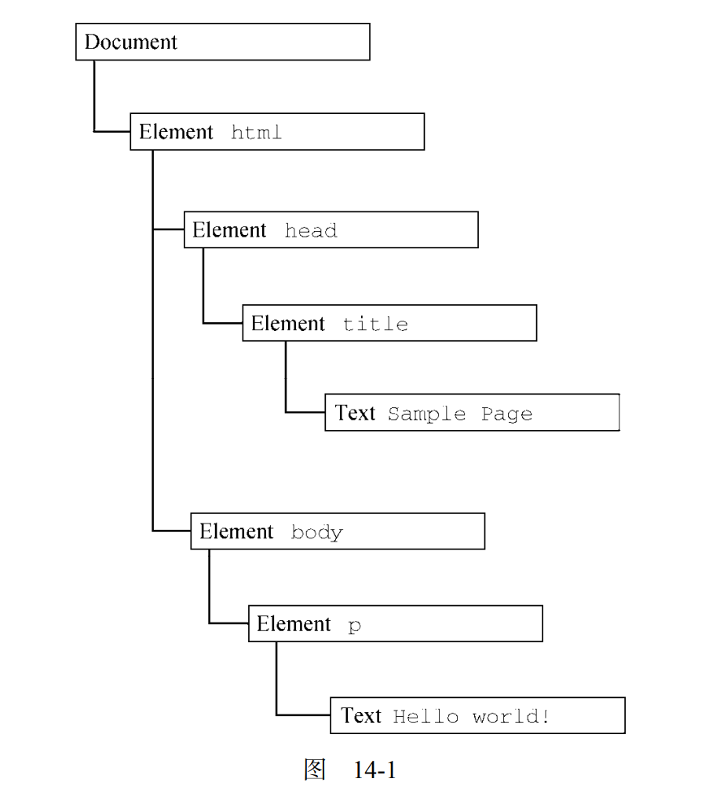
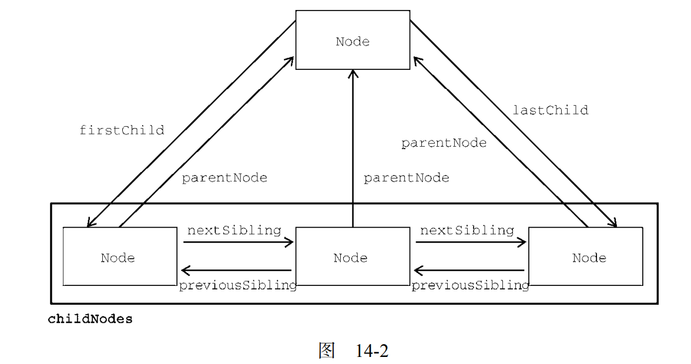

# DOM

The Document Object Model.介绍 DOM，即文档对象模型，主要是 DOM Level 1 定义的 API。这一章将简单讨论 XML及其与 DOM 的关系，进而全面探索 DOM 以及如何利用它操作网页

 理解文档对象模型（DOM）\作为nodes的继承 Understanding the DOM as a hierarchy of nodes
 节点类型                              Working with the various node types
 浏览器兼容性\代码                     Coding the DOM around browser incompatibilities and gotchas
 MutationObserver 接口                MutationObserver

WROX.COM DOWNLOADS FOR THIS CHAPTER
Please note that all the code examples for this chapter are available as a part of this chapter’s code download on the book’s website at ``www.wrox.com/go/projavascript4e`` on the Download Code tab.
The Document Object Model (DOM) is an application programming interface (API) for HTML and XML documents. The DOM represents a document as a hierarchical tree of nodes, allowing developers to add, remove, and modify individual parts of the page. Evolving out of earlyDynamic HTML (DHTML) innovations from Netscape and Microsoft, the DOM is now a trulycross-platform, language-independent way of representing and manipulating pages for markup.
文档对象模型（DOM，Document Object Model）是 HTML 和 XML 文档的编程接口。DOM 表示由多层节点构成的文档，通过它开发者可以添加、删除和修改页面的各个部分。!!!脱胎于网景和微软早期的动态 HTML（DHTML，Dynamic HTML），DOM 现在是真正跨平台、语言无关的表示和操作网页的方式!!!.
DOM Level 1 became a W3C recommendation in October 1998, providing interfaces for basic document structure and querying. This chapter focuses on the features and uses of the DOM as it relates to HTML pages in the browser and the DOM JavaScript API.
DOM Level 1 在 1998 年成为 W3C 推荐标准，提供了基本文档结构和查询的接口。本章之所以介绍DOM，主要因为它与浏览器中的 HTML 网页相关，并且在 JavaScript 中提供了 DOM API。
NOTE Note that all DOM objects are represented by COM objects in Internet Explorer 8 and earlier. This means that the objects don’t behave or function the same way as native JavaScript objects.
注意:IE8 及更低版本中的 DOM 是通过 COM 对象实现的。这意味着这些版本的 IE 中，DOM 对象跟原生 JavaScript 对象具有不同的行为和功能。

就是说跟文档相关???

## 节点层级

HIERARCHY OF NODES.

```js
//任何 HTML 或 XML 文档都可以用 DOM 表示为一个由节点构成的层级结构。节点分很多类型，每种类型对应着文档中不同的信息和（或）标记，也都有自己不同的特性、数据和方法，而且与其他类型有某种关系。这些关系构成了层级，让标记可以表示为一个以特定节点为根的树形结构。以下面的 HTML为例：
<html> 
 <head> 
    <title>Sample Page</title> 
 </head> 
 <body> 
     <p>Hello World!</p> 
 </body> 
</html> 
//其中，document 节点表示每个文档的根节点。在这里，根节点的唯一子节点是<html>元素，我们称之为文档元素（documentElement）。文档元素是文档最外层的元素，所有其他元素都存在于这个元素之内。!!!每个文档只能有一个文档元素!!!。在 HTML 页面中，文档元素始终是<html>元素。在 XML 文档中，则没有这样预定义的元素，任何元素都可能成为文档元素。HTML 中的每段标记都可以表示为这个树形结构中的一个节点。元素节点表示 HTML 元素，属性节点表示属性，文档类型节点表示文档类型，注释节点表示注释。!!!DOM 中总共有 12 种节点类型!!!，这些类型都继承一种基本类型。
```



### node类型

```js
//DOM Level 1 描述了名为 Node 的接口，这个接口是所有 DOM 节点类型都必须实现的。Node 接口在 JavaScript中被实现为 Node 类型，在除 IE之外的所有浏览器中都可以直接访问这个类型。在 JavaScript中，所有节点类型都继承 Node 类型，因此所有类型都共享相同的基本属性和方法。每个节点都有 nodeType 属性，表示该节点的类型。节点类型由定义在 Node 类型上的 12 个数值
常量表示：
 Node.ELEMENT_NODE（1） 
 Node.ATTRIBUTE_NODE（2） 
 Node.TEXT_NODE（3） 
 Node.CDATA_SECTION_NODE（4） 
 Node.ENTITY_REFERENCE_NODE（5） 
 Node.ENTITY_NODE（6） 
 Node.PROCESSING_INSTRUCTION_NODE（7） 
 Node.COMMENT_NODE（8） 
 Node.DOCUMENT_NODE（9） 
 Node.DOCUMENT_TYPE_NODE（10） 
 Node.DOCUMENT_FRAGMENT_NODE（11） 
 Node.NOTATION_NODE（12）
//节点类型可通过与这些常量比较来确定，比如：
if (someNode.nodeType == Node.ELEMENT_NODE){ 
 alert("Node is an element."); 
} 
//这个例子比较了 someNode.nodeType 与 Node.ELEMENT_NODE 常量。如果两者相等，则意味着someNode 是一个元素节点。浏览器并不支持所有节点类型。开发者最常用到的是元素节点和文本节点。本章后面会讨论每种节点受支持的程度及其用法。

//判断是否是元素节点的方法???
```

#### nodeName与nodeValue

```js
//nodeName 与 nodeValue 保存着有关节点的信息。这两个属性的值完全取决于节点类型。在使用这两个属性前，最好先检测节点类型，如下所示：
if (someNode.nodeType == 1){ 
 value = someNode.nodeName; // 会显示元素的标签名
} 
//这段代码检查 `someNode` 对象的 `nodeType` 属性。如果 `nodeType` 等于 `1`，表示 `someNode` 是一个元素节点。元素节点是表示 HTML 或 XML 文档中的元素的节点类型。如果 `someNode` 是一个元素节点，则代码将 `someNode` 的 `nodeName` 属性赋给变量 `value`。`nodeName` 属性返回元素的标签名，例如 `div`、`span`、`p` 等。这意味着 `value` 将被赋予 `someNode` 的标签名。对元素而言，nodeName 始终等于元素的标签名，而 nodeValue 则始终为 null。
```

#### 节点关系

Node Relationships.

```js
//文档中的所有节点都与其他节点有关系。这些关系可以形容为家族关系，相当于把文档树比作家谱。在 HTML 中，<body>元素是<html>元素的子元素，而<html>元素则是<body>元素的父元素。<head>元素是<body>元素的同胞元素，因为它们有共同的父元素<html>。每个节点都有一个 childNodes 属性，其中包含一个 NodeList 的实例。NodeList 是一个类数组对象，用于存储可以按位置存取的有序节点。注意，NodeList 并不是 Array 的实例，但可以使用中括号访问它的值，而且它也有 length 属性。NodeList 对象独特的地方在于，它其实是一个对 DOM 结构的查询，因此 DOM 结构的变化会自动地在 NodeList 中反映出来。我们通常说 NodeList 是实时的活动对象，而不是第一次访问时所获得内容的快照。
//下面的例子展示了如何使用中括号或使用 item()方法访问 NodeList 中的元素：
let firstChild = someNode.childNodes[0]; 
let secondChild = someNode.childNodes.item(1); 
let count = someNode.childNodes.length; 

//无论是使用中括号还是 item()方法都是可以的，但多数开发者倾向于使用中括号，因为它是一个类数组对象。注意，length 属性表示那一时刻 NodeList 中节点的数量。使用 Array.prototype. 
//slice()可以像前面介绍 arguments 时一样把 NodeList 对象转换为数组。比如：
let arrayOfNodes = Array.prototype.slice.call(someNode.childNodes,0); 
//当然，使用 ES6 的 Array.from()静态方法，可以替换这种笨拙的方式：
let arrayOfNodes = Array.from(someNode.childNodes); 

//每个节点都有一个 parentNode 属性，指向其 DOM 树中的父元素。childNodes 中的所有节点都有同一个父元素，因此它们的 parentNode 属性都指向同一个节点。此外，childNodes 列表中的每个节点都是同一列表中其他节点的同胞节点。而使用 previousSibling 和 nextSibling 可以在这个列表的节点间导航。这个列表中第一个节点的 previousSibling 属性是 null，最后一个节点的nextSibling 属性也是 null，如下所示：
if (someNode.nextSibling === null){ 
 alert("Last node in the parent's childNodes list."); 
} else if (someNode.previousSibling === null){ 
 alert("First node in the parent's childNodes list."); 
} 

//注意，如果 childNodes 中只有一个节点，则它的 previousSibling 和 nextSibling 属性都是null。

//父节点和它的第一个及最后一个子节点也有专门属性：firstChild 和 lastChild 分别指向childNodes 中的第一个和最后一个子节点。someNode.firstChild 的值始终等于 someNode. childNodes[0]，而 someNode.lastChild 的值始终等于 someNode.childNodes[someNode. childNodes.length-1]。如果只有一个子节点，则 firstChild 和 lastChild 指向同一个节点。如果没有子节点，则 firstChild 和 lastChild 都是 null。上述这些节点之间的关系为在文档树的节点之间导航提供了方便。图 14-2 形象地展示了这些关系。
```



有了这些关系，childNodes 属性的作用远远不止是必备属性那么简单了。这是因为利用这些关系指针，几乎可以访问到文档树中的任何节点，而这种便利性是 childNodes 的最大亮点。还有一个便利的方法是 hasChildNodes()，这个方法如果返回 true 则说明节点有一个或多个子节点。相比查询childNodes 的 length 属性，这个方法无疑更方便。

最后还有一个所有节点都共享的关系。ownerDocument 属性是一个指向代表整个文档的文档节点的指针。所有节点都被创建它们（或自己所在）的文档所拥有，因为一个节点不可能同时存在于两个或者多个文档中。这个属性为迅速访问文档节点提供了便利，因为无需在文档结构中逐层上溯了。

注意:虽然所有节点类型都继承了 Node，但并非所有节点都有子节点。本章后面会讨论不同节点类型的差异。

```js
//

```

```js
//

```

```js
//

```

```js
//

```

```js
//

```

```js
//

```
