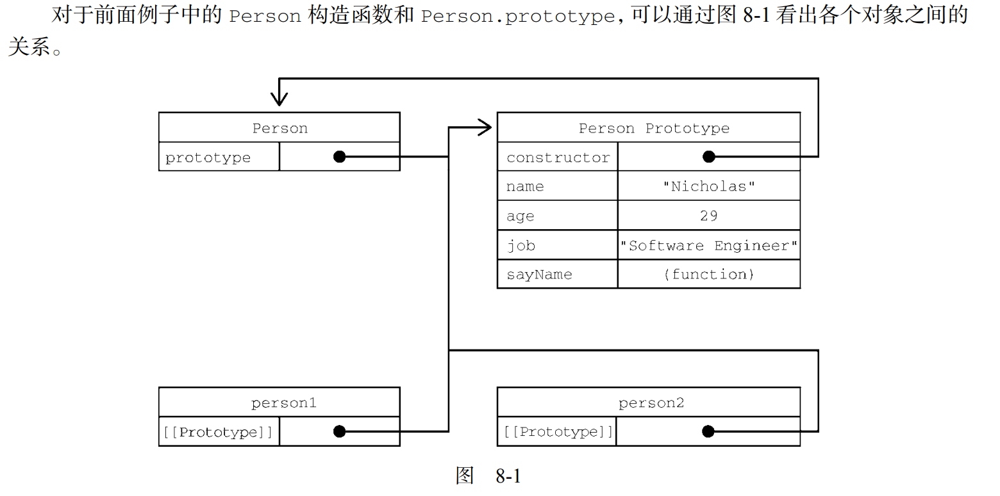
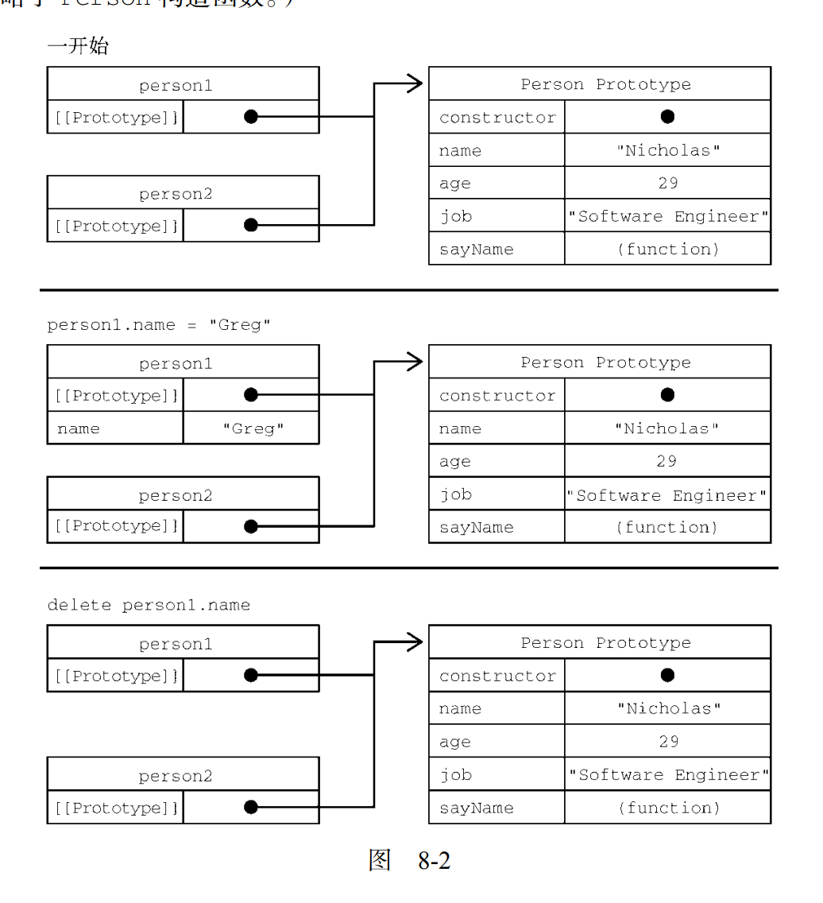
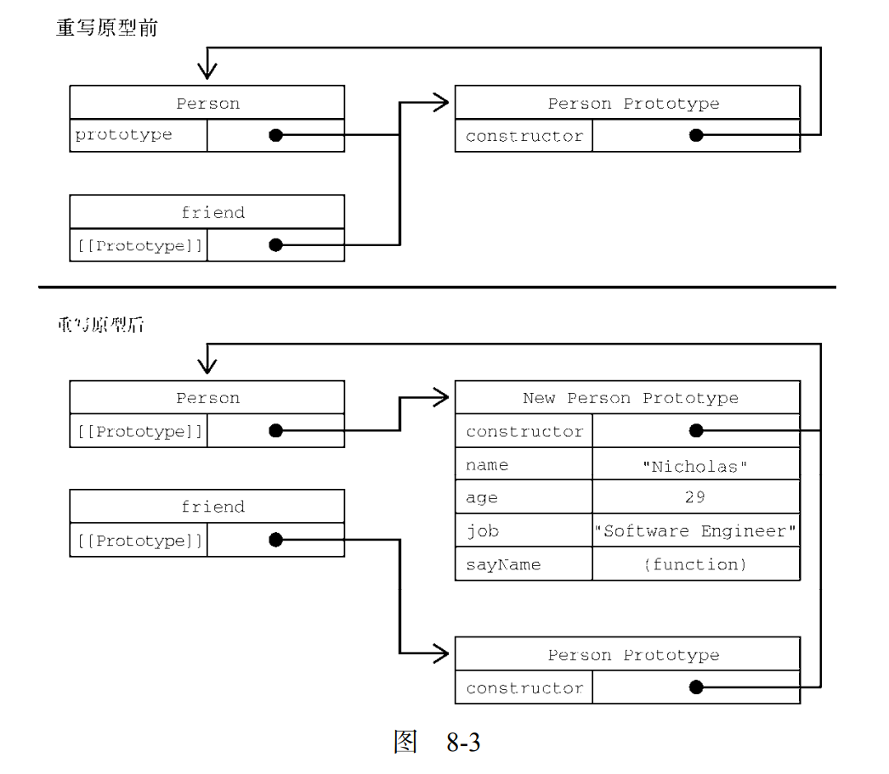
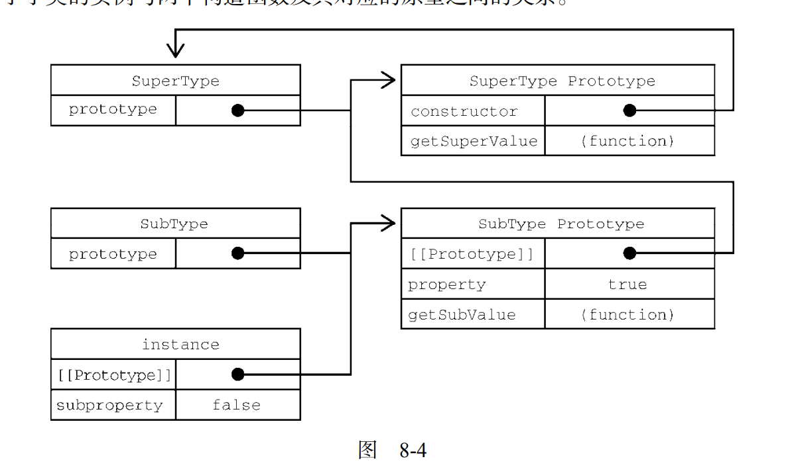
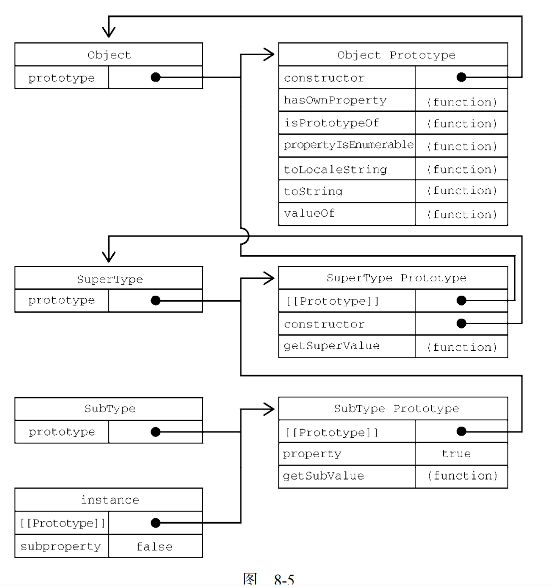
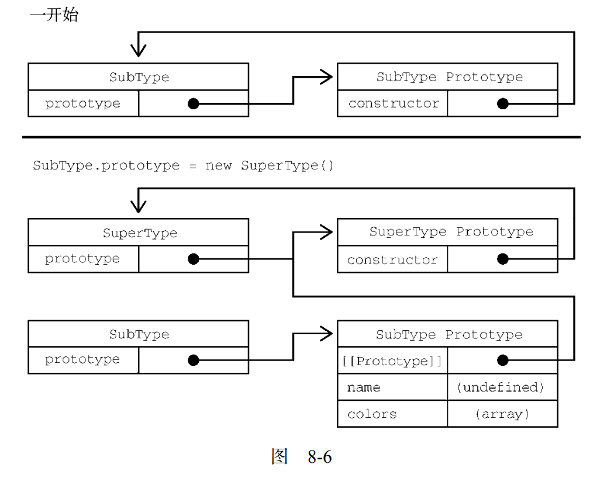
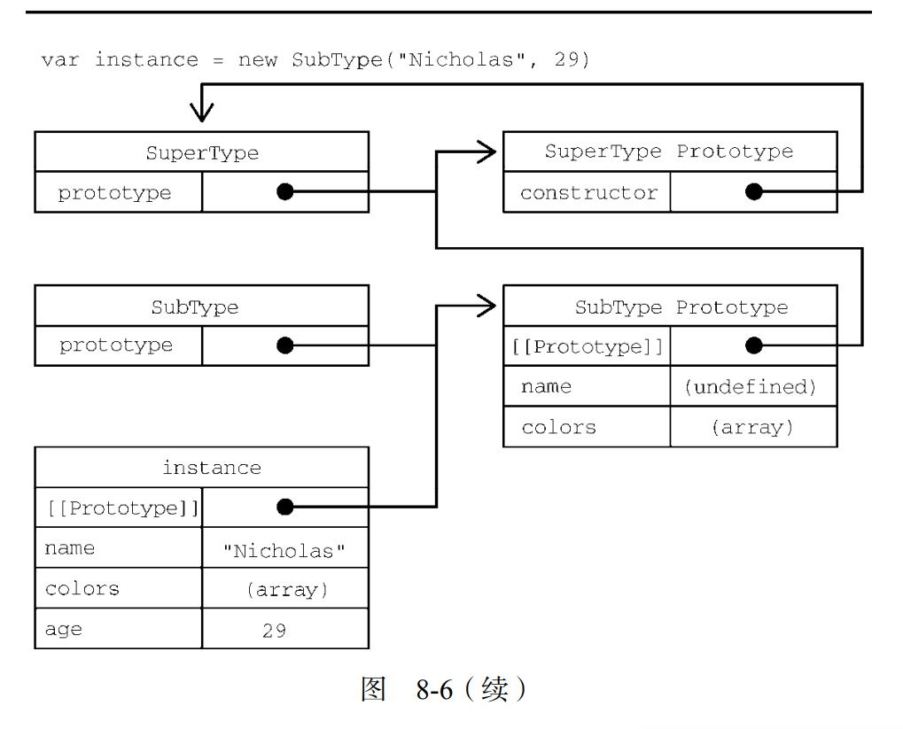

# 对象、类与面向对象编程

Objects, Classes, and Object-Oriented Programming.
 理解对象
 理解对象创建过程
 理解继承
 理解类
解释如何在 JavaScript 中使用类和面向对象编程。首先会深入讨论 JavaScript 的 Object 类型，进而探讨原型式继承，接下来全面介绍 ES6 类及其与原型式继承的紧密关系。

ecma将对象定义为一组属性的无序集合=一组没有特定顺序的值.对象的每个属性或方法都由一个 名称 来标识,名称映射一个值.   对象=散列表=内容是一组name\value对,value可以是数据或者函数.

## 理解对象

通常的创建方式是创建object的一个新实例,然后加入属性方法

```js
let person = new Object(); 
person.name = "Nicholas"; 
person.age = 29; 
person.job = "Software Engineer"; 
person.sayName = function() { 
 console.log(this.name); 
};

//用对象字面量写上面的
let person = { 
 name: "Nicholas", 
 age: 29, 
 job: "Software Engineer", 
 sayName() { 
 console.log(this.name); 
 } 
}; 
```

### 属性的类型

types of properties.
以例如[[Enumerable]]为标识。分两种：数据属性和访问器属性。

1.数据属性data properties

```js
//属性显式添加到对象之后，[[Configurable]](是否可以通过 delete 删除并重新定义，是否可以修改它的特性，以及是否可以把它改为访问器属性)、[[Enumerable]](是否可以通过 for-in 循环返回)和[[Writable]](属性的值是否可以被修改)都会被设置为 true，而[[Value]]特性会被设置为指定的值。比如：
let person = { 
 name: "Nicholas" 
}; 
```

```js
//要修改属性的默认特性，就必须使用 Object.defineProperty()方法.接收 3 个参数：要给其添加属性的对象、属性的名称和一个描述符对象。最后一个参数，即描述符对象上的属性可以包含：configurable、enumerable、writable 和 value，跟相关特性的名称一一对应。接收 3 个参数：要给其添加属性的对象、属性的名称和一个描述符对象。最后一个参数，即描述符对象上的属性可以包含：configurable、enumerable、writable 和 value，跟相关特性的名称一一对应。

//根据修改的特性,可以设置其中一个或多个值
let person = {}; 
Object.defineProperty(person, "name", { 
 writable: false, //这一行不要也行,因为有.defineProperty 就默认false
 value: "Nicholas" 
}); 
console.log(person.name); // "Nicholas" 
person.name = "Greg"; 
console.log(person.name); // "Nicholas"
//在非严格模式下尝试给这个属性重新赋值会被忽略。在严格模式下，尝试修改只读属性的值会抛出错误

let person = {}; 
Object.defineProperty(person, "name", { 
 writable: true, //上面的例子改动一下
 value: "Nicholas" 
}); 
console.log(person.name); // "Nicholas" 

person.name = "Greg"; 
console.log(person.name); //"Greg"
```

```js
//于创建不可配置的属性
let person = {}; 
Object.defineProperty(person, "name", { 
 configurable: false, 
 value: "Nicholas" 
}); 
console.log(person.name); // "Nicholas" 
delete person.name; 
//非严格模式下对这个属性调用 delete 没有效果，严格模式下会抛出错误。
console.log(person.name); // "Nicholas" 
```

```js
//一个属性被定义为不可配置之后，就不能再变回可配置的了。再次调用 Object.defineProperty()并修改任何非 writable 属性会导致错误：
let person = {}; 
Object.defineProperty(person, "name", { 
 configurable: false, 
 value: "Nicholas" 
}); 
// 抛出错误
Object.defineProperty(person, "name", { 
 configurable: true, 
 value: "Nicholas" 
}); 
```

在调用 Object.defineProperty()时，configurable、enumerable 和 writable 的值如果不指定，则都默认为 false。多数情况下，可能都不需要 Object.defineProperty()提供的这些强大的设置，但要理解 JavaScript 对象，就要理解这些概念。

2.访问器属性
Accessor Properties
不含数据值,却包含一个setter(写入访问器时传入新值)一个getter(读取访问器属性时返回一个有效值),不过这两都不是必需的.

4个属性:[[Configurable]]：是否可以通过 delete 删除并重新定义，是否可以修改它的特性，是否可以把它改为数据属性。默认true。[[Enumerable]]：是否可以通过 for-in 循环返回。默认true。[[Get]]：获取函数，在读取属性时调用。默认undefined。[[Set]]：设置函数，在写入属性时调用。默认undefined。

```js
//访问器属性是不能直接定义的，必须使用 Object.defineProperty()。下面是例

// 定义一个对象，包含伪私有成员 year_和公共成员 edition 
let book = { 
 year_: 2017, //year_中的下划线常用来表示该属性并不希望在对象方法的外部被访问
 edition: 1 
}; 

//对 book 对象的 year 属性进行定义
Object.defineProperty(book, "year", {
 get() { 
 return this.year_; 
 }, 
 //在 getter 函数中，当访问 year 属性时，会返回 this.year_ 的值，即返回 year_ 属性的当前值。
 set(newValue)
 //在 getter 函数中，当访问 year 属性时，会返回 this.year_ 的值，即返回 year_ 属性的当前值。
 { 
 if (newValue > 2017) { 
 this.year_ = newValue; 
 this.edition += newValue - 2017; 
 } 
 //2018 大于 2017，所以会触发 setter 函数。在 setter 函数中，this.year_ 被更新为 2018，而 this.edition 被增加了 2018 和 2017 的差值，即 1。
 } 
}); 
book.year = 2018; 
console.log(book.edition); // 2  是1加1
//以上是访问器属性的典型使用场景，即设置一个属性值会导致一些其他变化发生
```

严格模式下,只定义get和set中的一个,会抛错误.

### 定义多个属性

Defining Multiple Properties.

```js
//通过多个描述符一次性定义多个属性
let book = {}; 

//book 对象被定义了三个属性：year_、edition 和 year
Object.defineProperties(book, { 
 year_: { 
 value: 2017 
 }, 
 //属性不可枚举、不可配置、不可写
 edition: { 
 value: 1 
 }, //属性不可枚举、不可配置、不可写

 year: { 
 get() { 
 return this.year_; 
 },
 set(newValue) { 
 if (newValue > 2017) { 
 this.year_ = newValue; 
 this.edition += newValue - 2017; 
 } 
 } 
 }
 //year 属性具有 getter 和 setter 方法，允许对其进行读取和设置，并根据条件更新 year_ 和 edition 属性的值。 
}); 
```

### 读取属性的特性

Reading Property Attributes.

```js
let book = {}; 
Object.defineProperties(book, { 
 year_: { 
 value: 2017 
 }, 
 edition: { 
 value: 1 
 }, 
 year: { 
 get: function() { 
 return this.year_; 
 }, 
 set: function(newValue){ 
 if (newValue > 2017) { 
 this.year_ = newValue; 
 this.edition += newValue - 2017; 
 } 
 } 
 } 
}); 
let descriptor = Object.getOwnPropertyDescriptor(book, "year_"); //获取 book 对象中 year_ 属性的描述符，并将其赋值给变量 descriptor。
console.log(descriptor.value); // 2017  year_ 属性的值，预期输出为 2017。
console.log(descriptor.configurable); // false   year_ 属性是否可配置，预期输出为 false，因为在定义时未设置 configurable，默认值为 false。
console.log(typeof descriptor.get); // "undefined"     year_ 属性的 getter 方法是否存在，预期输出为 "undefined"，因为 year_ 属性没有 getter 方法。

let descriptor = Object.getOwnPropertyDescriptor(book, "year"); //year 属性的值，预期输出为 undefined，因为 year 属性没有初始值。
console.log(descriptor.value); // undefined         year属性的值，预期输出为 undefined，因为 year 属性没有初始值。 
console.log(descriptor.enumerable); // false        year 属性是否可枚举，预期输出为 false，因为在定义时未设置 enumerable，默认值为 false 
console.log(typeof descriptor.get); // "function"   year 属性的 getter 方法是否存在，预期输出为 "function"，因为 year 属性具有 getter 方法。.get 是一个指向获取函数的指针。
```

```js
//Object.getOwnPropertyDescriptors()静态方法,翻看每个属性里面的情况.
let book = {}; 
Object.defineProperties(book, { 
 year_: { 
 value: 2017 
 }, 
 edition: { 
 value: 1 
 }, 
 year: { 
 get: function() { 
 return this.year_; 
 }, 
 set: function(newValue){ 
 if (newValue > 2017) { 
 this.year_ = newValue; 
 this.edition += newValue - 2017; 
 } 
 } 
 } 
}); 
console.log(Object.getOwnPropertyDescriptors(book)); 
// { 
// edition: { 
// configurable: false, 
// enumerable: false, 
// value: 1, 
// writable: false 
// }, 
// year: { 
// configurable: false, 
// enumerable: false, 
// get: f(), 
// set: f(newValue), 
// }, 
// year_: { 
// configurable: false, 
// enumerable: false, 
// value: 2017, 
// writable: false 
// } 
// } 
```

### 合并对象

Merging Objects.也被称为“混入”（mixin）,目标对象通过混入源对象的属性得到了增强.

```js
//Object.assign()方法

let dest, src, result; 
/** 
 * 简单复制
 */ 
dest = {}; 
src = { id: 'src' }; 
result = Object.assign(dest, src); 

// Object.assign 修改目标对象
// 也会返回修改后的目标对象
console.log(dest === src);//false
console.log(dest === result); // true 是否指向同一个对象，预期输出为 true，因为 Object.assign() 方法会修改目标对象并返回修改后的目标对象。
console.log(dest !== src); // true 是否指向不同的对象，预期输出为 true，因为 Object.assign() 方法不会改变源对象。
console.log(result); // { id: src } 即复制了 src 对象的属性到 dest 对象。
console.log(dest); // { id: src } 与 result 相同，表示成功将 src 对象的属性复制到了 dest 对象中。

/** 
 * 多个源对象,即拼接多个
 */ 
dest = {}; 
result = Object.assign(dest, { a: 'foo' }, { b: 'bar' }); 
console.log(result); // { a: foo, b: bar }

/** 
 * 获取函数与设置函数.会使用源对象上的[[Get]]取得属性的值，然后使用目标对象上的[[Set]]设置属性的值
 */ 
dest = { 
 set a(val) { 
 console.log(`Invoked dest setter with param ${val}`); 
 } 
 //dest是目标对象.属性值是一个设置函数a。设置函数的定义中包含了一个参数 val，当这个设置函数被调用时，会在控制台打印一条消息，消息中包含参数 val 的值。调用的英语是invoke.
}; 
src = {  
 get a() { 
 console.log('Invoked src getter'); 
 return 'foo'; 
 } 
 //src是源对象.属性值是一个获取函数。获取函数的定义中没有参数，当这个获取函数被调用时，会在控制台打印一条消息，表示被调用，并返回字符串 'foo'。
}; 
//分别包含名为 a 的设置函数和获取函数。设置函数和获取函数的名称都是 a，这样设置是为了在调用 Object.assign() 时能够正确地将 src 的属性复制到 dest 中。

Object.assign(dest, src);  //目标对象 dest 中的 a 属性是一个设置函数，而不是一个普通属性，因此在复制属性时，获取函数会被调用，但设置函数不会执行赋值操作。
// 调用 src 的获取方法
// 调用 dest 的设置方法并传入参数"foo" 
// 因为这里的设置函数不执行赋值操作
// 所以实际上并没有把值转移过来
let result2=Object.assign(dest, src);//将 src 对象的属性复制到 dest 对象中，并将返回的修改后的目标对象赋值给 result2。
console.log(dest); // { set a(val) {...} }表示 Object.assign() 并未将 src 对象的属性复制到 dest 对象中，而是保留了 dest 自身的属性。
```

```js
//Object.assign()实际上对每个源对象执行的是浅复制。如果多个源对象都有相同的属性，则使用最后一个复制的值。此外，从源对象访问器属性取得的值，比如获取函数，会作为一个静态值赋给目标对象=不能在两个对象间转移获取函数和设置函数。
let dest, src, result; 
/** 
 * 覆盖属性
 */ 
dest = { id: 'dest' }; 
result = Object.assign(dest, { id: 'src1', a: 'foo' }, { id: 'src2', b: 'bar' }); 
// Object.assign 会覆盖重复的属性
console.log(result); // { id: src2, a: foo, b: bar } 同名属性只保留最后一个

// 可以通过目标对象上的设置函数观察到覆盖的过程：
dest = { 
 set id(x) { 
 console.log(x); 
 } 
}; 
Object.assign(dest, { id: 'first' }, { id: 'second' }, { id: 'third' }); 
// first 
// second 
// third 

/** 
 * 对象引用
 */ 
dest = {}; 
src = { a: {} }; 
Object.assign(dest, src); 

// 浅复制意味着只会复制对象的引用
console.log(dest); // { a :{} } 
console.log(dest.a === src.a); // true 
```

```js
//如果赋值期间出错，则操作会中止并退出，同时抛出错误。Object.assign()没有“回滚”之前赋值的概念，因此它是一个尽力而为、可能只会完成部分复制的方法。
let dest, src, result; 
/** 
 * 错误处理
 */ 
dest = {}; 
src = { 
 a: 'foo', 
 get b() { 
 // Object.assign()在调用这个获取函数时会抛出错误
 throw new Error(); 
 }, 
 c: 'bar' 
}; 
try { 
 Object.assign(dest, src); 
} catch(e) {} 
// Object.assign()没办法回滚已经完成的修改
// 因此在抛出错误之前，目标对象上已经完成的修改会继续存在： e 表示error
console.log(dest); // { a: foo } 
//尽管在处理源对象的过程中出现了错误，但是目标对象 dest 上已经成功地复制了 a 属性，因此输出结果为 { a: 'foo' }
```

### 对象标识及相等判定

Object Identity and Equality.对象的认证和相等

```js
//ecma6之前,操作符或无能为力

// 这些是===符合预期的情况
console.log(true === 1); // false 
console.log({} === {}); // false 
console.log("2" === 2); // false 

// 这些情况在不同 JavaScript 引擎中表现不同，但仍被认为相等
console.log(+0 === -0); // true 
console.log(+0 === 0); // true 
console.log(-0 === 0); // true 

// 要确定 NaN 的相等性，必须使用极为讨厌的 isNaN() 
console.log(NaN === NaN); // false 
console.log(isNaN(NaN)); // true  isnan这是一个全局函数，用于检查传入的值是否为 "NaN"
```

```js
//一下是ecma6

console.log(Object.is(true, 1)); // false 
console.log(Object.is({}, {})); // false 
console.log(Object.is("2", 2)); // false 
// 正确的 0、-0、+0 相等/不等判定
console.log(Object.is(+0, -0)); // false 
console.log(Object.is(+0, 0)); // true 
console.log(Object.is(-0, 0)); // false 
// 正确的 NaN 相等判定
console.log(Object.is(NaN, NaN)); // true 跟上面例子不一样的地方

要检查超过两个值，递归地利用相等性传递即可：
function recursivelyCheckEqual(x, ...rest) { 
 return Object.is(x, rest[0]) && 
 (rest.length < 2 || recursivelyCheckEqual(...rest)); 
} 
```

### 增强的 对象语法

Enhanced Object Syntax.

1.属性值填写Property Value Shorthand

```js
//在给对象添加变量的时候，开发者经常会发现属性名和变量名是一样的
let name = 'Matt'; 
let person = { 
 name: name 
}; 
console.log(person); // { name: 'Matt' } 

//以下是以上的解决方案

//代码压缩程序会在不同作用域间保留属性名，以防止找不到引用。以下面的代码为例：
function makePerson(name) { 
 return { 
 name 
 }; 
} 
let person = makePerson('Matt'); 
console.log(person.name); // Matt 

//即使参数标识符只限定于函数作用域，编译器也会保留初始的 name 标识符.若编译器压缩，那么函数参数会被缩短，而属性名不变
function makePerson(a) { 
 return { 
 name: a 
 }; 
} 
var person = makePerson("Matt"); 
console.log(person.name); // Matt 
```

2.可 运算属性Computed Property Keys

即可对属性名字进行操作

引入可计算属性之前，如果想使用变量的值作为属性，那么必须先声明对象，然后使用中括号语法来添加属性=不能在对象字面量中直接动态命名属性。

```js
const nameKey = 'name'; 
const ageKey = 'age'; 
const jobKey = 'job'; 
//以上是变量,赋了值

//以下是使用上述的变量值作为对象的属性名,属性值顺便一fu
let person = {}; 
person[nameKey] = 'Matt'; 
person[ageKey] = 27; 
person[jobKey] = 'Software engineer'; 
console.log(person); // { name: 'Matt', age: 27, job: 'Software engineer' } 
```

```js
//以下是以上的一步到位
//有了可计算属性，就可以在对象字面量中完成动态属性赋值。中括号包围的对象属性键告诉运行时将其作为 JavaScript 表达式而不是字符串来求值
const nameKey = 'name'; 
const ageKey = 'age'; 
const jobKey = 'job'; 
let person = { 
 [nameKey]: 'Matt', 
 [ageKey]: 27, 
 [jobKey]: 'Software engineer' 
}; 
console.log(person); // { name: 'Matt', age: 27, job: 'Software engineer' } 
```

```js
//上面的升级版

//接受一个输入参数key，然后将它与一个自增的唯一令牌拼接起来，生成一个唯一的键，并将其作为函数的返回值。
const nameKey = 'name'; 
const ageKey = 'age'; 
const jobKey = 'job'; 
let uniqueToken = 0; 
function getUniqueKey(key) { 
 return `${key}_${uniqueToken++}`; 
} 
//获取唯一键的函数.返回值的表达式，这里使用了模板字符串，${}用于嵌入变量key的值;并在其后添加一个下划线;然后紧接着是uniqueToken自增后的值。这个表达式的作用是生成一个唯一的键值。
let person = { 
 [getUniqueKey(nameKey)]: 'Matt', 
 [getUniqueKey(ageKey)]: 27, 
 [getUniqueKey(jobKey)]: 'Software engineer' 
}; 
console.log(person); // { name_0: 'Matt', age_1: 27, job_2: 'Software engineer' } 
```

3.简写方法名
Concise Method Syntax.

```js
//.sayname是下面的例子的方法
//在给对象定义方法时，要写一个方法名sayname、冒号，然后再引用一个匿名函数表达式function(name)
let person = { 
 sayName: function(name) { 
 console.log(`My name is ${name}`); 
 } 
}; 
person.sayName('Matt'); // My name is Matt 
```

```js
//以下代码和之前的代码在行为上是等价的：
//新的简写方法的语法遵循同样的模式，但开发者要放弃给函数表达式命名（不过给作为方法的函数命名通常没什么用）。相应地，这样也可以明显缩短方法声明。
let person = { 
 sayName(name) { 
 console.log(`My name is ${name}`); 
 } 
}; 
person.sayName('Matt'); // My name is Matt 

//简写方法名对获取函数和设置函数也是适用的：
let person = { 
 name_: '', 
 get name() { 
 return this.name_; 
 }, 
 set name(name) { 
 this.name_ = name; 
 }, 
 sayName() { 
 console.log(`My name is ${this.name_}`); 
 } 
}; 

person.name = 'Matt'; 
person.sayName(); // My name is Matt 
```

```js
//简写方法名与可运算属性键相互兼容：即[methodKey]就是方法名
const methodKey = 'sayName'; 
let person = { 
 [methodKey](name) { 
 console.log(`My name is ${name}`); 
 } 
}
person.sayName('Matt'); // My name is Matt 
```

### 对象解构

Object Destructuring.即使用与对象匹配的结构来实现对象属性赋值=可以在一条语句中使用嵌套数据实现一个或多个赋值操作(解构语法)

```js
//首先是不使用对象解构的：
// 不使用对象解构
let person = { 
 name: 'Matt', 
 age: 27 
};
let personName = person.name, 
 personAge = person.age; 
console.log(personName); // Matt 
console.log(personAge); // 27 

//然后，是使用对象解构的：
let person = { 
 name: 'Matt', 
 age: 27 
}; 
let { name: personName, age: personAge } = person; //不同出现在这里,意思是将person赋给新变量,使用{}里面的对应方式
console.log(personName); // Matt 
console.log(personAge); // 27 
```

```js
//使用解构，可以在一个类似对象字面量的结构中，声明多个变量，同时执行多个赋值操作。如果想让变量直接使用属性的名称，那么可以使用简写语法，比如：
let person = { 
 name: 'Matt', 
 age: 27 
}; 
let { name, age } = person; //多个赋值操作
console.log(name); // Matt 
console.log(age); // 27 

//解构赋值 不一定 与对象的属性 匹配 。赋值的时候可以忽略某些属性，而如果引用的属性不存在，则该变量的值就是 undefined：
let person = { 
 name: 'Matt', 
 age: 27 
}; 
let { name, job } = person; 
console.log(name); // Matt 
console.log(job); // undefined

//也可以在 解构 赋值的 同时定义默认值 ，这适用于前面刚提到的引用的属性不存在于源对象中的情况：
let person = { 
 name: 'Matt', 
 age: 27 
}; 
let { name, job='Software engineer' } = person; 
console.log(name); // Matt 
console.log(job); // Software engineer 

//解构在内部使用函数 ToObject()（不能在运行时环境中直接访问）把源数据结构转换为对象。这意味着在对象解构的上下文中，原始值会被当成对象。这也意味着（根据 ToObject()的定义），null和 undefined 不能被解构，否则会抛出错误。
let { length } = 'foobar'; 
console.log(length); // 6 

let { constructor: c } = 4; 
console.log(c === Number); // true 

let { _ } = null; // TypeError 
let { _ } = undefined; // TypeError

//解构并不要求变量必须在解构表达式中声明。不过，如果是给事先声明的变量赋值，则赋值表达式必须包含在一对括号中：
let personName, personAge; //事先声明的变量
let person = { 
 name: 'Matt', 
 age: 27 
}; 
({name: personName, age: personAge} = person);//相当于let { name: personName, age: personAge } = person;
console.log(personName, personAge); // Matt, 27
```

所谓解构赋值,其实也是赋值,只不过解构了再赋

1.嵌套解构

Nested Destructuring.

```js
//解构对于引用嵌套的属性或赋值目标没有限制。为此，可以通过解构来复制对象属性：
let person = { 
 name: 'Matt', 
 age: 27, 
 job: { 
 title: 'Software engineer' 
 } 
}; 
let personCopy = {}; 
({ 
 name: personCopy.name,
 age: personCopy.age, 
 job: personCopy.job 
} = person); 

// 因为一个对象的引用被赋值给 personCopy，所以修改
// person.job 对象的属性也会影响 personCopy 
person.job.title = 'Hacker' 

console.log(person); 
// { name: 'Matt', age: 27, job: { title: 'Hacker' } } 
console.log(personCopy); 
// { name: 'Matt', age: 27, job: { title: 'Hacker' } } 


//解构赋值可以使用嵌套结构，以匹配嵌套的属性
let person = { 
 name: 'Matt', 
 age: 27, 
 job: { 
 title: 'Software engineer' 
 } 
}; 
// 声明 title 变量并将 person.job.title 的值赋给它
let { job: { title } } = person; 
console.log(title); // Software engineer 


//在外层属性没有定义的情况下不能使用嵌套解构。无论源对象还是目标对象都一样：
let person = { 
 job: { 
 title: 'Software engineer' 
 } 
}; 
let personCopy = {}; 

// foo 在源对象上是 undefined 
({ 
 foo: { 
 bar: personCopy.bar 
 } 
} = person); 
// TypeError: Cannot destructure property 'bar' of 'undefined' or 'null'. 意思是person没有定义bar

// job 在目标对象上是 undefined 
({ 
 job: { 
 title: personCopy.job.title 
 } 
} = person); 
// TypeError: Cannot set property 'title' of undefined 意思是person定义job里面没有.title
```

2.部分解构

Partial Destructuring Completion.

```js
//需要注意的是，涉及多个属性的解构赋值是一个输出无关的顺序化操作。如果一个解构表达式涉及多个赋值，开始的赋值成功而后面的赋值出错，则整个解构赋值只会完成一部分：
let person = { 
 name: 'Matt', 
 age: 27 
}; 
let personName, personBar, personAge; 
try { 
 // person.foo 是 undefined，因此会抛出错误
 ({name: personName, foo: { bar: personBar }, age: personAge} = person); 
} catch(e) {} 
console.log(personName, personBar, personAge); 
// Matt, undefined, undefined 错误终止在第二个,所以第三个也没赋出来
```

3.参数上下文匹配

Parameter Context Matching.

```js
//在函数参数列表中也可以进行解构赋值。对参数的解构赋值不会影响 arguments 对象，但可以在函数签名中声明在函数体内使用局部变量：
let person = { 
 name: 'Matt', 
 age: 27 
}; 
function printPerson(foo, {name, age}, bar) { 
 console.log(arguments); 
 console.log(name, age); 
} 

function printPerson2(foo, {name: personName, age: personAge}, bar) { 
 console.log(arguments); 
 console.log(personName, personAge); 
} 

printPerson('1st', person, '2nd'); 
// ['1st', { name: 'Matt', age: 27 }, '2nd'] 
// 'Matt', 27 
//['1st', { name: 'Matt', age: 27 }, '2nd']: 第一个console.log打印出函数的参数，即调用printPerson时传入的参数数组。'Matt', 27: 第二个console.log打印出从person对象中解构得到的name和age属性值。
printPerson2('1st', person, '2nd'); 
// ['1st', { name: 'Matt', age: 27 }, '2nd'] 
// 'Matt', 27 
//通过解构赋值，将该对象的name属性赋值给personName变量，将age属性赋值给personAge变量
```

## 创建对象

OBJECT CREATION.
创建具有同样接口的多个对象需要重复编写很多代码,所以任何解决呢?

### 概述Overview

支持面向对象的结构，比如类或继承=巧妙地运用原型式继承可以成功地模拟同样的行为

### 工厂模式

The Factory Pattern.用于抽象创建特定对象的过程.

```js
function createPerson(name, age, job) { 
 let o = new Object(); 
 o.name = name; 
 o.age = age; 
 o.job = job; 
 o.sayName = function() { 
 console.log(this.name); 
 }; 
 return o; 
} //每次都会返回包含 3 个属性和 1 个方法的对象
let person1 = createPerson("Nicholas", 29, "Software Engineer"); 
let person2 = createPerson("Greg", 27, "Doctor"); 
```

### 构造函数模式

The Function Constructor Pattern.用于创建特定类型对象的.像 Object 和 Array 这样的原生直接使用。当然也可以自定义构造函数，以函数的形式为自己的对象类型定义属性和方法

```js
//前面的例子使用构造函数模式可以这样写：
function Person(name, age, job){ 
 this.name = name; 
 this.age = age; 
 this.job = job; 
 this.sayName = function() { 
 console.log(this.name); 
 }; 
} 
let person1 = new Person("Nicholas", 29, "Software Engineer"); 
let person2 = new Person("Greg", 27, "Doctor"); 
person1.sayName(); // Nicholas 
person2.sayName(); // Greg

//，person1 和 person2 分别保存着 Person 的不同实例。这两个对象都有一个constructor 属性指向 Person，如下所示：
console.log(person1.constructor == Person); // true 
console.log(person2.constructor == Person); // true

//constructor 本来是用于标识对象类型的。不过，一般认为 instanceof 操作符是确定对象类型更可靠的方式。前面例子中的每个对象都是Object 的实例(是因为所有自定义对象都继承自 Object)，同时也是 Person 的实例，如下面调用instanceof 操作符的结果所示：
console.log(person1 instanceof Object); // true 
console.log(person1 instanceof Person); // true 
console.log(person2 instanceof Object); // true 
console.log(person2 instanceof Person); // true 
```

Person()构造函数代替了 createPerson()工厂函数。实际上，Person()内部的代码跟 createPerson()基本是一样的，只是有如下区别。
 没有显式地创建对象。
 属性和方法直接赋值给了 this。
 没有 return
另外，要注意函数名 Person 的首字母大写了。按照惯例，构造函数名称的首字母都是要大写的，非构造函数则以小写字母开头。有助于在 ECMA中区分构
造函数和普通函数。毕竟构造函数就是能创建对象的函数。要创建 Person 的实例，应使用 new 操作符。以这种方式调用构造函数会执行如下操作。
(1) 在内存中创建一个新对象。
(2) 这个新对象内部的[[Prototype]]特性被赋值为构造函数的 prototype 属性。
(3) 构造函数内部的 this 被赋值为这个新对象（即 this 指向新对象）。
(4) 执行构造函数内部的代码（给新对象添加属性）。
(5) 如果构造函数返回非空对象，则返回该对象；否则，返回刚创建的新对象。

```js
//构造函数不一定要写成函数声明的形式。赋值给变量的函数表达式也可以表示构造函数：
let Person = function(name, age, job)
//相当于function Person(name, age, job){}的另一形式
{ 
 this.name = name; 
 this.age = age; 
 this.job = job; 
 this.sayName = function() { 
 console.log(this.name); 
 }; 
} 
let person1 = new Person("Nicholas", 29, "Software Engineer"); 
let person2 = new Person("Greg", 27, "Doctor"); 
person1.sayName(); // Nicholas 
person2.sayName(); // Greg 
console.log(person1 instanceof Object); // true 
console.log(person1 instanceof Person); // true 
console.log(person2 instanceof Object); // true 
console.log(person2 instanceof Person); // true 
```

```js
//在实例化时，如果不想传参数，那么构造函数后面的括号可加可不加。只要有 new 操作符，就可以调用相应的构造函数：
function Person() { 
 this.name = "Jake"; 
 this.sayName = function() { 
 console.log(this.name); 
 }; 
} 
let person1 = new Person(); 
let person2 = new Person; 
person1.sayName(); // Jake 
person2.sayName(); // Jake 
console.log(person1 instanceof Object); // true 
console.log(person1 instanceof Person); // true 
console.log(person2 instanceof Object); // true 
console.log(person2 instanceof Person); // true 
```

1.构造函数也是函数
Constructors as Functions.与普通函数唯一的区别就是 !调用方式不同! .任何函数只要使用 new 操作符调用就是构造函数，而不使用 new 操作符调用的函数就是普通函数。

```js
//前面的例子中定义的 Person()可以像下面这样调用：
// 作为构造函数 
let person = new Person("Nicholas", 29, "Software Engineer"); 
person.sayName(); // "Nicholas" 

// 作为函数调用
Person("Greg", 27, "Doctor"); // 添加到 window 对象.作为函数调用了Person构造函数，没有使用new关键字。在非严格模式下，这会导致Person函数中的this绑定到全局对象（在浏览器环境中是window对象），并创建了全局变量sayName，它的值为"Greg"。
window.sayName(); // "Greg" 
//调用了全局变量sayName

//在另一个对象的作用域中调用
let o = new Object(); //创建了一个新的空对象o。
Person.call(o, "Kristen", 25, "Nurse"); //使用call方法将Person构造函数的上下文设置为对象o，并传入了参数"Kristen"、25和"Nurse"。
o.sayName(); // "Kristen"  调用了对象o的sayName方法
//此在上面的调用之后，window 对象上就有了一个 sayName()方法，调用它会返回"Greg"。最后展示的调用方式是通过 call()（或 apply()）调用函数，同时将特定对象指定为作用域。这里的调用将对象 o 指定为 Person()内部的 this 值，因此执行完函数代码后，所有属性和 sayName()方法都会添加到对象 o 上面
```

关于call的知识

```js
`call()` 方法是函数对象的一个方法，它允许你在指定的 `this` 值和参数列表的情况下调用函数。
function.call(thisArg, arg1, arg2, ...)
- `function` 是要调用的函数；- `thisArg` 是函数执行时的上下文，即在函数内部的 `this` 值；- `arg1`, `arg2`, ... 是函数调用时传入的参数。
当你调用 `call()` 方法时，函数会立即执行，并且 `this` 的值会被设置为 `thisArg`。这允许你在调用函数时显式地指定函数执行的上下文。
举个例子，假设有一个函数 `sayName()`：
function sayName(greeting) {
    console.log(`${greeting}, ${this.name}!`);
}
你可以使用 `call()` 方法以不同的上下文调用它：
const person1 = { name: 'Alice' };
const person2 = { name: 'Bob' };
sayName.call(person1, 'Hello'); // 输出：Hello, Alice!
sayName.call(person2, 'Hi');    // 输出：Hi, Bob!
在这个例子中，我们使用 `call()` 方法将函数 `sayName()` 分别绑定到了 `person1` 和 `person2` 对象上，这样函数中的 `this` 就分别指向了这两个对象，从而实现了不同的输出。
```

### 构造函数的毛病

Problems with Constructors.

```js
//构造函数的主要毛病在于，其定义的方法会在每个实例上都创建一遍。因此对前面的例子而言，person1 和 person2 都有名为 sayName()的方法，但这两个方法不是同一个 Function 实例。我们知道，ECMAScript 中的函数是对象，因此每次定义函数时，都会初始化一个对象。逻辑上讲，这个构造函数实际上是这样的：
function Person(name, age, job){ 
 this.name = name; 
 this.age = age; 
 this.job = job; 
 this.sayName = new Function("console.log(this.name)"); // 逻辑等价
} 
//每个 Person 实例都会有自己的 Function 实例用于显示 name 属性。当然了，以这种方式创建函数会带来不同的作用域链和标识符解析。
```

```js
//但创建新 Function实例的机制是一样的。因此不同实例上的函数虽然同名却不相等，如下所示：
console.log(person1.sayName == person2.sayName); //false
```

```js
//因为都是做一样的事，所以没必要定义两个不同的 Function 实例。况且，this 对象可以把函数与对象的绑定推迟到运行时。要解决这个问题，可以把函数定义转移到构造函数外部：
function Person(name, age, job){ 
 this.name = name; 
 this.age = age; 
 this.job = job; 
 this.sayName = sayName; 
} 
function sayName() { 
 console.log(this.name); 
} //sayName()被定义在了构造函数外部。
//在构造函数内部，sayName 属性等于全局 sayName()函数。因为这一次 sayName 属性中包含的只是一个指向外部函数的指针，所以 person1 和 person2共享了定义在全局作用域上的 sayName()函数。这样虽然解决了相同逻辑的函数重复定义的问题，但全局作用域也因此被搞乱了，因为那个函数实际上只能在一个对象上调用。???如果这个对象需要多个方法，那么就要在全局作用域中定义多个函数。这会导致自定义类型引用的代码不能很好地聚集一起。这个新问题可以通过原型模式来解决.???不懂
let person1 = new Person("Nicholas", 29, "Software Engineer"); 
let person2 = new Person("Greg", 27, "Doctor"); 
person1.sayName(); // Nicholas 
person2.sayName(); // Greg 
```

### 原型模式

The Prototype Pattern.

```js
//每个函数都会创建一个 prototype 属性，这个属性是一个对象，包含应该由特定引用类型的实例共享的属性和方法。实际上，这个对象就是通过调用构造函数创建的对象的原型。使用原型对象的好处是，在它上面定义的属性和方法可以被对象实例共享。原来在构造函数中直接赋给对象实例的值，可以直接赋值给它们的原型，如下所示：
function Person() {}

Person.prototype.name = "Nicholas"; 
Person.prototype.age = 29; 
Person.prototype.job = "Software Engineer"; 
Person.prototype.sayName = function() { 
 console.log(this.name); 
};

let person1 = new Person(); 
person1.sayName(); // "Nicholas" 
let person2 = new Person(); 
person2.sayName(); // "Nicholas" 
console.log(person1.sayName == person2.sayName); // true  ==是转换后再比较值是否相等


//以上是构造函数模式.与构造函数模式不同，使用这种原型模式定义的属性和方法是由所有实例共享的如下使用函数表达式也可以：
let Person = function() {}; //使用函数表达式
Person.prototype.name = "Nicholas"; 
Person.prototype.age = 29; 
Person.prototype.job = "Software Engineer"; 
Person.prototype.sayName = function() { 
 console.log(this.name); 
}; 
let person1 = new Person(); 
person1.sayName(); // "Nicholas" 
let person2 = new Person(); 
person2.sayName(); // "Nicholas" 
console.log(person1.sayName == person2.sayName); // true 
```

原型的本质:
1.理解原型
How Prototypes Work.。脚本中没有访问这个[[Prototype]]特性的标准方式
实例与构造函数原型之间有直接的联系，但实例与构造函数之间没有。

```js
//这种关系不好可视化，但可以通过下面的代码来理解原型的行为：
/** 
 * 构造函数可以是函数表达式
 * 也可以是函数声明，因此以下两种形式都可以：
 * function Person() {} 
 * let Person = function() {} 
 */ 
function Person() {} 
/** 
 * 声明之后，构造函数就有了一个
 * 与之关联的原型对象：
 */ 
console.log(typeof Person.prototype); 
console.log(Person.prototype); 
// { 
// constructor: f Person(), 
// __proto__: Object 
// } 
/** 
 * 如前所述，构造函数有一个 prototype 属性
 * 引用其原型对象，而这个原型对象也有一个
 * constructor 属性，引用这个构造函数
 * 换句话说，两者循环引用：
 */ 
console.log(Person.prototype.constructor === Person); // true 
/** 
 * 正常的原型链都会终止于 Object 的原型对象
 * Object 原型的原型是 null 
 */ 
console.log(Person.prototype.__proto__ === Object.prototype); // true 
console.log(Person.prototype.__proto__.constructor === Object); // true 
console.log(Person.prototype.__proto__.__proto__ === null); // true 
console.log(Person.prototype.__proto__); 
// { 
// constructor: f Object(), 
// toString: ... 
// hasOwnProperty: ... 
// isPrototypeOf: ... 
// ... 
// } 
let person1 = new Person(), 
 person2 = new Person(); 
/** 
 * 构造函数、原型对象和实例
 * 是 3 个完全不同的对象：
 */ 
console.log(person1 !== Person); // true 
console.log(person1 !== Person.prototype); // true 
console.log(Person.prototype !== Person); // true 
/** 
 * 实例通过__proto__链接到原型对象，
 * 它实际上指向隐藏特性[[Prototype]] 
 * 
 * 构造函数通过 prototype 属性链接到原型对象
 * 
 * 实例与构造函数没有直接联系，与原型对象有直接联系
 */ 
console.log(person1.__proto__ === Person.prototype); // true 
conosle.log(person1.__proto__.constructor === Person); // true 
/** 
 * 同一个构造函数创建的两个实例
 * 共享同一个原型对象：
 */ 
console.log(person1.__proto__ === person2.__proto__); // true 
/** 
 * instanceof 检查实例的原型链中
 * 是否包含指定构造函数的原型：
 */ 
console.log(person1 instanceof Person); // true 
console.log(person1 instanceof Object); // true 
console.log(Person.prototype instanceof Object); // true 
```


就是无论是person还person1还是person2,都走person prototype,但是person prototype又指向原型person.  这里面到底是什么东西,怎么使用的???
Person.prototype 指向原型对象，而 Person.prototype.contructor 指回 Person 构造函数。原型对象包含 constructor 属性和其他后来添加的属性。Person 的两个实例 person1 和 person2 都只有一个内部属性指回 Person.prototype，而且两者都与构造函数没有直接联系。另外要注意，虽然这两个实例都没有属性和方法，但 person1.sayName()可以正常调用。这是由于对象属性查找机制的原因。

```js
//虽然不是所有实现都对外暴露了[[Prototype]]，但可以使用 isPrototypeOf()方法确定两个对象之间的这种关系。本质上，isPrototypeOf()会在传入参数的[[Prototype]]指向调用它的对象时返回 true，如下所示：
console.log(Person.prototype.isPrototypeOf(person1)); // true 
console.log(Person.prototype.isPrototypeOf(person2)); // true 
//以上通过原型对象调用 isPrototypeOf()方法检查了 person1 和 person2。
```

```js
//ECMA 的 Object 类型有一个方法叫 Object.getPrototypeOf()，返回参数的内部特性[[Prototype]]的值。例如：
console.log(Object.getPrototypeOf(person1) == Person.prototype); // true 
console.log(Object.getPrototypeOf(person1).name); // "Nicholas" 
```

```js
//Object 类型还有一个 setPrototypeOf()方法，可以向实例的私有特性[[Prototype]]写入一个新值。这样就可以重写一个对象的原型继承关系：
let biped = { 
 numLegs: 2 
}; 
let person = { 
 name: 'Matt' 
}; 
Object.setPrototypeOf(person, biped); //使用 Object.setPrototypeOf() 方法将 person 对象的原型设置为 biped 对象。这意味着 person 对象继承了 biped 对象的属性和方法。
console.log(person.name); // Matt 
console.log(person.numLegs); // 2 
console.log(Object.getPrototypeOf(person) === biped); // true  使用 Object.getPrototypeOf() 方法获取 person 对象的原型，然后与 biped 对象进行比较。

//warning:Object.setPrototypeOf()可能会严重影响代码性能。Mozilla 文档说得很清楚：“在所有浏览器和 JavaScript 引擎中，修改继承关系的影响都是微妙且深远的。这种影响并不仅是执行 Object.setPrototypeOf()语句那么简单，而是会涉及所有访问了那些修改过[[Prototype]]的对象的代码。”
//为了避免上述:为避免使用 Object.setPrototypeOf()可能造成的性能下降，可以通过 Object.create()来创建一个新对象，同时为其指定原型：
let biped = { 
 numLegs: 2 
}; 
let person = Object.create(biped); //使用object.create
person.name = 'Matt'; 
console.log(person.name); // Matt 
console.log(person.numLegs); // 2 
console.log(Object.getPrototypeOf(person) === biped); // true 
```

2.原型层级

Understanding the Prototype Hierarchy.理解原型的继承.
在调用 person1.sayName()时，会发生两步搜索。首先，JavaScript 引擎会问：“person1 实例有 sayName 属性吗？”答案是没有。然后，继续搜索并问：“person1 的原型有 sayName 属性吗？”答案是有。于是就返回了保存在原型上的这个函数。在调用 person2.sayName()时，会发生同样的搜索过程，而且也会返回相同的结果。这就是原型用于在多个对象实例间共享属性和方法的原理.
即:前面提到的 constructor 属性只存在于原型对象，因此通过实例对象也是可以访问到的。

```js
//虽然可以通过实例读取原型对象上的值，但不可能通过实例重写这些值。如果在实例上添加了一个与原型对象中同名的属性，那就会在实例上创建这个属性，这个属性会遮住原型对象上的属性。下面看一个例子：
function Person() {} 
Person.prototype.name = "Nicholas"; 
Person.prototype.age = 29; 
Person.prototype.job = "Software Engineer"; 
Person.prototype.sayName = function() { 
 console.log(this.name); 
}; 
let person1 = new Person(); 
let person2 = new Person(); 
person1.name = "Greg"; 
console.log(person1.name); // "Greg"，来自实例.访问 person1.name 时，会先在实例上搜索个属性。因为这个属性在实例上存在，所以就不会再搜索原型对象了。只要给对象实例添加一个属性，这个属性就会遮蔽（shadow）原型对象上的同名属性，也就是虽然不会修改它，但会屏蔽对它的访问.
console.log(person2.name); // "Nicholas"，来自原型
```

```js
//使用 delete 操作符可以完全删除实例上的这个属性，从而让标识符解析过程能够继续搜索原型对象。
function Person() {} 
Person.prototype.name = "Nicholas"; 
Person.prototype.age = 29; 
Person.prototype.job = "Software Engineer"; 
Person.prototype.sayName = function() { 
 console.log(this.name); 
}; 
let person1 = new Person(); 
let person2 = new Person(); 
person1.name = "Greg"; 
console.log(person1.name); // "Greg"，来自实例
console.log(person2.name); // "Nicholas"，来自原型

delete person1.name; 
console.log(person1.name); // "Nicholas"，来自原型   之前是Greg,之前以"Greg"遮蔽了原型上的同名属性。然后原型上 name 属性的联系就恢复了，因此再访问 person1.name 时，就会返回原型对象上这个属性的值.
```

```js
//以下是一种查实例的方法,实例上有才会true
//hasOwnProperty()方法用于确定某个属性是在实例上还是在原型对象上。这个方法是继承自 Object的，会在属性存在于调用它的对象实例上时返回 true，如下面的例子所示：
function Person() {} 
Person.prototype.name = "Nicholas"; 
Person.prototype.age = 29; 
Person.prototype.job = "Software Engineer"; 
Person.prototype.sayName = function() { 
 console.log(this.name); 
}; 
let person1 = new Person(); 
let person2 = new Person(); 
console.log(person1.hasOwnProperty("name")); // false 
person1.name = "Greg"; 
console.log(person1.name); // "Greg"，来自实例
console.log(person1.hasOwnProperty("name")); // true 
console.log(person2.name); // "Nicholas"，来自原型
console.log(person2.hasOwnProperty("name")); // false 
delete person1.name; 
console.log(person1.name); // "Nicholas"，来自原型
console.log(person1.hasOwnProperty("name")); // false 
```



tip:Object.getOwnPropertyDescriptor()方法只对实例属性有效。要取得原型属性的描述符，就必须直接在原型对象上调用 Object.getOwnProperty-Descriptor()

### 原型和in操作符

Prototypes and the “in” Operator.有两种方式使用 in 操作符：单独使用和在for-in 循环中使用.

```js
//在单独使用时，in 操作符会在可以通过对象访问指定属性时返回 true，无论该属性是在实例上还是在原型上。来看下面的例子：
function Person() {} 
Person.prototype.name = "Nicholas"; 
Person.prototype.age = 29; 
Person.prototype.job = "Software Engineer"; 
Person.prototype.sayName = function() { 
 console.log(this.name); 
}; 
let person1 = new Person(); 
let person2 = new Person(); 
console.log(person1.hasOwnProperty("name")); // false 
console.log("name" in person1); // true 属性中有name吗?实例或原型都行
person1.name = "Greg"; 
console.log(person1.name); // "Greg"，来自实例
console.log(person1.hasOwnProperty("name")); // true 
console.log("name" in person1); // true 
console.log(person2.name); // "Nicholas"，来自原型
console.log(person2.hasOwnProperty("name")); // false 
console.log("name" in person2); // true 
delete person1.name; 
console.log(person1.name); // "Nicholas"，来自原型
console.log(person1.hasOwnProperty("name")); // false 
console.log("name" in person1); // true 
```

```js
//以上调用"name" in persoon1时始终返回 true，无论这个属性是否在实例上。如果要确定某个属性是否存在于原型上，则可以像下面这样同时使用 hasOwnProperty()和 in 操作符：
function hasPrototypeProperty(object, name){ 
 return !object.hasOwnProperty(name) && (name in object); 
} 
// 返回一个表达式的结果，该表达式检查对象是否具有指定名称的属性，但不在对象自身上定义，而是在其原型链上继承。具体逻辑如下：!object.hasOwnProperty(name)：检查对象自身是否具有指定名称的属性。如果返回 true，表示对象自身没有定义该属性(因为有!号)。(name in object)：检查指定名称的属性是否在对象的原型链上。如果返回 true，表示属性在原型链上被找到。因此，!object.hasOwnProperty(name) && (name in object) 表达式的结果为 true 表示对象没有自己的属性，但在原型链上找到了这个属性。如下面的例子
// 定义一个原型对象
let animal = {
  legs: 4
};
// 创建一个对象，它的原型是animal
let dog = Object.create(animal);
// 在dog对象中并没有直接定义legs属性
// 但是它通过原型链继承了这个属性
console.log(dog.legs); // 输出: 4
//只要通过对象可以访问，in 操作符就返回 true，而 hasOwnProperty()只有属性存在于实例上时才返回 true。因此，只要 in 操作符返回 true 且 hasOwnProperty()返回 false，就说明该属性是一个原型属性。
```

```js
function Person() {} 
Person.prototype.name = "Nicholas"; 
Person.prototype.age = 29; 
Person.prototype.job = "Software Engineer"; 
Person.prototype.sayName = function() { 
 console.log(this.name); 
}; 
let person = new Person(); 
console.log(hasPrototypeProperty(person, "name")); // true  函数名叫测是否有原型属性的函数
person.name = "Greg"; 
console.log(hasPrototypeProperty(person, "name")); // false 因为在实例上重写了属性,所以 查原型的hasPrototypeProperty() 返回 false.即便此时原型对象还有 name 属性，但因为实例上的属性遮蔽了它，所以不会用到。
```

在 for-in 循环中使用 in 操作符时，可以通过对象访问且可以被枚举的属性都会返回，包括实例属性和原型属性。遮蔽原型中不可枚举（[[Enumerable]]特性被设置为 false）属性的实例属性也会在 for-in 循环中返回，因为默认情况下开发者定义的属性都是可枚举的。  什么意思???

```js
//要获得对象上所有可枚举的实例属性，可以使用 Object.keys()方法。这个方法接收一个对象作为参数，返回包含该对象所有可枚举属性名称的字符串数组。比如：
function Person() {} 
Person.prototype.name = "Nicholas"; 
Person.prototype.age = 29; 
Person.prototype.job = "Software Engineer"; 
Person.prototype.sayName = function() { 
 console.log(this.name); 
}; 
let keys = Object.keys(Person.prototype); 
console.log(keys); // "name,age,job,sayName" 获取了所有可枚举的实例属性
let p1 = new Person(); 
p1.name = "Rob"; 
p1.age = 31; 
let p1keys = Object.keys(p1); 
console.log(p1keys); // "[name,age]" 而在 Person 的实例上调用时，Object.keys()返回的数组中只包含"name"和"age"两个属性。
```

```js
//如果想列出所有实例属性，无论是否可以枚举，都可以使用 Object.getOwnPropertyNames()：
let keys = Object.getOwnPropertyNames(Person.prototype); 
console.log(keys); // "[constructor,name,age,job,sayName]" 
//注意，返回的结果中包含了一个不可枚举的属性 constructor。Object.keys()和 Object. getOwnPropertyNames()在适当的时候都可用来代替 for-in 循环
```

```js
//ecma6之后,相应地出现了增加一个 Object.getOwnPropertyNames()的兄弟方法的需求，因为以符号为键的属性没有名称的概念。这是什么意思???因此，Object.getOwnProperty-Symbols()方法就出现了，这个方法与 Object.getOwnPropertyNames()类似，只是针对符号而已：
let k1 = Symbol('k1'), 
 k2 = Symbol('k2');
let o = { 
 [k1]: 'k1', 
 [k2]: 'k2' 
}; 
console.log(Object.getOwnPropertySymbols(o)); 
// [Symbol(k1), Symbol(k2)]
```

### 属性枚举顺序

Property Enumeration Order.

```js
//for-in 循环、Object.keys()、Object.getOwnPropertyNames()、Object.getOwnProperty-Symbols()以及 Object.assign()在属性枚举顺序方面有很大区别。for-in 循环和 Object.keys()的枚举顺序是不确定的，取决于 JavaScript 引擎，可能因浏览器而异。Object.getOwnPropertyNames()、Object.getOwnPropertySymbols()和 Object.assign()的枚举顺序是确定性的。如下
let k1 = Symbol('k1'), 
 k2 = Symbol('k2'); 
let o = { 
 1: 1, 
 first: 'first', 
 [k1]: 'sym2', 
 second: 'second', 
 0: 0 
}; 
o[k2] = 'sym2'; 
o[3] = 3; 
o.third = 'third'; 
o[2] = 2; 
console.log(Object.getOwnPropertyNames(o)); 
// ["0", "1", "2", "3", "first", "second", "third"] 先以升序枚举数值键，然后以插入顺序枚举字符串和符号键。
console.log(Object.getOwnPropertySymbols(o)); 
// [Symbol(k1), Symbol(k2)]在对象字面量中定义的键以它们逗号分隔的顺序插入。
```

### 对象迭代

Object Iteration.

```js
//在 JavaScript 有史以来的大部分时间内，迭代对象属性都是一个难题。ECMAScript 2017 新增了两个静态方法，用于将对象内容转换为序列化的——更重要的是可迭代的——格式。这两个静态方法Object.values()和 Object.entries()接收一个对象，返回它们内容的数组。Object.values()返回对象值的数组，Object.entries()返回键/值对的数组。下面的示例展示了这两个方法：
const o = { 
 foo: 'bar', 
 baz: 1, 
 qux: {} 
}; 
console.log(Object.values(o)); 
// ["bar", 1, {}] 
console.log(Object.entries((o))); 
// [["foo", "bar"], ["baz", 1], ["qux", {}]]   entries" 单词可以指代各种不同的条目、记录、作品或者参与者
```

```js
//什么意思,不懂???

//注意，非字符串属性会被转换为字符串输出。另外，这两个方法执行对象的浅复制：
const o = { 
 qux: {} 
}; 
console.log(Object.values(o)[0] === o.qux); 
// true 
console.log(Object.entries(o)[0][1] === o.qux); 
// true 

//符号属性会被忽略：
const sym = Symbol(); 
const o = { 
 [sym]: 'foo' 
}; 
console.log(Object.values(o)); 
// [] 
console.log(Object.entries((o))); 
// [] 
```

1.其它原型语法

Alternate Prototype Syntax.

```js
//在前面的例子中，每次定义一个属性或方法都会把 Person.prototype 重写一遍。为了减少代码冗余，也为了从视觉上更好地封装原型功能，直接通过一个包含所有属性和方法的对象字面量来重写原型成为了一种常见的做法，如下面的例子所示：
function Person() {} 
Person.prototype = {
 name: "Nicholas", 
 age: 29, 
 job: "Software Engineer", 
 sayName() { 
 console.log(this.name); 
 } 
}; //写进一个式子
```

```js
//以上是Person.prototype 被设置为等于一个通过对象字面量创建的新对象。最终结果是一样的，只有一个问题：这样重写之后，Person.prototype 的 constructor 属性就不指向 Person了。在创建函数时，也会创建它的 prototype 对象，同时会自动给这个原型的 constructor 属性赋值。而上面的写法完全重写了默认的 prototype 对象，因此其 constructor 属性也指向了完全不同的新对象（Object 构造函数），不再指向原来的构造函数。虽然 instanceof 操作符还能可靠地返回值，但我们不能再依靠 constructor 属性来识别类型了，如下面的例子所示：
let friend = new Person(); 
console.log(friend instanceof Object); // true 因为所有对象都是 Object 类型的实例。
console.log(friend instanceof Person); // true 因为 friend 对象是通过 new Person() 创建的，因此它是 Person 类型的实例
console.log(friend.constructor == Person); // false 表示 friend 对象的构造函数不是 Person。这是因为虽然 friend 对象是 Person 类型的实例，但其构造函数可能被修改过，不一定是默认的 Person 构造函数。
console.log(friend.constructor == Object); // true friend 对象的构造函数是 Object。这是因为所有对象默认的构造函数都是 Object

//如果 constructor 的值很重要，则可以像下面这样在重写原型对象时专门设置一下它的值：
function Person() { 
} 
Person.prototype = { 
 constructor: Person, //这是在干嘛???有什么用???
 name: "Nicholas", 
 age: 29, 
 job: "Software Engineer", 
 sayName() { 
 console.log(this.name); 
 } 
}; 
//但要注意，以这种方式恢复 constructor 属性会创建一个[[Enumerable]]为 true 的属性。而原生 constructor 属性默认是不可枚举的。因此，

//改为使用 Object.defineProperty()方法来定义 constructor 属性：
function Person() {} 
Person.prototype = { 
 name: "Nicholas", 
 age: 29, 
 job: "Software Engineer", 
 sayName() { 
 console.log(this.name); 
 } 
}; 
// 恢复 constructor 属性
Object.defineProperty(Person.prototype, "constructor", { 
 enumerable: false, 
 value: Person 
});////这是在干嘛???有什么用???
```

2.原型的动态性

Dynamic Nature of Prototypes.原型的动态特征.

```js
//因为从原型上搜索值的过程是动态的，所以即使实例在修改原型之前已经存在，任何时候对原型对象所做的修改也会在实例上反映出来。下面是一个例子：
let friend = new Person(); 
Person.prototype.sayHi = function() { 
 console.log("hi"); 
}; 
friend.sayHi(); // "hi"，没问题！
//虽然 friend 实例是在添加方法之前创建的，但它仍然可以访问这个方法。之所以会这样，主要原因是实例与原型之间松散的联系。在调用 friend.sayHi()时，首先会从这个实例中搜索名为 sayHi 的属性。在没有找到的情况下，运行时会继续搜索原型对象。因为实例和原型之间的链接就是简单的指针，而不是保存的副本，所以会在原型上找到 sayHi 属性并返回这个属性保存的函数。
```

```js
//虽然随时能给原型添加属性和方法，并能够立即反映在所有对象实例上，但这跟重写整个原型是两回事。实例的[[Prototype]]指针是在调用构造函数时自动赋值的，这个指针即使把原型修改为不同的对象也不会变。重写整个原型会切断最初原型与构造函数的联系，但实例引用的仍然是最初的原型。记住，实例只有指向原型的指针，没有指向构造函数的指针。来看下面的例子：
function Person() {} 
let friend = new Person(); 
Person.prototype = { 
 constructor: Person, 
 name: "Nicholas", 
 age: 29, 
 job: "Software Engineer", 
 sayName() { 
 console.log(this.name); 
 } 
}; 
friend.sayName(); // 错误
//Person 的新实例是在重写原型对象之前创建的。在调用 friend.sayName()的时候，会导致错误。这是因为 firend 指向的原型还是最初的原型，而这个原型上并没有 sayName 属性。下图展示了这里面的原因.重写构造函数上的原型之后再创建的实例才会引用新的原型。而在此之前创建的实例仍然会引用最初的原型。
```



3.原生对象原型

Native Object Prototypes.对象自带的原型

```js
console.log(typeof Array.prototype.sort); // "function" 
console.log(typeof String.prototype.substring); // "function"
```

```js
//通过原生对象的原型可以取得所有默认方法的引用，也可以给原生类型的实例定义新的方法。可以像修改自定义对象原型一样修改原生对象原型，因此随时可以添加方法。比如，下面的代码就给 String原始值包装类型的实例添加了一个 startsWith()方法：
String.prototype.startsWith = function (text) { 
 return this.indexOf(text) === 0; //使用字符串对象的 indexOf 方法来检查给定的 text 是否在字符串的起始位置（索引为0）。如果 text 在字符串的起始位置，则返回 true
}; 
let msg = "Hello world!"; 
console.log(msg.startsWith("Hello")); // true   因为这个方法是被定义在 String.rototype 上，所以当前环境下所有的字符串都可以使用这个方法。msg是个字符串，在读取它的属性时，后台会自动创建 String 的包装实例，从而找到并调用 startsWith()方法。
```

4.原型的问题

```js
//原型模式也不是没有问题。首先，它弱化了向构造函数传递初始化参数的能力，会导致所有实例默认都取得相同的属性值。虽然这会带来不便，但还不是原型的最大问题。原型的最主要问题源自它的共享特性。我们知道，原型上的所有属性是在实例间共享的，这对函数来说比较合适。另外包含原始值的属性也还好，如前面例子中所示，可以通过在实例上添加同名属性来简单地遮蔽原型上的属性。真正的问题来自包含引用值的属性。来看下面的例子：
function Person() {} 
Person.prototype = { 
 constructor: Person, 
 name: "Nicholas", 
 age: 29, 
 job: "Software Engineer", 
 friends: ["Shelby", "Court"],
 sayName() { 
 console.log(this.name); 
 } 
}; 
let person1 = new Person(); 
let person2 = new Person(); 
person1.friends.push("Van"); 
console.log(person1.friends); // "Shelby,Court,Van" 
console.log(person2.friends); // "Shelby,Court,Van" 
console.log(person1.friends === person2.friends); // true 
//由于这个friends 属性存在于 Person.prototype 而非 person1 上，新加的这个字符串也会在（指向同一个数组的）person2.friends 上反映出来。如果这是有意在多个实例间共享数组，那没什么问题。但一般来说，不同的实例应该有属于自己的属性副本。这就是实际开发中通常不单独使用原型模式的原因。那怎么使用???
```

## 继承

INHERITANCE.继承是面向对象编程中讨论最多的话题。很多面向对象语言都支持两种继承：接口继承和实现继承。前者只继承方法签名 Interface inheritance where the only the method signatures are inherited，后者继承实际的方法implementation inheritance, where actual methods are inherited. is。接口继承在 ECMAScript 中是不可能的，因为函数没有签名。实现继承是 ECMAScript 唯一支持的继承方式，而这主要是通过原型链实现的。

### 原型链

Prototype Chaining.

```js
//ECMA-262 把原型链定义为 ECMAScript 的主要继承方式。其基本思想就是通过原型继承多个引用类型的属性和方法。重温一下构造函数、原型和实例的关系：每个构造函数都有一个原型对象，原型有一个属性指回构造函数，而实例有一个内部指针指向原型。如果原型是另一个类型的实例呢？那就意味着这个原型本身有一个内部指针指向另一个原型，相应地另一个原型也有一个指针指向另一个构造函数。这样就在实例和原型之间构造了一条原型链。这就是原型链的基本构想。实现原型链涉及如下代码模式：
function SuperType() { 
 this.property = true; 
} //!!!property 是一个实例属性!!!.这行代码定义了一个名为 SuperType 的构造函数。在这个构造函数内部，它将一个属性 property 设置为 true
SuperType.prototype.getSuperValue = function() { 
 return this.property; 
}; //!!!getSuperValue()是一个原型方法.!!!这行代码在 SuperType 的原型上定义了一个名为 getSuperValue 的方法返回实例的 property 属性值
function SubType() { 
 this.subproperty = false; //在 SubType 构造函数中，将属性 subproperty 设置为 false
} //这行代码定义了一个名为 SubType 的构造函数。在这个构造函数内部，它将一个属性 subproperty 设置为 false。
 
SubType.prototype = new SuperType(); //这行代码实现了继承，将 SubType 的原型设置为一个新的 SuperType 实例。通过这种方式，SubType 继承了 SuperType 的属性和方法
SubType.prototype.getSubValue = function () { 
 return this.subproperty; 
}; //这行代码在 SubType 的原型上定义了一个名为 getSubValue 的方法用于获取 subproperty 属性的值。
let instance = new SubType(); //这行代码创建了一个 SubType 的实例对象 instance
console.log(instance.getSuperValue()); // true 这行代码调用 instance 对象的 getSuperValue 方法。由于 SubType 继承了 SuperType，因此 instance 对象也具有 getSuperValue 方法。 调用 instance.getSuperValue()经过了 3 步搜索：instance、SubType.prototype 和 SuperType.prototype，最后一步才找到这个方法。对属性和方法的搜索会一直持续到原型链的末端。
```



这个例子中实现继承的!!!关键，是 SubType 没有使用默认原型，!!!而是将其替换成了一个新的对象。这个新的对象恰好是 SuperType 的实例。这样一来，SubType 的实例   不仅能从 SuperType 的实例中继承属性和方法，而且还与 SuperType 的原型挂上了钩   。于是 instance（通过内部的[[Prototype]]）指向SubType.prototype，而 SubType.prototype（作为 SuperType 的实例又通过内部的[[Prototype]]）指向 SuperType.prototype。注意，getSuperValue()方法还在 SuperType.prototype 对象上，而 property 属性则在 SubType.prototype 上。这是因为 getSuperValue()是一个原型方法，而property 是一个实例属性。SubType.prototype 现在是 SuperType 的一个实例，因此 property才会存储在它上面。还要注意，由于 SubType.prototype 的 constructor 属性被重写为指向SuperType，所以 instance.constructor 也指向 SuperType

我们知道，在读取实例上的属性时，首先会在实例上搜索这个属性。如果没找到，则会继承搜索实例的原型。在通过原型链实现继承之后，搜索就可以继承向上，搜索原型的原型。

#### 默认原型

Default Prototypes.实际上，原型链中还有一环。默认情况下，所有引用类型都继承自 Object，这也是通过原型链实现的。任何函数的默认原型都是一个 Object 的实例，这意味着这个实例有一个内部指针指向Object.prototype。这也是为什么自定义类型能够继承包括 toString()、valueOf()在内的所有默认方法的原因。因此前面的例子还有额外一层继承关系。


SubType 继承 SuperType，而 SuperType 继承 Object。在调用 instance.toString()时，实际上调用的是保存在 Object.prototype 上的方法

#### 原型与继承的关系

Prototype and Instance Relationships.原型和实例的关系.

```js
//原型与实例的关系可以通过两种方式来确定。    第一种方式是使用 instanceof 操作符，如果一个实例的原型链中出现过相应的构造函数，则 instanceof 返回 true。如下例所示：
console.log(instance instanceof Object); // true 
console.log(instance instanceof SuperType); // true 
console.log(instance instanceof SubType); // true 
//从技术上讲，instance 是 Object、SuperType 和 SubType 的实例，因为 instance 的原型链中包含这些构造函数的原型。结果就是 instanceof 对所有这些构造函数都返回 true。
```

```js
//确定这种关系的第二种方式是使用 isPrototypeOf()方法。原型链中的每个原型都可以调用这个方法，如下例所示，只要原型链中包含这个原型，这个方法就返回 true：
console.log(Object.prototype.isPrototypeOf(instance)); // true 
console.log(SuperType.prototype.isPrototypeOf(instance)); // true 
console.log(SubType.prototype.isPrototypeOf(instance)); // true
```

#### 关于方法

Working with Methods.带方法的使用

```js
//子类有时候需要覆盖父类的方法，或者增加父类没有的方法。为此，这些方法必须在原型赋值之后再添加到原型上。下例：
function SuperType() { 
 this.property = true; 
} 
SuperType.prototype.getSuperValue = function() { 
 return this.property; 
}; 
function SubType() { 
 this.subproperty = false; 
} 
// 继承 SuperType 
SubType.prototype = new SuperType(); 

// 新方法   1.
SubType.prototype.getSubValue = function () { 
 return this.subproperty; 
}; 
// 覆盖已有的方法  2.   后面在 SubType 实例上调用 getSuperValue()时调用的是这个方法。???而 SuperType 的实例仍然会调用最初的方法。重点在于上述两个方法都是在把原型赋值为 SuperType 的实例之后定义的。???
SubType.prototype.getSuperValue = function () { 
 return false; 
}; 
let instance = new SubType(); 
console.log(instance.getSuperValue()); // false 
```

```js
//另一个要理解的重点是:以对象字面量方式创建原型方法会破坏之前的原型链，因为这相当于重写了原型链。下面是一个例子：
function SuperType() { 
 this.property = true; 
} 
SuperType.prototype.getSuperValue = function() { 
 return this.property; 
}; 
function SubType() { 
 this.subproperty = false; 
}
// 继承 SuperType 
SubType.prototype = new SuperType(); 

// 通过对象字面量添加新方法，这会导致上一行无效
SubType.prototype = { 
 getSubValue() { 
 return this.subproperty; 
 }, 
 someOtherMethod() { 
 return false; 
 } 
}; 

let instance = new SubType(); 
console.log(instance.getSuperValue()); // 出错！在这段代码中，子类的原型在被赋值为 SuperType 的实例后，又被一个对象字面量覆盖了。覆盖后的原型是一个 Object 的实例，而不再是 SuperType 的实例。因此之前的原型链就断了。SubType和 SuperType 之间也没有关系了。
```

#### 原型链的问题

Problems with Prototype Chaining.

```js
//主要问题出现在原型中包含引用值的时候。前面在谈到原型的问题时也提到过，原型中包含的引用值会在所有实例间共享，这也是为什么属性通常会在构造函数中定义而不会定义在原型上的原因。在使用原型实现继承时，原型实际上变成了另一个类型的实例。这意味着原先的实例属性摇身一变成为了原型属性。下面的例子揭示了这个问题：
function SuperType() { 
 this.colors = ["red", "blue", "green"]; 
} 
function SubType() {} 

// 继承 SuperType 
SubType.prototype = new SuperType(); 
let instance1 = new SubType(); 
instance1.colors.push("black"); 
console.log(instance1.colors); // "red,blue,green,black" 
let instance2 = new SubType(); 
console.log(instance2.colors); // "red,blue,green,black" 
//但是，当 SubType 通过原型继承SuperType 后，SubType.prototype 变成了 SuperType 的一个实例，因而也获得了自己的 colors属性。这类似于创建了 SubType.prototype.colors 属性。最终结果是，SubType 的所有实例都会共享这个 colors 属性。这一点通过 instance1.colors 上的修改也能反映到 instance2.colors上就可以看出来
```

原型链的第二个问题是，子类型在实例化时不能给父类型的构造函数传参。事实上，我们无法在不影响所有对象实例的情况下把参数传进父类的构造函数。再加上之前提到的原型中包含引用值的问题，就导致原型链基本不会被单独使用.

```js
// 定义父类
function Parent() {
    this.name = "Parent";
}

// 定义子类
function Child() {
    this.age = 10;
}

// 将子类的原型设置为父类的实例
Child.prototype = new Parent();

// 创建子类的实例
var child1 = new Child();
console.log(child1.name); // 输出 "Parent"
//在这个例子中，我们定义了一个父类 Parent 和一个子类 Child。我们尝试将子类的原型设置为父类的实例，以实现原型链的继承。然后，我们创建了子类的一个实例 child1，并尝试访问 child1 的 name 属性，发现它输出了 "Parent"。这说明子类的实例成功地继承了父类的属性。
//然而，上述代码存在一个问题：父类构造函数 Parent 并没有接受任何参数，因此我们无法向其传递参数来初始化父类的属性。这是原型链在这个示例中的一个限制.  不是很懂,???
```

### 盗用构造函数

Constructor Stealing.构造的偷盗\对象伪装\经典继承.基本思路很简单：在子类构造函数中调用父类构造函数。因为毕竟函数就是在特定上下文中执行代码的简单对象，所以可以使用象为上下文执行构造函数。来看下面的例子：

```js
function SuperType() { 
 this.colors = ["red", "blue", "green"]; 
} 
function SubType() { 
 // 继承 SuperType 
 SuperType.call(this); 
 //展示了盗用构造函数的调用。通过使用 call()（或 apply()）方法，SuperType构造函数在为 SubType 的实例创建的新对象的上下文中执行了。这相当于新的 SubType 对象上运行了SuperType()函数中的所有初始化代码。结果就是每个实例都会有自己的 colors 属性。
} 
let instance1 = new SubType(); 
instance1.colors.push("black"); 
console.log(instance1.colors); // "red,blue,green,black" 
let instance2 = new SubType(); 
console.log(instance2.colors); // "red,blue,green" 
```

#### 传递参数

Passing Arguments.

```js
//相比于使用原型链，盗用构造函数的一个优点就是可以在子类构造函数中向父类构造函数传参。来看下面的例子：
function SuperType(name){ 
 this.name = name; 
} 
function SubType() { 
 // 继承 SuperType 并传参
 SuperType.call(this, "Nicholas"); 
 // 实例属性
 this.age = 29; 
} 
let instance = new SubType(); 
console.log(instance.name); // "Nicholas"; 
console.log(instance.age); // 29
//SuperType 构造函数接收一个参数 name，然后将它赋值给一个属性。在 SubType构造函数中调用 SuperType 构造函数时传入这个参数，实际上会在 SubType 的实例上定义 name 属性。为确保 SuperType 构造函数不会覆盖 SubType 定义的属性，可以在调用父类构造函数之后再给子类实例添加额外的属性
```

#### 盗用构造函数的问题

Problems with Constructor Stealing.
盗用构造函数的主要缺点，也是使用构造函数模式自定义类型的问题：必须在构造函数中定义方法，因此函数不能重用。此外，子类也不能访问父类原型上定义的方法，因此所有类型只能使用构造函数模式。由于存在这些问题，盗用构造函数基本上也不能单独使用。

### 组合继承

Combination Inheritance.

```js
//组合继承（有时候也叫伪经典继承）综合了原型链和盗用构造函数，将两者的优点集中了起来。基本的思路是使用原型链继承原型上的属性和方法，而通过盗用构造函数继承实例属性。来看下面的例子：弥补了原型链和盗用构造函数的不足，是 JavaScript 中使用最多的继承模式。而且组合继承也保留了 instanceof 操作符和 isPrototypeOf()方法识别合成对象的能力。
function SuperType(name){ 
 this.name = name; 
 this.colors = ["red", "blue", "green"]; 
} 
SuperType.prototype.sayName = function() { 
 console.log(this.name); 
}; 
function SubType(name, age){ 
 // 继承属性
 SuperType.call(this, name); 
 this.age = age; 
} 
// 继承方法
SubType.prototype = new SuperType(); 
SubType.prototype.sayAge = function() { 
 console.log(this.age); 
}; 
let instance1 = new SubType("Nicholas", 29); 
instance1.colors.push("black"); 
console.log(instance1.colors); // "red,blue,green,black" 
instance1.sayName(); // "Nicholas"; 
instance1.sayAge(); // 29 
let instance2 = new SubType("Greg", 27); 
console.log(instance2.colors); // "red,blue,green" 
instance2.sayName(); // "Greg"; 
instance2.sayAge(); // 27 
//这样既可以把方法定义在原型上以实现重用，又可以让每个实例都有自己的属性。

//有点迷糊,大概懂
```

### 原型式继承

Prototypal Inheritance.

```js
//一种不涉及严格意义上构造函数的继承方法,出发点是即使不自定义类型也可以通过原型实现对象之间的信息共享。文章最终给出了一个函数：
function object(o) { 
 function F() {} 
 F.prototype = o; 
 return new F(); 
} 
//这个 object()函数会创建一个临时构造函数，将传入的对象赋值给这个构造函数的原型，然后返回这个临时类型的一个实例。本质上，object()是对传入的对象执行了一次浅复制。
```

```js
let person = { 
 name: "Nicholas", 
 friends: ["Shelby", "Court", "Van"] 
}; 

let anotherPerson = object(person); 
anotherPerson.name = "Greg"; 
anotherPerson.friends.push("Rob"); 

let yetAnotherPerson = object(person); 
yetAnotherPerson.name = "Linda"; 
yetAnotherPerson.friends.push("Barbie");

console.log(person.friends); // "Shelby,Court,Van,Rob,Barbie" 
//你有一个对象，想在它的基础上再创建一个新对象。你需要把这个对象先传给 object()，然后再对返回的对象进行适当修改。在这个例子中，person 对象定义了另一个对象也应该共享的信息，把它传给 object()之后会返回一个新对象。这个新对象的原型是 person，意味着它的原型上既有原始值属性又有引用值属性。这也意味着 person.friends 不仅是person 的属性，也会跟 anotherPerson 和 yetAnotherPerson 共享。这里实际上克隆了两个 person
```

```js
//ECMA5 通过增加 Object.create()方法将原型式继承的概念规范化了。这个方法接收两个参数：作为新对象原型的对象，以及给新对象定义额外属性的对象（第二个可选）。
let person = { 
 name: "Nicholas", 
 friends: ["Shelby", "Court", "Van"] 
}; 

let anotherPerson = Object.create(person); 
// 在只有一个参数时，Object.create()与这里的 object()方法效果相同：
anotherPerson.name = "Greg"; 
anotherPerson.friends.push("Rob"); 

let yetAnotherPerson = Object.create(person);
yetAnotherPerson.name = "Linda"; 
yetAnotherPerson.friends.push("Barbie"); 

console.log(person.friends); // "Shelby,Court,Van,Rob,Barbie" 
```

```js
//两个参数
//Object.create()的第二个参数与 Object.defineProperties()的第二个参数一样：每个新增属性都通过各自的描述符来描述。以这种方式添加的属性会遮蔽原型对象上的同名属性。比如：
let person = { 
 name: "Nicholas", 
 friends: ["Shelby", "Court", "Van"] 
}; 
let anotherPerson = Object.create(person, { 
 name: { 
 value: "Greg" 
 } 
}); 
//两个参数,一个是属性名,一个是属性描述
console.log(anotherPerson.name); // "Greg" 
//原型式继承非常适合不需要单独创建构造函数，但仍然需要在对象间共享信息的场合。但要记住，属性中包含的引用值始终会在相关对象间共享，跟使用原型模式是一样的。
```

### 寄生式继承

Parasitic Inheritance.寄生样的继承

```js
//与原型式继承比较接近的一种继承方式是寄生式继承（parasitic inheritance），也是 Crockford 首倡的一种模式。寄生式继承背后的思路类似于寄生构造函数和工厂模式：创建一个实现继承的函数，以某种方式增强对象，然后返回这个对象。基本的寄生继承模式如下：
function createAnother(original){ 
 let clone = object(original); // 通过调用函数创建一个新对象
 clone.sayHi = function() { // 以某种方式增强这个对象
 console.log("hi"); 
 }; 
 return clone; // 返回这个对象
}
//在这段代码中，createAnother()函数接收一个参数，就是新对象的基准对象。这个对象 original会被传给 object()函数，然后将返回的新对象赋值给 clone。接着给 clone 对象添加一个新方法sayHi()。最后返回这个对象。


//可以像下面这样使用 createAnother()函数：
let person = { 
 name: "Nicholas", 
 friends: ["Shelby", "Court", "Van"] 
}; 
let anotherPerson = createAnother(person); 
anotherPerson.sayHi(); // "hi" 
//这个例子基于 person 对象返回了一个新对象。新返回的 anotherPerson 对象具有 person 的所有属性和方法，还有一个新方法叫 sayHi()。
```

寄生式继承同样适合主要关注对象，而不在乎类型和构造函数的场景。object()函数不是寄生式继承所必需的，任何返回新对象的函数都可以在这里使用。
注意:通过寄生式继承给对象添加函数会导致函数难以重用，与构造函数模式类似

### 寄生式组合继承

Parasitic Combination Inheritance

```js
//组合继承其实也存在效率问题。最主要的效率问题就是父类构造函数始终会被调用两次：一次在是创建子类原型时调用，另一次是在子类构造函数中调用。本质上，子类原型最终是要包含超类对象的所有实例属性，子类构造函数只要在执行时重写自己的原型就行了。再来看一看这个组合继承的例子：
function SuperType(name) { 
 this.name = name; 
 this.colors = ["red", "blue", "green"]; 
} 
SuperType.prototype.sayName = function() { 
 console.log(this.name); 
}; 
function SubType(name, age){ 
 SuperType.call(this, name); // 第二次调用 SuperType() 
 this.age = age; 
} 
SubType.prototype = new SuperType(); // 第一次调用 SuperType() 
SubType.prototype.constructor = SubType; 
SubType.prototype.sayAge = function() { 
 console.log(this.age); 
}; 
//代码中加粗的部分(第二次\第一次调用)是调用 SuperType 构造函数的地方。在上面的代码执行后，SubType.prototype上会有两个属性：name 和 colors。它们都是 SuperType 的实例属性，但现在成为了 SubType 的原型属性。在调用 SubType 构造函数时，也会调用 SuperType 构造函数，这一次会在新对象上创建实例属性 name 和 colors。这两个实例属性会遮蔽原型上同名的属性。
```




有两组 name 和 colors 属性：一组在实例上，另一组在 SubType 的原型上。这是调用两次 SuperType 构造函数的结果。

```js
//寄生式组合继承通过盗用构造函数继承属性，但使用混合式原型链继承方法。基本思路是不通过调用父类构造函数给子类原型赋值，而是取得父类原型的一个副本。说到底就是使用寄生式继承来继承父类原型，然后将返回的新对象赋值给子类原型。寄生式组合继承的基本模式如下所示：
function inheritPrototype(subType, superType) { 
 let prototype = object(superType.prototype); // 创建对象
 prototype.constructor = subType; // 增强对象 
 subType.prototype = prototype; // 赋值对象
} 
//这个 inheritPrototype()函数实现了寄生式组合继承的核心逻辑。这个函数接收两个参数：子类构造函数和父类构造函数。在这个函数内部，第一步是创建父类原型的一个副本。然后，给返回的prototype 对象设置 constructor 属性，解决由于重写原型导致默认 constructor 丢失的问题。最后将新创建的对象赋值给子类型的原型。
```

```js
//调用 inheritPrototype()就可以实现前面例子中的子类型原型赋值：
function SuperType(name) { 
 this.name = name; 
 this.colors = ["red", "blue", "green"]; 
} 
SuperType.prototype.sayName = function() { 
 console.log(this.name); 
}; 
function SubType(name, age) { 
 SuperType.call(this, name); 
this.age = age; 
} 
inheritPrototype(SubType, SuperType); 
SubType.prototype.sayAge = function() { 
 console.log(this.age); 
}; 
//这里只调用了一次 SuperType 构造函数，避免了 SubType.prototype 上不必要也用不到的属性，因此可以说这个例子的效率更高。而且，原型链仍然保持不变，因此 instanceof 操作符和isPrototypeOf()方法正常有效。寄生式组合继承可以算是引用类型继承的!!!最佳模式!!!。
```

## 类

classes.
ecma5 的特性来模拟类似于类（class-like）的行为。不难看出，各种策略都有自己的问题，也有相应的妥协。正因为如此，实现继承的代码也显得非常冗长和混乱
ecma6 类是新的基础语法结构.表面上看起来可以支持正式的面向对象编程，但实际上它背后使用的仍然是原型和构造函数的概念

### 类定义

Class Definition Basics.

```js
//与函数类型相似，定义类也有两种主要方式：类声明和类表达式。这两种方式都使用 class 关键
字加大括号：
// 类声明
class Person {} 
// 类表达式
const Animal = class {}; 
```

```js
//与函数表达式类似，类表达式在它们被求值前也不能引用。不过，与函数定义不同的是，虽然函数声明可以提升，但类定义不能：
console.log(FunctionExpression); // undefined 
var FunctionExpression = function() {}; 
console.log(FunctionExpression); // function() {} 

console.log(FunctionDeclaration); // FunctionDeclaration() {} 
function FunctionDeclaration() {} 
console.log(FunctionDeclaration); // FunctionDeclaration() {} 

console.log(ClassExpression); // undefined 
var ClassExpression = class {}; 
console.log(ClassExpression); // class {}

console.log(ClassDeclaration); // ReferenceError: ClassDeclaration is not defined 
class ClassDeclaration {} 
console.log(ClassDeclaration); // class ClassDeclaration {}
```

```js
//另一个跟函数声明不同的地方是，函数受函数作用域限制，
{ 
 function FunctionDeclaration() {} 
 class ClassDeclaration {} 
} 
console.log(FunctionDeclaration); // FunctionDeclaration() {} 
console.log(ClassDeclaration); // ReferenceError: ClassDeclaration is not defined 而类受块作用域限制
```

类的构成Class Composition

```js
//类可以包含构造函数方法、实例方法、获取函数、设置函数和静态类方法，但这些都不是必需的。空的类定义照样有效。默认情况下，类定义中的代码都在严格模式下执行。与函数构造函数一样，多数编程风格都建议类名的首字母要大写，以区别于通过它创建的实例（比如，通过 class Foo {}创建实例 foo）：
// 空类定义，有效 
class Foo {} 
// 有构造函数的类，有效
class Bar { 
 constructor() {} 
} 
// 有获取函数的类，有效
class Baz { 
 get myBaz() {} 
} 
// 有静态方法的类，有效
class Qux { 
 static myQux() {} 
} 
//类表达式的名称是可选的。在把类表达式赋值给变量后，可以通过 name 属性取得类表达式的名称字符串。但不能在类表达式作用域外部访问这个标识符。
let Person = class PersonName { 
 identify() { 
 console.log(Person.name, PersonName.name); 
 } 
} //在把类表达式赋值给变量后,
let p = new Person(); 
p.identify(); // PersonName PersonName 

console.log(Person.name); // PersonName 
console.log(PersonName); // ReferenceError: PersonName is not defined但不能在类表达式作用域外部访问这个标识符。 
```

### 类构造函数

The Class Constructor. constructor 关键字用于在类定义块!!!内部!!!创建类的构造函数。方法名 constructor 会告诉解释器在使用 new 操作符创建类的新实例时，应该调用这个函数。构造函数的定义不是必需的，不定义构造函数相当于将构造函数定义为空函数。

#### 实例化

Instantiation.使用 new 操作符实例化 Person 的操作等于使用 new 调用其构造函数。唯一可感知的不同之处就是，JavaScript 解释器知道使用 new 和类意味着应该使用 constructor 函数进行实例化。使用 new 调用类的构造函数会执行如下操作。(1) 在内存中创建一个新对象。(2) 这个新对象内部的[[Prototype]]指针被赋值为构造函数的 prototype 属性。(3) 构造函数内部的 this 被赋值为这个新对象（即 this 指向新对象）。(4) 执行构造函数内部的代码（给新对象添加属性）。(5) 如果构造函数返回非空对象，则返回该对象；否则，返回刚创建的新对象。

```js
class Animal {} //这行代码定义了一个名为 Animal 的类。这个类是一个空类，没有显式定义任何属性或方法
class Person { 
 constructor() { 
 console.log('person ctor');//这条消息表示在创建 Person 类的实例时，构造函数被调用。 
 } //constructor 方法是 Person 类的构造函数。当创建 Person 类的实例时，这个构造函数会被调用。
} //这行代码定义了一个名为 Person 的类。在这个类内部，通过构造函数 constructor 定义了一个方法
class Vegetable { 
 constructor() { 
 this.color = 'orange'; 
 } //constructor 方法是 Vegetable 类的构造函数。在这个构造函数中，将 color 属性设置为 'orange'
} //这行代码定义了一个名为 Vegetable 的类。
let a = new Animal(); //这行代码创建了一个 Animal 类的实例对象 a。由于 Animal 类没有定义构造函数，因此创建实例时不会执行任何特定的构造逻辑。
let p = new Person(); // person ctor 这行代码创建了一个 Person 类的实例对象 p。在创建实例时，会调用 Person 类的构造函数，并输出 "person ctor"
let v = new Vegetable(); //这行代码创建了一个 Vegetable 类的实例对象 v。在创建实例时，会执行 Vegetable 类的构造函数，并将实例的 color 属性设置为 'orange'
console.log(v.color); // orange 
//类实例化时传入的参数会用作构造函数的参数。

//如果不需要参数，则类名后面的括号也是可选的：
class Person { 
 constructor(name) { 
 console.log(arguments.length); 
 this.name = name || null; 
 } 
} 
let p1 = new Person; // 0 类名后无()
console.log(p1.name); // null 
let p2 = new Person(); // 0 
console.log(p2.name); // null 
let p3 = new Person('Jake'); // 1 
console.log(p3.name); // Jake 
```

```js
//默认情况下，类构造函数会在执行之后返回 this 对象。构造函数返回的对象会被用作实例化的对象，如果没有什么引用新创建的 this 对象，那么这个对象会被销毁。不过，如果返回的不是 this 对象，而是其他对象，那么这个对象不会通过 instanceof 操作符检测出跟类有关联，因为这个对象的原型指针并没有被修改
class Person { 
 constructor(override) { 
 this.foo = 'foo'; 
 if (override) { 
 return { 
 bar: 'bar' 
 }; //这会导致构造函数提前结束，不再执行后续的实例化过程。
 } //如果返回的不是 this 对象，而是其他对象，
 } 
} 
let p1 = new Person(), //p1 实例没有传入参数，默认情况下不会覆盖默认行为
 p2 = new Person(true); //p2 实例传入了 true，表示要覆盖默认行为。

console.log(p1); // Person{ foo: 'foo' } 
console.log(p1 instanceof Person); // true 

console.log(p2); // { bar: 'bar' } 
console.log(p2 instanceof Person); // false 由于传入了参数 override 为 true，构造函数提前返回了一个新对象 { bar: 'bar' }。因此，p2 实例对象不是 Person 类的实例，而是一个普通的对象，其属性为 { bar: 'bar' }。
```

```js
//类构造函数与构造函数的主要区别是，调用类构造函数必须使用 new 操作符。而普通构造函数如果不使用 new 调用，那么就会以全局的 this（通常是 window）作为内部对象。调用类构造函数时如果忘了使用 new 则会抛出错误：
function Person() {} 
class Animal {} 
// 把 window 作为 this 来构建实例
let p = Person(); 

let a = Animal(); 
// TypeError: class constructor Animal cannot be invoked without 'new' 调用类构造函数时如果忘了使用 new,
```

```js
//类构造函数没有什么特殊之处，实例化之后，它会成为普通的实例方法（但作为类构造函数，仍然要使用 new 调用）。因此，实例化之后可以在实例上引用它：
class Person {} 

// 使用类创建一个新实例
let p1 = new Person(); 

p1.constructor(); 
// TypeError: Class constructor Person cannot be invoked without 'new' 

// 使用对类构造函数的引用创建一个新实例
let p2 = new p1.constructor(); //得使用new调用
```

#### 把类当成特殊函数

Understanding Classes as Special Functions.

```js
//ECMAScript 中没有正式的类这个类型。从各方面来看，ECMAScript 类就是一种特殊函数。声明一个类之后，通过 typeof 操作符检测类标识符，表明它是一个函数：
class Person {} 
console.log(Person); // class Person {} 
console.log(typeof Person); // function

//类标识符有 prototype 属性，而这个原型也有一个 constructor 属性指向类自身：
class Person{} 
console.log(Person.prototype); // { constructor: f() } 
console.log(Person === Person.prototype.constructor); // true 
//与普通构造函数一样，可以使用 instanceof 操作符检查构造函数原型是否存在于实例的原型链中：
class Person {} 
let p = new Person(); 
console.log(p instanceof Person); // true
//由此可知，可以使用 instanceof 操作符检查一个对象与类构造函数，以确定这个对象是不是类的实例。只不过此时的类构造函数要使用类标识符，比如，在前面的例子中要检查 p 和 Person。
```

```js
//如前所述，类本身具有与普通构造函数一样的行为。在类的上下文中，类本身在使用 new 调用时就会被当成构造函数。重点在于，类中定义的constructor 方法!!!不会!!!被当成构造函数，在对它使用instanceof 操作符时会返回 false。但是，如果在创建实例时直接将类构造函数当成普通构造函数来使用，那么 instanceof 操作符的返回值会反转：
class Person {} 
let p1 = new Person(); 
console.log(p1.constructor === Person); // true 
console.log(p1 instanceof Person); // true 
console.log(p1 instanceof Person.constructor); // false 

let p2 = new Person.constructor(); //跟p1完全反转了

console.log(p2.constructor === Person); // false 
console.log(p2 instanceof Person); // false 
console.log(p2 instanceof Person.constructor); // true 
```

```js
//类是 JavaScript 的一等公民，因此可以像其他对象或函数引用一样把类作为参数传递：
// 类可以像函数一样在任何地方定义，比如在数组中
let classList = [ 
 class { 
 constructor(id) { 
 this.id_ = id; 
 console.log(`instance ${this.id_}`); 
 } 
 } 
]; //类可以像函数一样在任何地方定义，比如在数组中
function createInstance(classDefinition, id) { 
 return new classDefinition(id); 
} 
let foo = createInstance(classList[0], 3141); // instance 3141 

//与立即调用函数表达式相似，类也可以立即实例化：
// 因为是一个类表达式，所以类名是可选的
let p = new class Foo {
 constructor(x) { 
 console.log(x); 
 } 
}('bar'); // bar .使用自执行函数的形式，立即传入参数 'bar'，这个参数将作为构造函数的参数 x。
console.log(p); // Foo {} 
```

### 实例\原型\类成员

Instance, Prototype, and Class Members.类的语法可以非常方便地定义应该存在于实例上的成员、应该存在于原型上的成员，以及应该存在于类本身的成员

#### 实例成员

```js
//每次通过new调用类标识符时，都会执行类构造函数。在这个函数内部，可以为新创建的实例（this）添加“自有”属性。至于添加什么样的属性，则没有限制。另外，在构造函数执行完毕后，仍然可以给实例继续添加新成员。每个实例都对应一个唯一的成员对象，这意味着所有成员都不会在原型上共享：
class Person { 
 constructor() { 
 // 这个例子先使用对象包装类型定义一个字符串
 // 为的是在下面测试两个对象的相等性
 this.name = new String('Jack'); 
 this.sayName = () => console.log(this.name); 
 this.nicknames = ['Jake', 'J-Dog'] 
 } 
} 
let p1 = new Person(), 
 p2 = new Person(); 
p1.sayName(); // Jack 
p2.sayName(); // Jack 

console.log(p1.name === p2.name); // false 比较 p1 和 p2 的 name 属性，因为它们分别是两个不同的对象，所以返回 false
console.log(p1.sayName === p2.sayName); // false 比较 p1 和 p2 的 sayName 方法，因为它们分别是两个不同的函数，所以返回 false。
console.log(p1.nicknames === p2.nicknames); // false 比较 p1 和 p2 的 nicknames 属性，因为它们分别指向两个不同的数组对象，所以返回 false。
//每个实例都对应一个唯一的成员对象，这意味着所有成员都不会在原型上共享

p1.name = p1.nicknames[0]; 
p2.name = p2.nicknames[1]; 

p1.sayName(); // Jake 
p2.sayName(); // J-Dog
```

#### 原型方法与访问器

Prototype Methods and Accessors.

```js
//为了在实例间共享方法，类定义语法把在类块中定义的方法作为原型方法。
class Person { 
 constructor() { 
 // 添加到 this 的所有内容都会存在于不同的实例上
 this.locate = () => console.log('instance'); 
 }

 // 在类块中定义的所有内容都会定义在类的原型上:以下两句
 locate() { 
 console.log('prototype'); 
 } 
} 

let p = new Person(); 
p.locate(); // instance 
Person.prototype.locate(); // prototype 


//可以把方法定义在类构造函数中或者类块中，但不能在类块中给原型添加原始值或对象作为成员数据：
class Person { 
 name: 'Jake' 
} 
// Uncaught SyntaxError: Unexpected token

//类方法等同于对象属性，因此可以使用字符串、符号或计算的值作为键：
const symbolKey = Symbol('symbolKey'); 
class Person { 
 stringKey() { 
 console.log('invoked stringKey'); 
 } //字符串做键
 [symbolKey]() { 
 console.log('invoked symbolKey'); 
 } //符号做键
 ['computed' + 'Key']() { 
 console.log('invoked computedKey'); 
 } //计算的值做键
} 
let p = new Person(); 
p.stringKey(); // invoked stringKey 
p[symbolKey](); // invoked symbolKey 
p.computedKey(); // invoked computedKey 


//类定义也支持获取和设置访问器。语法与行为跟普通对象一样：
class Person { 

 set name(newName) { 
 this.name_ = newName; 
 } //定义了 name 的 setter 方法。当为 name 属性赋值时，会调用这个 setter 方法。(下横线去掉会报错)

 get name() { 
 return this.name_; //在 getter 方法中，返回 this.name_ 属性的值。
 } //定义了 name 的 getter 方法。当获取 name 属性时，会调用这个 getter 方法.(先设置后获取)
} 
let p = new Person(); 
p.name = 'Jake'; //调用 p 的 name setter 方法，将字符串 'Jake' 赋给 name 属性
console.log(p.name); // Jake
```

#### 静态类方法

Static Class Methods and Accessors.可以在类上定义静态方法。这些方法通常用于执行不特定于实例的操作，也不要求存在类的实例。与原型成员类似，静态成员每个类上只能有一个。

```js
//静态类成员在类定义中使用 static 关键字作为前缀。在静态成员中，this 引用类自身。其他所有约定跟原型成员一样：
class Person { 
 constructor() { 
 // 添加到 this 的所有内容都会存在于不同的实例上
 this.locate = () => console.log('instance', this); 
 } 
 // 定义在类的原型对象上
 locate() { 
 console.log('prototype', this); 
 } 

 // 定义在类本身上
 static locate() { 
 console.log('class', this); 
 } 
  
} 
let p = new Person(); 
p.locate(); // instance, Person {} 实例
Person.prototype.locate(); // prototype, {constructor: ... } person的原型
Person.locate(); // class,
 class Person {} 类

```

```js
//静态类方法非常适合作为实例工厂 instance factories：
class Person { 
 constructor(age) { 
 this.age_ = age; 
 } 
 sayAge() { 
 console.log(this.age_); 
 } 
 static create() { 
 // 使用随机年龄创建并返回一个 Person 实例
 return new Person(Math.floor(Math.random()*100)); //0到1 不含1
 } 
} 
console.log(Person.create()); // Person { age_: ... } 
```

#### 非函数原型和类成员

```js
//虽然类定义并不显式支持在原型或类上添加成员数据，但在类定义外部，可以手动添加：
class Person 
//定义了一个名为 Person 的类
{ //在 Person 类中定义了一个名为 sayName 的方法。
 sayName() { 
 console.log(`${Person.greeting} ${this.name}`); //引用了 Person 类的静态属性 greeting
 } 
} 

// 在类上定义数据成员.在 Person 类上定义了一个静态属性 greeting
Person.greeting = 'My name is'; 
// 在原型上定义数据成员.在 Person 类的原型对象上定义了一个 name 属性，
Person.prototype.name = 'Jake'; 

let p = new Person(); 
p.sayName(); // My name is Jake 
```

类定义中之所以没有显式支持添加数据成员，是因为在共享目标（原型和类）上添加可变（可修改）数据成员是一种反模式。一般来说，对象实例应该独自拥有通过this引用的数据。

#### 迭代器与生成器方法

```js
//类定义语法支持在原型和类本身上定义生成器方法：
class Person { 
 // 在原型上定义生成器方法
 *createNicknameIterator() { 
 yield 'Jack'; 
 yield 'Jake'; 
 yield 'J-Dog'; 
 } 
 // 在类上定义生成器方法
 static *createJobIterator() { 
 yield 'Butcher'; 
 yield 'Baker'; 
 yield 'Candlestick maker'; 
 } 
} 
let jobIter = Person.createJobIterator(); 
console.log(jobIter.next().value); // Butcher 
console.log(jobIter.next().value); // Baker 
console.log(jobIter.next().value); // Candlestick maker 

let p = new Person(); 
let nicknameIter = p.createNicknameIterator(); 
console.log(nicknameIter.next().value); // Jack 
console.log(nicknameIter.next().value); // Jake 
console.log(nicknameIter.next().value); // J-Dog
```

```js
//因为支持生成器方法，所以可以通过添加一个默认的迭代器，把类实例变成可迭代对象：
class Person { 
 constructor() { 
 this.nicknames = ['Jack', 'Jake', 'J-Dog']; 
 } 
 *[Symbol.iterator]() { 
 yield *this.nicknames.entries(); 
 } 
} 
let p = new Person(); 
for (let [idx, nickname] of p) { 
 console.log(nickname); 
 } 
// Jack 
// Jake 
// J-Dog 


//也可以只返回迭代器实例：
class Person { 
 constructor() { 
 this.nicknames = ['Jack', 'Jake', 'J-Dog']; 
 } 
 [Symbol.iterator]() { 
 return this.nicknames.entries(); //键值对
 } 
} 
let p = new Person(); 
for (let [idx, nickname] of p)
 //在循环中，使用解构赋值来获取迭代器返回的键值对。
 { 
 console.log(nickname); 
} 
// Jack 
// Jake 
// J-Dog
```

### 继 承

Inheritance.前面花了大量篇幅讨论如何使用 ES5 的机制实现继承。ECMA 6 新增特性中最出色的一个就是原生支持了类继承机制。虽然类继承使用的是新语法，但背后依旧使用的是原型链

#### 继承基础Inheritance Basics

```js
//ES6 类支持单继承。使用 extends 关键字，就可以继承任何拥有[[Construct]]和原型的对象。很大程度上，这意味着不仅可以继承一个类，也可以继承普通的构造函数（保持向后兼容）：
class Vehicle {} 
// 继承类
class Bus extends Vehicle {} 

let b = new Bus(); 
console.log(b instanceof Bus); // true 
console.log(b instanceof Vehicle); // true 

function Person() {} 

// 继承普通构造函数
class Engineer extends Person {}

let e = new Engineer(); 
console.log(e instanceof Engineer); // true 
console.log(e instanceof Person); // true 


//派生类都会通过原型链访问到类和原型上定义的方法。this 的值会反映调用相应方法的实例或者类：
class Vehicle { 
 identifyPrototype(id) { 
 console.log(id, this); 
 } 
static identifyClass(id) { 
 console.log(id, this); 
 } 
} 
class Bus extends Vehicle {} 
let v = new Vehicle(); 
let b = new Bus(); 
b.identifyPrototype('bus'); // bus, Bus {} 
v.identifyPrototype('vehicle'); // vehicle, Vehicle {} 
Bus.identifyClass('bus'); // bus, class Bus {} 
Vehicle.identifyClass('vehicle'); // vehicle, class Vehicle {} 
//extends 关键字也可以在类表达式中使用，let Bar = class extends Foo {}因此 是有效的语法。
```

#### 构造函数\HOMEObjec\super()

Constructors, HomeObjects, and super().

```js
//派生类的方法可以通过 super 关键字引用它们的原型。这个关键字只能在派生类中使用，而且仅限于类构造函数、实例方法和静态方法内部。在类构造函数中使用 super 可以调用父类构造函数。
class Vehicle { 
 constructor() { 
 this.hasEngine = true; 
 } 
} 
class Bus extends Vehicle { 
 constructor() { 
 // 不要在调用 super()之前引用 this，否则会抛出 ReferenceError 
 super(); // 相当于 super.constructor() sup父类,调用父类构造函数
 console.log(this instanceof Vehicle); // true 
 console.log(this); // Bus { hasEngine: true } 
 } 
} 
new Bus(); 

//在静态方法中可以通过 super 调用继承的类上定义的静态方法：
class Vehicle { 
 static identify() { 
 console.log('vehicle'); 
 } // 定义了一个静态方法 identify()，该方法用于打印字符串 'vehicle'。
} 
class Bus extends Vehicle 
//定义了一个名为 Bus 的类，它继承自 Vehicle 类。
{ //定义了一个静态方法 identify()，在该方法内部通过 super.identify() 调用了父类 Vehicle 的 identify() 方法。
 static identify() { 
 super.identify();
 } 
} 
Bus.identify(); // vehicle 
```

ES6 给类构造函数和静态方法添加了内部特性[[HomeObject]]，这个特性是一个指针，指向定义该方法的对象。这个指针是自动赋值的，而且只能在 JavaScript 引擎内部访问。super 始终会定义为[[HomeObject]]的原型.什么意思???

```js
//在使用 super 时要注意几个问题。
//super 只能在派生类构造函数extends和静态方法中使用。
class Vehicle { 
 constructor() { 
 super(); 
 // SyntaxError: 'super' keyword unexpected 
 } 
} 
// 不能单独引用 super 关键字，要么用它调用构造函数，要么用它引用静态方法。
class Vehicle {} 
class Bus extends Vehicle { 
 constructor() { 
 console.log(super); 
 // SyntaxError: 'super' keyword unexpected here 
 } 
} 
// 调用 super()会调用父类构造函数，并将返回的实例赋值给 this。
class Vehicle {} 
class Bus extends Vehicle { 
 constructor() { 
 super(); 
 console.log(this instanceof Vehicle); 
 } 
} 
new Bus(); // true 
// super()的行为如同调用构造函数，如果需要给父类构造函数传参，则需要手动传入。
class Vehicle { 
 constructor(licensePlate) { 
 this.licensePlate = licensePlate; 
 } 
} 
class Bus extends Vehicle { 
 constructor(licensePlate) { 
 super(licensePlate); 
 } 
} 
console.log(new Bus('1337H4X')); // Bus { licensePlate: '1337H4X' } 
// 如果没有定义类构造函数，在实例化派生类时会调用 super()，而且会传入所有传给派生类的参数
class Vehicle { 
 constructor(licensePlate) { 
 this.licensePlate = licensePlate; 
 } 
} 
class Bus extends Vehicle {} 
console.log(new Bus('1337H4X')); // Bus { licensePlate: '1337H4X' } 
// 在类构造函数中，不能在调用 super()之前引用 this。
class Vehicle {} 
class Bus extends Vehicle { 
 constructor() { 
 console.log(this); 
 } 
} 
new Bus(); 
// ReferenceError: Must call super constructor in derived class 
// before accessing 'this' or returning from derived constructor 
// 如果在派生类中显式定义了构造函数，则要么必须在其中调用 super()，要么必须在其中返回一个对象。
class Vehicle {} 
class Car extends Vehicle {} 
class Bus extends Vehicle { 
 constructor() { 
 super(); 
 } 
} //则要么必须在其中调用 super()
class Van extends Vehicle { 
 constructor() { 
 return {}; 
 } 
} //要么必须在其中返回一个对象。
console.log(new Car()); // Car {} 
console.log(new Bus()); // Bus {} 
console.log(new Van()); // {} 
```

#### 抽象基类

Abstract Base Classes.

```js
//有时候可能需要定义这样一个类，它可供其他类继承，但本身不会被实例化。虽然 ECMAScript 没有专门支持这种类的语法 ，但通过 new.target 也很容易实现。new.target 保存通过 new 关键字调用的类或函数。通过在实例化时检测 new.target 是不是抽象基类，可以阻止对抽象基类的实例化：
// 抽象基类 
class Vehicle { 
 constructor() { 
 console.log(new.target); 
 if (new.target === Vehicle) { 
 throw new Error('Vehicle cannot be directly instantiated'); 
} 
 } 
} 
// 派生类
class Bus extends Vehicle {} 
new Bus(); // class Bus {} 
new Vehicle(); // class Vehicle {} 
// Error: Vehicle cannot be directly instantiated


//另外，通过在抽象基类构造函数中进行检查，可以要求派生类必须定义某个方法。因为原型方法在调用类构造函数之前就已经存在了，所以可以通过 this 关键字来检查相应的方法：
// 抽象基类
class Vehicle { 
 constructor() { 
 if (new.target === Vehicle) { 
 throw new Error('Vehicle cannot be directly instantiated'); 
 } 
 if (!this.foo) { 
 throw new Error('Inheriting class must define foo()'); 
 } 
 console.log('success!'); 
 } 
} 
// 派生类
class Bus extends Vehicle { 
 foo() {} 
} 
// 派生类
class Van extends Vehicle {} 
new Bus(); // success! 
new Van(); // Error: Inheriting class must define foo()
```

#### 继承内置类型

Inheriting from Built-in Types.

```js
//ES6 类为继承内置引用类型提供了顺畅的机制，开发者可以方便地扩展内置类型：
class SuperArray extends Array { 
 shuffle() { 
 // 洗牌算法
 for (let i = this.length - 1; i > 0; i--) 
 //使用 for 循环遍历数组元素，从最后一个元素开始递减索引。
 { 
 const j = Math.floor(Math.random() * (i + 1)); //在每次迭代中，生成一个随机索引 j，范围是从 0 到当前索引 i。
 [this[i], this[j]] = [this[j], this[i]]; 
 //使用解构赋值交换数组中索引 i 和索引 j 处的元素值，实现洗牌操作。
 } 
 } 
} 
let a = new SuperArray(1, 2, 3, 4, 5); 
console.log(a instanceof Array); // true 
console.log(a instanceof SuperArray); // true
console.log(a); // [1, 2, 3, 4, 5] 
a.shuffle(); 
console.log(a); // [3, 1, 4, 5, 2] 

//有些内置类型的方法会返回新实例。默认情况下，返回实例的类型与原始实例的类型是一致的：
class SuperArray extends Array {} 
let a1 = new SuperArray(1, 2, 3, 4, 5); 
let a2 = a1.filter(x => !!(x%2)) //使用 filter() 方法基于条件过滤 a1 中的元素，生成一个新的数组 a2，其中保留了所有满足条件（奇数）的元素。使用了一个箭头函数 (x => !!(x%2))，该函数计算每个数组元素除以2的余数，并将结果转换为布尔值。
console.log(a1); // [1, 2, 3, 4, 5] 
console.log(a2); // [1, 3, 5] 
console.log(a1 instanceof SuperArray); // true 
console.log(a2 instanceof SuperArray); // true

//如果想覆盖这个默认行为，则可以覆盖 Symbol.species 访问器，这个访问器决定在创建返回的实例时使用的类：
class SuperArray extends Array { 
 static get [Symbol.species]() { 
 return Array; //使得返回实例的类型和原始的不一致
 } 
} 
let a1 = new SuperArray(1, 2, 3, 4, 5); 
let a2 = a1.filter(x => !!(x%2)) 
console.log(a1); // [1, 2, 3, 4, 5] 
console.log(a2); // [1, 3, 5] 
console.log(a1 instanceof SuperArray); // true 
console.log(a2 instanceof SuperArray); // false 为什么跟上例(返回实例的类型与原始实例的类型是一致的) 不一样?
```

#### 类混入

Class Mixins.

```js
//把不同类的行为集中到一个类是一种常见的 JavaScript 模式。虽然 ES6 没有显式支持多类继承，但通过现有特性可以轻松地模拟这种行为。注意:Object.assign()方法是为了混入对象行为而设计的。只有在需要混入类的行为时才有必要自己实现混入表达式。如果只是需要混入多个对象的属性，那么使用Object.assign()就可以了。在下面的代码片段中，extends 关键字后面是一个 JavaScript 表达式。任何可以解析为一个类或一个构造函数的表达式都是有效的。这个表达式会在求值类定义时被求值：
class Vehicle {} 
function getParentClass() { 
 console.log('evaluated expression'); 
 return Vehicle; 
} 
class Bus extends getParentClass() {} 
// 可求值的表达式

//混入模式可以通过在一个表达式中连缀多个混入元素来实现，这个表达式最终会解析为一个可以被继承的类。如果 Person 类需要组合 A、B、C，则需要某种机制实现 B 继承 A，C 继承 B，而 Person再继承 C，从而把 A、B、C 组合到这个超类中。实现这种模式有不同的策略。一个策略是定义一组“可嵌套”的函数，每个函数分别接收一个超类作为参数，而将混入类定义为这个参数的子类，并返回这个类。这些组合函数可以连缀调用，最终组合成超类表达式：
class Vehicle {} 
let FooMixin = (Superclass) => class extends Superclass { 
 foo() { 
 console.log('foo'); 
 } 
}; 
let BarMixin = (Superclass) => class extends Superclass { 
 bar() { 
 console.log('bar'); 
 } 
}; 
let BazMixin = (Superclass) => class extends Superclass { 
 baz() { 
 console.log('baz'); 
 } 
}; 
class Bus extends FooMixin(BarMixin(BazMixin(Vehicle))) 
//组合函数可以连缀调用
{} 
let b = new Bus(); 
b.foo(); // foo 
b.bar(); // bar 
b.baz(); // baz 

//通过写一个辅助函数，可以把嵌套调用展开：
class Vehicle {} 
let FooMixin = (Superclass) => class extends Superclass { 
 foo() { 
 console.log('foo'); 
 } 
}; 
let BarMixin = (Superclass) => class extends Superclass { 
 bar() { 
 console.log('bar'); 
 } 
}; 
let BazMixin = (Superclass) => class extends Superclass { 
 baz() { 
 console.log('baz'); 
 } 
}; 
function mix(BaseClass, ...Mixins)
//定义了一个名为 mix 的函数，它接受一个基础类 BaseClass 和一个或多个混合类 Mixins。
{ 
 return Mixins.reduce((accumulator, current) => current(accumulator), BaseClass); //使用 reduce 方法对 Mixins 数组中的每个混合类进行迭代。在每次迭代中，将当前混合类应用到累加器（初始值为基础类 BaseClass）上，并将结果作为下一次迭代的累加器。最终返回混合后的类。
} 
class Bus extends mix(Vehicle, FooMixin, BarMixin, BazMixin) {} 
let b = new Bus(); 
b.foo(); // foo 
b.bar(); // bar 
b.baz(); // baz 
```

tip:很多 JavaScript 框架（特别是 React）已经抛弃混入模式，转向了组合模式（把方法提取到独立的类和辅助对象中，然后把它们组合起来，但不使用继承）。这反映了那个众所周知的软件设计原则：!!!!“组合胜过继承（composition over inheritance）。”!!!!这个设计原则被很多人遵循，在代码设计中能提供极大的灵活性。

```javascript
// `reduce` 方法是 JavaScript 数组对象的一个高阶函数，用于对数组中的每个元素执行指定的回调函数，并将结果累积为单个值。它接收一个回调函数和一个初始值作为参数，并且可以应用于任何类型的数组。
array.reduce(callback(accumulator, currentValue, currentIndex, array), initialValue)
// - `callback`: 用于处理每个数组元素的回调函数，它可以接收四个参数：
//   - `accumulator`：累加器，累积回调函数的返回值，或者是初始值 `initialValue`。
//   - `currentValue`：当前正在处理的数组元素。
//   - `currentIndex`：当前正在处理的数组元素的索引。
//   - `array`：调用 `reduce` 方法的数组。
// - `initialValue`（可选）：作为第一次调用回调函数时的初始值。如果不提供初始值，则将使用数组的第一个元素作为初始值，并从数组的第二个元素开始调用回调函数。
// `reduce` 方法执行过程如下：
// 1. 如果提供了初始值 `initialValue`，则将其作为第一次调用回调函数时的累加器，否则将使用数组的第一个元素作为初始值，并从数组的第二个元素开始调用回调函数。
// 2. 对数组中的每个元素，依次调用回调函数，并将当前元素和累加器作为参数传入回调函数中。
// 3. 回调函数的返回值作为下一次调用的累加器。
// 4. 最终返回最后一次调用回调函数后得到的累加器的值。
// `reduce` 方法常用于对数组中的元素进行累加、求和、求平均值等操作，也可以用于对数组中的元素进行转换、筛选等复杂操作。
```

## 小结

对象在代码执行过程中的任何时候都可以被创建和增强，具有极大的动态性，并不是严格定义的实体。下面的模式适用于创建对象。
  工厂模式就是一个简单的函数，这个函数可以创建对象，为它添加属性和方法，然后返回这个对象。这个模式在构造函数模式出现后就很少用了。

  使用构造函数模式可以自定义引用类型，可以使用 new 关键字像创建内置类型实例一样创建自定义类型的实例。不过，构造函数模式也有不足，主要是其成员无法重用，包括函数。考虑到
  函数本身是松散的、弱类型的，没有理由让函数不能在多个对象实例间共享。

  原型模式解决了成员共享的问题，只要是添加到构造函数 prototype 上的属性和方法就可以共享。而组合构造函数和原型模式通过构造函数定义实例属性，通过原型定义共享的属性和方法。

JavaScript 的继承主要通过原型链来实现。原型链涉及把构造函数的原型赋值为另一个类型的实例。这样一来，子类就可以访问父类的所有属性和方法，就像基于类的继承那样。原型链的问题是所有继承的属性和方法都会在对象实例间共享，无法做到实例私有。盗用构造函数模式通过在子类构造函数中调用父类构造函数，可以避免这个问题。这样可以让每个实例继承的属性都是私有的，但要求类型只能通过构造函数模式来定义（因为子类不能访问父类原型上的方法）。目前最流行的继承模式是组合继承，即通过原型链继承共享的属性和方法，通过盗用构造函数继承实例属性。
除上述模式之外，还有以下几种继承模式。

  原型式继承可以无须明确定义构造函数而实现继承，本质上是对给定对象执行浅复制。这种操作的结果之后还可以再进一步增强。

  与原型式继承紧密相关的是寄生式继承，即先基于一个对象创建一个新对象，然后再增强这个新对象，最后返回新对象。这个模式也被用在组合继承中，用于避免重复调用父类构造函数导
   致的浪费。

  寄生组合继承被认为是实现基于类型继承的最有效方式。

ECMAScript 6 新增的类很大程度上是基于既有原型机制的语法糖\打包。类的语法让开发者可以优雅地定义向后兼容的类，既可以继承内置类型，也可以继承自定义类型。类有效地跨越了对象实例、对象原型和对象类之间的鸿沟。
