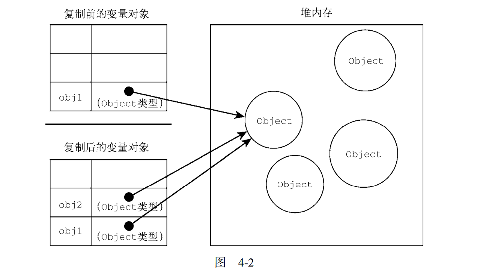
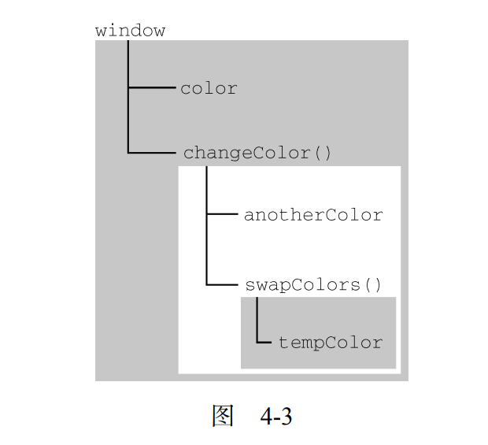

# 变量、作用域与内存

探索 JavaScript 松散类型下的变量处理。这一章将涉及原始类型与引用类型的不同，以及与变量有关的执行上下文。此外，这一章也会讨论 JavaScript 中的垃圾回收，涉及在变量超出作用域时如何回收内存

 通过变量使用原始值与引用值

 理解执行上下文

 理解垃圾回收

js中的变量是松散类型的。变量=特定时间点一特定值名称而已。没规定变量必须包含什么数据类型=变量值和数据类型在脚本生命期内可以改变=很强大=有不少问题。

## 原始值和引用值

原始值就是你直接给一个,引用值就是搞个new在等号后面

primitive value即最简单的数据；reference value是由多个值构成的对象。js碰到一值赋给一变量时，必确定是primitive还是reference。
6 种primitive：Undefined、Null、Boolean、Number、String 和 Symbol。
js不允许直接访问内存位置中的应用值。在操作引用值/对象时，实际上操作的是对该对象的引用。

### 动态属性

两种值定义类似。可以对值做什么不同，引用值：可以随时增删改

```js
let person = new Object(); 
person.name = "Nicholas"; 
console.log(person.name); // "Nicholas" 
```

原始值不能有属性，只有引用值可以动态添加属性

```js
let name = "Nicholas"; 
name.age = 27; 
console.log(name.age); // undefined 
```

```js
let name1 = "Nicholas"; 
let name2 = new String("Matt"); 
console.log(typeof name1); // string 
console.log(typeof name2); // object name1.age = 27; 
name2.age = 26; 
console.log(name1.age); // undefined 
console.log(name2.age); // 26 
```

### 复制值

原始值复制的时候就是重开一块,完全跟你复制标的不一样的块.

```js
let num1 = 5; 
let num2 = num1; 
```

引用值复制是复制的指针,因此一个标的对象上的变化会在复制的2上反映出来,如下

```js
let obj1 = new Object(); 
let obj2 = obj1; 
obj1.name = "Nicholas"; 
console.log(obj2.name); // "Nicholas" 
```



### 传递参数

什么叫按引用?什么叫按参数?没懂.....

所有函数的参数都是按值传递的.变量有按值和按引用,而传参只按值传递.

```js
function addTen(num) { 
 num += 10; 
 return num; 
} 
let count = 20; 
let result = addTen(count); 
console.log(count); // 20，没有变化
console.log(result); // 30 
```

```js
function setName(obj) { 
 obj.name = "Nicholas"; 
} 
let person = new Object(); 
setName(person); 
console.log(person.name); // "Nicholas" 
```

以下证明对象是按值传递的,如果是按引用传递,则不是当前log的结果

```js
function setName(obj) { 
 obj.name = "Nicholas"; 
 obj = new Object(); 
 obj.name = "Greg"; 
} 
let person = new Object(); 
setName(person); 
console.log(person.name); // "Nicholas" 
```

以上的原理没看懂,就是说还是指向原来???

### 确定类型

```js
let s = "Nicholas"; 
let b = true; 
let i = 22; 
let u; 
let n = null; 
let o = new Object(); 
console.log(typeof s); // string 
console.log(typeof i); // number 
console.log(typeof b); // boolean 
console.log(typeof u); // undefined 
console.log(typeof n); // object 
console.log(typeof o); // object 
```

typeof对原始值有效用,但对引用值用处不大.
如果我们想知道一个object是什么类型的object,用instanceof

```js
result = variable instanceof constructor
console.log(person instanceof Object); // 变量 person 是 Object 吗？
console.log(colors instanceof Array); // 变量 colors 是 Array 吗？
console.log(pattern instanceof RegExp); // 变量 pattern 是 RegExp 吗？

//变量x是什么什么的实例吗
```

instanceof检测引用值和object构造函数都会返回true,因为是实例关系;要是检测原始值,则始终返回false

## 执行上下文与作用域

什么是执行上下文?即上下文.决定变量或函可以访问哪些数据及它们的行为.在后台有个存变或函的变量对象.

全局上下文是最外层的上下文.在浏览器中,即我们说的window对象.上下文在其所有代码执行完毕后会被销毁,包括定义在它上面的所有变量和函数.

上下文中的代码在执行时,会创建变量对象的一作用域链,决定了里面的顺序.   全局上下文的变量对象始终时作用域链的最后一个变量对象.

代码执行时的标志符解析是通过沿作用域链逐级搜索标识符名称完成的....直到找到标识符

```js
var color = "blue"; 
function changeColor() { 
 if (color === "blue") { 
 color = "red"; 
 } else { 
 color = "blue"; 
 } 
} 
changeColor();
```

以上能访问变量color,就是因为可以在作用域链中找到它.changecolor包含两个对象,一个自己的变量对象,一个全局上下文的

以下时局部作用域中定义的变量可用于在局部上下文中替换全局变量.

```js
var color = "blue"; 

function changeColor() { 
 let anotherColor = "red"; 

 function swapColors() { 
 let tempColor = anotherColor; 
 anotherColor = color; 
 color = tempColor; 

 // 这里可以访问 color、anotherColor 和 tempColor 
 } 

 // 这里可以访问 color 和 anotherColor，但访问不到 tempColor 
 swapColors(); 
} 

// 这里只能访问 color 
changeColor(); 
```

以上被function的,只能在本function中才能访问到


每个上下文都可以到上一级上下文中去搜索变量和函数，但任何上下文都不能到下一级上下文中去搜索。函参被认为是当前上下文的变量,也跟其它上下文中其它变量相同的访问规则.嵌套在里面的才能往上搜索.

### 作用域链增强

```js
function buildUrl() { 
 let qs = "?debug=true"; 
 with(location){ 
 let url = href + qs; 
 } 
 return url; 
} 
```

with块内let只能限制在本作用域,要是var会成为上下文的一部分

### 变量说明

let和const成为超越var的首选

#### 使用var的函数作用域说明

```js
function add(num1, num2) { 
 var sum = num1 + num2; 
 return sum; 
} 
let result = add(10, 20); // 30 
console.log(sum); // 报错：sum 在这里不是有效变量

function add(num1, num2) { 
 sum = num1 + num2; 
 return sum; 
} 
let result = add(10, 20); // 30 
console.log(sum); // 30
```

以上两个例子区别是什么?为什么?第一个function例子中变量未经声明就初始化;第二个中sum在add调用之后就变得外部可以访问到了

var 声明会被拿到函数或全局作用域的顶部，位于作用域中所有代码之前。这个现象叫作“提升”（hoisting）。

```js
var name = "Jake"; 
// 等价于：
name = 'Jake'; 
var name; 
//下面是两个等价的函数：
function fn1() { 
 var name = 'Jake'; 
} 
// 等价于：
function fn2() { 
 var name; 
 name = 'Jake
```

如何看是否被提升?声明前打印.
声明的提升=输出undefined而不是reference error

#### 使用let的块级作用域声明

什么是块级作用域?就是花括号``{}``
单独的块也是let声明变量的作用域.
let只要除了花括号,打印就是error.

```js
if (true) { 
 let a; 
} 
console.log(a); // ReferenceError: a 没有定义
while (true) { 
 let b; 
} 
console.log(b); // ReferenceError: b 没有定义
function foo() { 
 let c; 
} 
console.log(c); // ReferenceError: c 没有定义
 // 这没什么可奇怪的
 // var 声明也会导致报错
// 这不是对象字面量，而是一个独立的块
// JavaScript 解释器会根据其中内容识别出它来
{ 
 let d; 
} 
console.log(d); // ReferenceError: d 没有定义```

let不能被声明两次,会error;var可以,可以多次,但会被忽略.如下

```js
var a; 
var a; 
// 不会报错
{ 
 let b; 
 let b; 
} 
// SyntaxError: 标识符 b 已经声明过了
```

let适合在循环中声明迭代变量.
严格讲let也会被提升,但由于暂时性死区,不能在声明前使用let变量.so,从js代码角度说,let的提升跟var是不一样的.

##### 暂时性死区

"暂时性死区"（Temporal Dead Zone，简称 TDZ）是指在某个作用域中，使用 `let` 或 `const` 声明的变量在声明语句之前是不可访问的。这个区域称为“死区”，因为在这个阶段，访问变量会导致引发错误。

让我们通过一个例子来说明：

```javascript
console.log(myVar);  // ReferenceError: Cannot access 'myVar' before initialization
let myVar = 10;
```

在这个例子中，尽管 `myVar` 的声明出现在 `console.log` 语句之前，但在这个声明前的位置尝试访问 `myVar` 会导致引发 `ReferenceError`。这是因为在声明语句之前的位置，`myVar` 处于 TDZ 中，JavaScript 引擎不允许对其进行访问。

暂时性死区的存在是为了防止在变量声明前使用变量，以减少代码中的一些潜在错误。在实际代码中，这可能会让开发者更容易发现并修复在作用域顶部使用未声明变量的问题。

比方说，你可以将 TDZ 想象成一个代码中的“保护区”，在这个区域内，变量虽然已经被声明，但是还不能被访问，直到执行到实际声明语句的位置。

```javascript
// 这是一个比喻，实际上 JavaScript 引擎并不会创建“保护区”
// 用于演示暂时性死区
{
    console.log(myVar);  // ReferenceError: Cannot access 'myVar' before initialization
    let myVar = 10; // 变量声明语句
}
```

在这个比喻中，`console.log(myVar)` 处于“保护区”内，尝试访问 `myVar` 会导致错误。一旦执行到 `let myVar = 10;`，变量 `myVar` 就脱离了“保护区”，可以正常访问。

#### 使用const的常量声明

使用const必须初始化,一经声明,不能再赋新值

```js
const a; // SyntaxError: 常量声明时没有初始化
const b = 3; 
console.log(b); // 3 
b = 4; // TypeError: 给常量赋值
```

但是对象的键不受影响,你可以该.如下

```js
const o1 = {}; 
o1 = {}; // TypeError: 给常量赋值
const o2 = {}; 
o2.name = 'Jake'; 
console.log(o2.name); // 'Jake' 
//想让整个对象都不可更改,可以object.freeze改了会自动失败
const o3 = Object.freeze({}); 
o3.name = 'Jake'; 
console.log(o3.name); // undefined
```

#### 标识符查找

是指在程序执行过程中，根据标识符的名称查找相应的变量、函数、属性等的过程。当程序中使用一个标识符时，编程语言需要找到与该标识符相关联的实体，并根据上下文使用它。

想象一下你的程序是一座大图书馆，而标识符就是书的书名。当你在程序中使用一个标识符时，就好比你在图书馆里寻找一本书。标识符的查找过程就像你在图书馆中寻找特定书籍的过程一样。

```javascript
let myVariable = 42;
function myFunction() {
    console.log("Hello, World!");
}
// 在这里，myVariable 和 myFunction 就是标识符
// 当程序执行到这里时，JavaScript 需要查找这两个标识符对应的值或行为
console.log(myVariable);  // 查找 myVariable 的值
myFunction();             // 查找并执行 myFunction
```

在这个例子中，`myVariable` 和 `myFunction` 就是标识符。当程序执行到使用它们的地方时，JavaScript 引擎会进行标识符查找，找到相应的值或行为。这就好比你在图书馆中查找书籍一样，通过书名找到相应的书。

```js
var color = 'blue'; 
function getColor() { 
 return color; 
} 
console.log(getColor()); // 'blue' 
//现在本function块中搜索,没找到再搜全局上下文,然而下面的例子表明,本块内有,搜索就停止.
var color = 'blue'; 
function getColor() { 
 let color = 'red'; 
 return color; 
} 
console.log(getColor()); // 'red' 
//下面的更加说明了搜索流程:先本块,找到就结束
var color = 'blue'; 
function getColor() { 
 let color = 'red'; 
 { 
 let color = 'green'; 
 return color; 
 } 
} 
console.log(getColor()); // 'green' 
```

## 垃圾回收

js是使用垃圾回收的语言.跟踪内存在c和c++是很大负担=问题,而js通过自动内存管理实现内存分配和闲置资源回收:周期性垃圾回收=不再使用的变量进行释放,但算法解决不了哪儿块你不用了,哪儿块你还要用.

垃圾回收程序必须跟踪记录哪个变量还会再用,以及哪个变量不会再使用,以便回收内存.

有两种主要策略:

### 标记清理

最常用的.标记的实现过程不重要:变量反转一位或者搞两个列表\一个在上下文中,一个不在\,重要的是策略.

### 引用计数

没那么常用.思路:变量声明并赋一引用值,会记录一个引用数1;如果赋给另一变量,加1;如果存该值的变量被其它值覆盖了,那么减1,直到变0,就回收释放内存.

但碰到循环引用就会出现严重问题,如下:计数不会变为0

```js
function problem() { 
 let objectA = new Object(); 
 let objectB = new Object(); 
 objectA.someOtherObject = objectB; 
 objectB.anotherObject = objectA; 
}
```

下面是com component object model对象的循环引用问题

```js
let element = document.getElementById("some_element"); 
let myObject = new Object(); 
myObject.element = element; 
element.someObject = myObject; 
```

1. `let element = document.getElementById("some_element");`：
   - 使用 `document.getElementById("some_element")` 获取文档中具有指定 ID 的元素。
   - 将该元素赋值给变量 `element`。
   比喻：- 就像通过标识符（ID）在整个文档中找到了一个特定的元素，然后将这个元素放到了一个盒子（变量 `element`）里面。

2. `let myObject = new Object();`：
   - 创建了一个新的空对象，并将其赋值给变量 `myObject`。
   比喻：- 好比制造了一个空盒子（对象），可以往里面放东西。

3. `myObject.element = element;`：
   - 在对象 `myObject` 中创建一个属性 `element`，并将之前获取的元素对象 `element` 赋值给这个属性。
   比喻：- 就像在刚刚制造的盒子（对象 `myObject`）里放入了一个东西（元素对象 `element`）。

4. `element.someObject = myObject;`：
   - 在之前获取的元素对象 `element` 中创建一个属性 `someObject`，并将对象 `myObject` 赋值给这个属性。
   比喻：- 就像在之前找到的元素（盒子 `element`）上标记了一个新的属性，这个属性里放了之前制造的盒子（对象 `myObject`）。

功能说明：这段代码的目的是将一个 HTML 元素（通过 ID 获取）与一个 JavaScript 对象建立关联。通过属性的赋值，可以在 JavaScript 中方便地访问和操作这个元素。这样做的好处是能够在对象中存储关于元素的信息，以及在元素中存储关于对象的信息。这种关联可以在需要在 JavaScript 中处理 DOM 元素时很有用。

上面的例子在一个 DOM 对象（element）和一个原生 JavaScript 对象（myObject）之间制造了循环引用,这会导致dom元素的内存永远不会回收,即便从页面上删除了.

通过下面的代码清除循环引用``myObject.element = null;
element.someObject = null;``

### 性能

!!!!写代码的时候就要做到:无论什么时候开始回收垃圾,都能让它尽快结束工作.!!!!因为垃圾回收占内存,尤其在内存有限的设备上,垃圾回收的时间调度很重要.

### 内存管理

使用垃圾回收=不用关心内存管理。
优化内存最佳手段：保证在执行代码时只保存必要的数据；数据不再必要了就设置为null，释放其引用=解除引用，适用于全局变量和全局变量的属性。

```js
function createPerson(name){ 
 let localPerson = new Object(); 
 localPerson.name = name; 
 return localPerson; 
} 
let globalPerson = createPerson("Nicholas"); 
// 解除 globalPerson 对值的引用
globalPerson = null;
```

以上是说，localperson会在createperson（）执行完后会自动解除引用，不许显示处理；但globalperso是一个全局变量，应该在不需要时 手打一行 解除其引用。

tip：解除引用不会立马回收，其关键在于确保相关值不在上下文里，因此下次垃圾回收时会被回收

#### 通过const和let声明提升性能

为什么能提高？因为他俩都是以块为作用域。

#### 隐藏类和删除操作

完全不懂？？？？？？什么东西？？？v8利好注重性能的你。

什么是隐藏类？如下

在 JavaScript 引擎的内部，隐藏类（Hidden Class）是一种用于优化对象访问和属性查找的数据结构。它与JavaScript 中的对象和原型链密切相关，用于提高代码的执行效率。
想象你有一家制造汽车的工厂，每辆汽车都有一些共同的特征，比如车轮、发动机等。每当你生产一辆新汽车时，你都使用相同的设计图纸（构造函数和原型）来制造它们。这个设计图纸就是隐藏类。现在，如果你有两辆汽车，它们都是相同的型号，使用相同的设计图纸，那么它们就可以共享相同的隐藏类。这意味着工厂在制造这两辆汽车时，知道它们的共同特征，并且可以更高效地管理它们。
在 JavaScript 引擎（例如 V8）中，当你创建一个对象实例时，引擎会为这个对象实例生成一个隐藏类。这个隐藏类描述了该对象的内部结构和属性的排列方式。

```javascript
function Car(make, model) {
    this.make = make;
    this.model = model;
}
let car1 = new Car('Toyota', 'Camry');
let car2 = new Car('Honda', 'Accord');
```

在这个例子中，`car1` 和 `car2` 都是使用相同的构造函数 `Car` 创建的对象，它们会共享相同的隐藏类。这使得 JavaScript 引擎可以更有效地处理它们，因为它们的内部结构是一致的。

这种优化对于性能很重要，因为当对象共享相同的隐藏类时，引擎可以更快地执行属性查找和优化代码。隐藏类是 JavaScript 引擎内部用于提高对象操作效率的一种优化手段。

#### 内存泄漏

js中的内存泄漏大部分是由不合理的引用导致的。
意外声明全局变量是最常见的不合理。
``function setName() { name = 'Jake';}``
在解释时相当于Window.name,也就说窗口不关，内存不会消失。加var、let、const即可

以下也是泄漏的例子

```js
let name = 'Jake'; 
setInterval(() => { 
 console.log(name); 
}, 100);

let outer = function() { 
 let name = 'Jake'; 
 return function() { 
 return name; 
 }; 
}; 
//上面这个只要函数存在就不能清路name，因为闭包一直引用
```

#### 静态分配与对象池

压榨浏览器相关：减少浏览器垃圾回收的次数。开发者能做什么呢？控制触发垃圾回收的条件。

```js
function addVector(a, b) { 
 let resultant = new Vector(); 
 resultant.x = a.x + b.x; 
 resultant.y = a.y + b.y; 
 return resultant; 
}
//上面的堆里有个创建的新对象，是个动态矢量，如果它被频繁调用，会频繁的被回收程序发现安排
function addVector(a, b, resultant) { 
 resultant.x = a.x + b.x; 
 resultant.y = a.y + b.y; 
 return resultant; 
}
```

上面例2条件是需要在其它地方实例化参数矢量resultant。有两个策略
一个策略是使用对象池

```js
// vectorPool 是已有的对象池 
let v1 = vectorPool.allocate(); 
let v2 = vectorPool.allocate(); 
let v3 = vectorPool.allocate(); 
v1.x = 10; 
v1.y = 5; 
v2.x = -3; 
v2.y = -6; 
addVector(v1, v2, v3); 
console.log([v3.x, v3.y]); // [7, -1] 
vectorPool.free(v1); 
vectorPool.free(v2); 
vectorPool.free(v3); 
// 如果对象有属性引用了其他对象
// 则这里也需要把这些属性设置为 null 
v1 = null; 
v2 = null; 
v3 = null;
```

以上是对象池的伪实现。程序向池请求一个对象、设置其属性、使用，操作完成再把它还给对象池。
下面是使用数组来实现对象池，数组要设定的合适
。

tip：要是过早优化不必担忧；如果被回收严重拖后腿，可以用用

```javascript
let vectorList = new Array(100);
```

1. - 创建了一个长度为 100 的数组，并将其赋值给变量 `vectorList`。
   比喻：
   - 就像制造了一个装有 100 个盒子的货架，然后标记这个货架的名字为 `vectorList`。

```javascript
let vector = new Vector();
```

2.- 创建了一个新的 `Vector` 对象，并将其赋值给变量 `vector`。
   比喻： - 就像制造了一个新的盒子，然后标记这个盒子的名字为 `vector`。

```javascript
vectorList.push(vector);
```

3.- 将之前创建的 `vector` 对象添加到数组 `vectorList` 的末尾。
   比喻：- 就像把之前制造的盒子 `vector` 放到了之前制造的货架 `vectorList` 的最后一个位置。

功能说明：这段代码的目的是创建一个数组（`vectorList`），然后在数组中存储 `Vector` 对象。通过将 `vector` 对象添加到数组的末尾，可以在数组中保留对多个 `Vector` 对象的引用。这种做法可以在需要处理多个向量（或对象）时，方便地通过数组进行管理和访问。比如，可以把 `vectorList` 想象成一个存储多个向量的集合。

## 小结

JavaScript 变量可以保存两种类型的值：原始值和引用值。原始值可能是以下 6 种原始数据类型之一：Undefined、Null、Boolean、Number、String 和 Symbol。原始值和引用值有以下特点。

 原始值大小固定，因此保存在栈内存上。

 从一个变量到另一个变量复制原始值会创建该值的第二个副本。

 引用值是对象，存储在堆内存上。

 包含引用值的变量实际上只包含指向相应对象的一个指针，而不是对象本身。

 从一个变量到另一个变量复制引用值只会复制指针，因此结果是两个变量都指向同一个对象。

 typeof 操作符可以确定值的原始类型，而 instanceof 操作符用于确保值的引用类型。

任何变量（不管包含的是原始值还是引用值）都存在于某个执行上下文中（也称为作用域）。这个上下文（作用域）决定了变量的生命周期，以及它们可以访问代码的哪些部分。执行上下文可以总结如下。

 执行上下文分全局上下文、函数上下文和块级上下文。

 代码执行流每进入一个新上下文，都会创建一个作用域链，用于搜索变量和函数。

 函数或块的局部上下文不仅可以访问自己作用域内的变量，而且也可以访问任何包含上下文乃至全局上下文中的变量。

 全局上下文只能访问全局上下文中的变量和函数，不能直接访问局部上下文中的任何数据。

 变量的执行上下文用于确定什么时候释放内存。

JavaScript 是使用垃圾回收的编程语言，开发者不需要操心内存分配和回收。JavaScript 的垃圾回收程序可以总结如下。

 离开作用域的值会被自动标记为可回收，然后在垃圾回收期间被删除。

 主流的垃圾回收算法是标记清理，即先给当前不使用的值加上标记，再回来回收它们的内存。

 引用计数是另一种垃圾回收策略，需要记录值被引用了多少次。JavaScript 引擎不再使用这种算法，但某些旧版本的 IE 仍然会受这种算法的影响，原因是 JavaScript 会访问非原生 JavaScript 对象（如 DOM 元素）。

 引用计数在代码中存在循环引用时会出现问题。

 解除变量的引用不仅可以消除循环引用，而且对垃圾回收也有帮助。为促进内存回收，全局对象、全局对象的属性和循环引用都应该在不需要时解除引用
